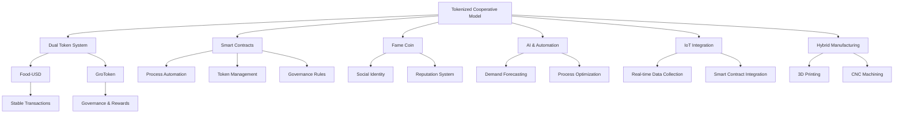
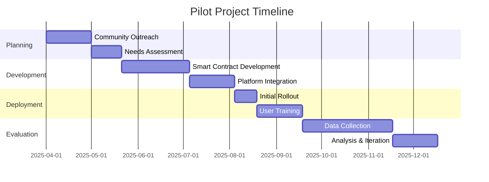
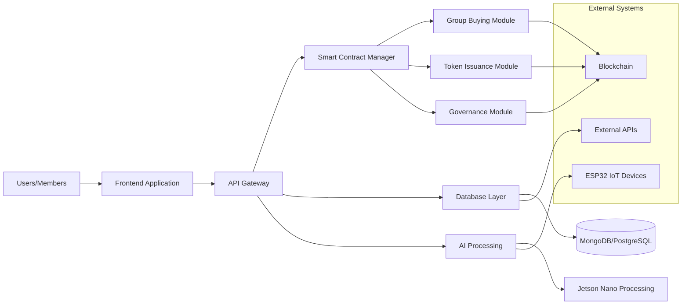
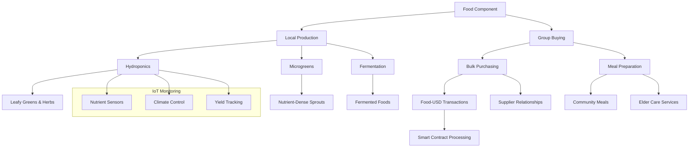
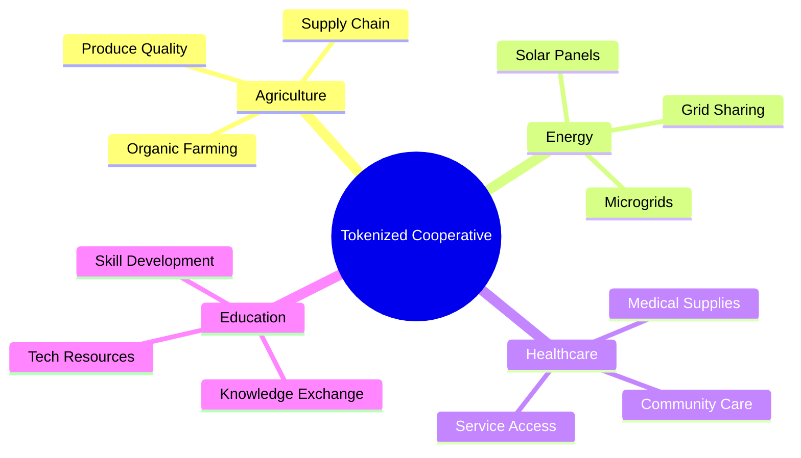
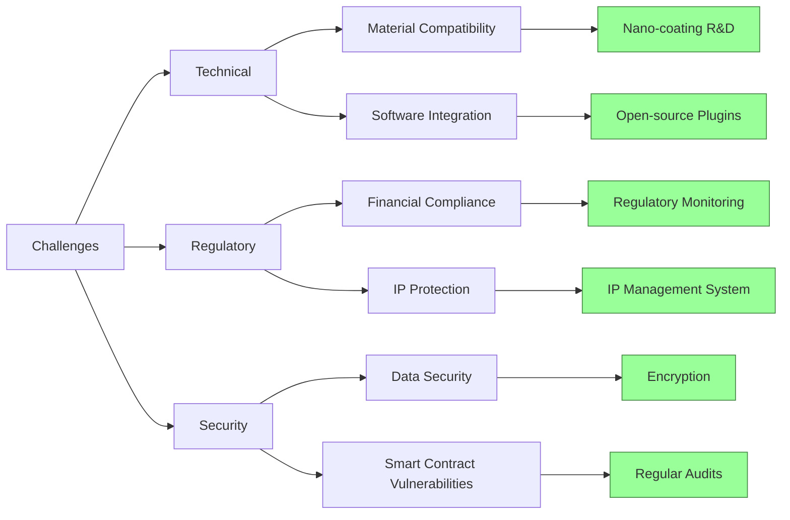
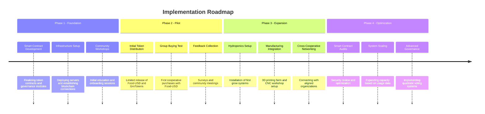
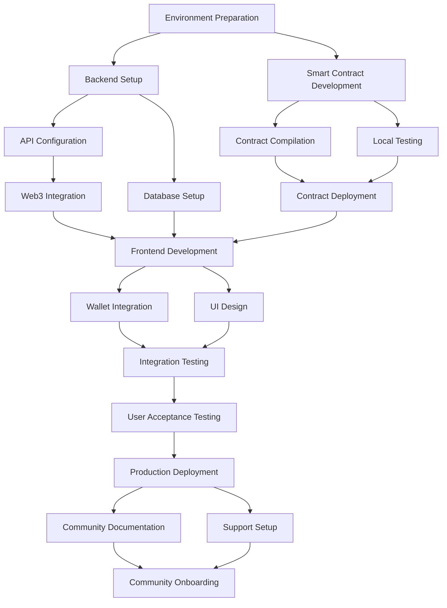
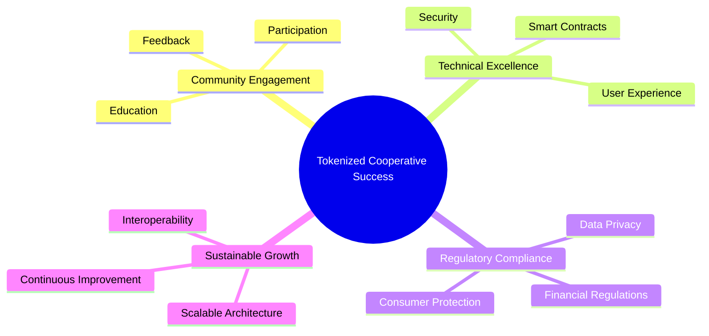

# Cataclysm Studios: Tokenized Cooperative Model for Fordham Hill Oval

## Briefing Document: Cataclysm Studios - Tokenized Cooperative Model and Food Component for Fordham Hill Oval

### Executive Summary:

This briefing document outlines the proposed tokenized cooperative model being developed by Cataclysm Studios, focusing on its application within a Bronx cooperative apartment complex (Fordham Hill Oval). The core concept involves a dual-token system (Food-USD and GroToken), smart contract functionalities for group buying and governance, and integration of local food production (hydroponics, fermentation) and hybrid manufacturing (additive and subtractive). The model aims to create a resilient, sustainable, and equitable circular economy, empowering residents through decentralized decision-making and community participation. The incorporation of a "Fame Coin" is proposed to enhance the social layer of the platform by acting as unique user identifiers tied to reputation and engagement. A key aspect involves a food component, encompassing local food production via hydroponics/fermentation and group buying initiatives to improve access to quality food for residents.

## 1. Core Concepts & Technologies

- **Tokenized Cooperative Model**: The overarching principle is to shift towards community ownership and transparent governance, facilitated by blockchain technology and AI. "Cataclysm Studios aims to empower small businesses by leveraging AI and blockchain technology to create a tokenized cooperative model."

- **Dual Token System**:
  - **Food-USD**: A stablecoin pegged to the US dollar, designed for stable and predictable transactions within the cooperative, specifically for bulk purchases and payments for services. "Food-USD is a stablecoin pegged to the US dollar, used for purchasing bulk supplies and paying for services within the cooperative. Its stability helps avoid speculation and maintain predictable transaction costs."
  - **GroToken**: A governance and reward token that empowers holders to vote on decisions, earn staking rewards, and participate in long-term cooperative initiatives. "GroToken is a governance and reward token that enables voting on important decisions and rewards participation within the cooperative. GroToken holders can influence pricing, supplier selection, and investment in local projects, among other things." The GroToken governance model includes quadratic voting and veToken mechanics. Effective Voting Power is calculated by: V_i = sqrt(x_i) × (1 + 0.5 × (T_i - 1))

- **Smart Contracts**: Automation of processes, management of token transactions, and enforcement of governance rules using Solidity, considering ERC-20 and ERC-1155 standards.

- **Fame Coin**: Repurposed as a social identity token; unique and non-replicable, linking user's social identity to their participation in the cooperative ecosystem.

- **AI & Automation**: Demand forecasting, process optimization, and data analytics using Jetson Nanos (edge computing) and ESP32 microcontrollers (IoT data).

- **IoT Integration**: Collection of real-time data from hydroponics setups and manufacturing equipment for AI models and smart contracts.

- **Hybrid Manufacturing**: Combining additive (3D printing) and subtractive (CNC machining) methods.

## 2. Pilot Project & Community Engagement

- **Fordham Hill Oval Pilot**: A Bronx cooperative apartment complex will serve as the primary testing ground, with the vision of transforming underutilized spaces into microfactories.

- **Pilot Objectives**: Validation of the model, demonstration of benefits (automated group buying, AI-driven processes), user feedback collection, and engagement measurement. "Validate the tokenized cooperative model by running a pilot in your Bronx co-op. Demonstrate the benefits of automated group buying, tokenized transactions, and AI-driven process automation."

- **Community Engagement**: Emphasis on education and onboarding through YouTube videos, presentations, live demos, and Q&A sessions.

- **YouTube Content Strategy**: Educational tutorials, use case showcases, how-to guides, and thought leadership content.

## 3. System Components & Functionalities

- **Group Buying Module**: Pooling funds for bulk purchases.
- **Token Issuance & Management**: Minting, burning, and transfer tracking.
- **Governance Module**: Proposal creation, voting, and automatic execution.
- **Data Aggregation & Pricing**: Integration of external APIs (USDA, local market data).
- **Database & Backend**: PostgreSQL or MongoDB on a cloud provider, with a Node.js or Python backend.
- **Hardware Integration**: Development machines, Jetson Nanos, and ESP32 microcontrollers.
- **Real-Time Communication**: WebRTC.

## 4. Food Component

- **Local Food Production**:
  - **Hydroponics**: Utilizing a 2x4x72 grow tent for year-round production of leafy greens, herbs, and small fruiting plants. Ebb-and-flow or Kratky hydroponic systems are recommended.
  - **Microgreens**: Growing in shallow trays with coco coir or hemp mats.
  - **Fermentation**: Producing sauerkraut, kombucha, ginger ale, and pickled vegetables using mason jars with airlocks or fermentation crocks.

- **Group Buying**:
  - **Bulk Purchasing**: Leveraging the cooperative's power to buy high-quality food at lower prices, integrating Food-USD tokens.
  - **Meal Preparation Services**: Preparing meals for elderly residents and hosting communal dinners.

## 5. Cross-Industry Applications & Adaptability

- The model is adaptable to sectors beyond food cooperatives: sustainable agriculture, renewable energy, healthcare supplies, and educational resources. "The tokenized cooperative model can be adapted to sustainable agriculture (rewarding organic practices and tracking produce quality), renewable energy cooperatives (enabling group buying of solar panels), healthcare supplies (procuring medical supplies at lower costs), and educational resources (enabling group purchases of technology and books)."

## 6. Economic & Social Impact

- **Cost Reduction**: Bulk buying, efficient resource management, and automation. Simulations suggest significant cost savings. Early simulations suggest 23-40% cost reductions versus traditional models.

- **Community Empowerment**: Skill development programs, decentralized governance, and local production. "Training programs (funded via GroToken votes) upskill members in CAD/CAM and machine operation."

- **Sustainability**: Closed-loop material recycling and reduced reliance on external suppliers. Hydroponics uses up to 90% less water than traditional farming methods.

- **Economic Resilience**: Transformation of urban housing complexes into resilient production hubs.

## 7. Challenges & Mitigation Strategies

- **Technical Barriers**: Material compatibility in hybrid manufacturing and software interoperability.

- **Regulatory & Security Concerns**: Financial regulation compliance (stablecoin issuance) and design IP protection. "Ensure that stablecoin issuance (Food-USD) complies with financial regulatory frameworks. Monitor evolving policies on tokenized governance to maintain compliance."

- **Material Compatibility**: Nano-coating R&D funded through decentralized governance.

- **Software Integration**: Open-source plugins developed by cooperative developer pools.

- **Compliance**: AI audits ensure traceability and compliance.

- **Cybersecurity**: Blockchain encryption.

## 8. Implementation Roadmap & Next Steps

- Finalizing Smart Contract Code.
- Setting Up Infrastructure.
- Planning Pilot Session.
- Developing YouTube Content.
- Engaging with the Community.
- Integrating Hybrid Manufacturing: Phase 1 deployment targeting: 3D Printing Farm, CNC Workshop, Recycling Center.
- Network Expansion: Connect with other cooperatives.
- Regular Smart Contract Audits.

## 9. Key Performance Indicators (KPIs) for the YouTube Channel:

- **Engagement Metrics**: Views, likes, comments, shares, and watch time.
- **Subscriber Growth**: Track monthly subscriber increase.
- **Conversion Rates**: Monitor sign-ups for pilot programs or consultations.
- **Audience Feedback**: Collect qualitative feedback via surveys and community polls.

## 10. Key Steps in Platform Setup

- **Environment Preparation**: Installing necessary development tools and software (Visual Studio Code, Git, Node.js, Solidity Compiler).
- **Backend Setup**: Configuring server and API endpoints using Express and interacting with smart contracts using Web3.js.
- **Smart Contract Deployment**: Using Hardhat or Truffle to compile and deploy smart contracts (GroupBuy, FoodCoopDAO, FameCoin).
- **Frontend Development**: Setting up the frontend project with React, integrating wallet connectivity, and designing the unified dashboard.
- **Final Integration & Testing**: Conducting local and user acceptance testing to validate functionality and integration between Fame Coin and GroToken.
- **Production Deployment**: Setting up production environments for backend and frontend, and deploying smart contracts to the mainnet.
- **Community Engagement**: Providing detailed documentation and support channels to encourage active participation.

## Conclusion:

Cataclysm Studios' tokenized cooperative model, enhanced by the food component and the "Fame Coin" social layer, offers a promising approach to empowering small businesses and communities within Fordham Hill Oval. The project integrates blockchain technology, AI, IoT, and hybrid manufacturing to promote a resilient and equitable economic system. Success will depend on community engagement, navigating regulatory hurdles, continuous iteration based on pilot data, and effective execution of the detailed setup roadmap.

