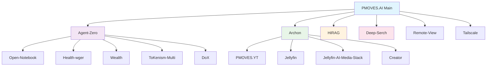

# PMOVES Repository Index & Navigation Guide

This document provides a comprehensive index of all PMOVES repositories and their relationships, helping you navigate the distributed PMOVES ecosystem across GitHub. It complements the GitHub organization & infrastructure guide in `PMOVES_Git_Organization.md`.

_Last updated: 2025-11-17_

## Quick Navigation

- [🚀 Core Infrastructure](#-core-infrastructure)
- [🤖 AI & Agent Systems](#-ai--agent-systems)
- [📺 Media & Content](#-media--content)
- [🛠️ Tools & Utilities](#️-tools--utilities)
- [🌐 Networking & Infrastructure](#-networking--infrastructure)
- [📚 Documentation & Resources](#-documentation--resources)
- [👥 Team & Collaboration](#-team--collaboration)

---

## 🚀 Core Infrastructure

### [PMOVES.AI](https://github.com/POWERFULMOVES/PMOVES.AI)
**Main Repository** - The central hub for the PMOVES ecosystem
- Primary configuration and orchestration
- Docker compose configurations
- Core documentation and guides
- Environment setup and bootstrap scripts

**Key Files:**
- [`pmoves/env.shared`](../pmoves/env.shared) - Shared environment configuration
- [`pmoves/docker-compose.yml`](../pmoves/docker-compose.yml) - Main service orchestration
- [`pmoves/README.md`](../pmoves/README.md) - Project documentation

---

## 🤖 AI & Agent Systems

### [PMOVES-Agent-Zero](https://github.com/POWERFULMOVES/PMOVES-Agent-Zero.git)
**Primary Agent System** - Core AI agent implementation
- Multi-agent coordination
- Task execution and management
- Integration with various AI models

### [PMOVES-Archon](https://github.com/POWERFULMOVES/PMOVES-Archon.git)
**Architecture Layer** - System orchestration and management
- Service orchestration
- Resource management
- VM spinning capabilities for Claude Code integration

### [PMOVES-HiRAG](https://github.com/POWERFULMOVES/PMOVES-HiRAG.git)
**Hierarchical RAG** - Advanced retrieval-augmented generation
- Multi-level retrieval systems
- Knowledge graph integration
- Context-aware responses

### [PMOVES-Deep-Serch](https://github.com/POWERFULMOVES/PMOVES-Deep-Serch.git)
**Advanced Search** - Deep search capabilities
- Semantic search
- Multi-modal search
- Indexing and retrieval

---

## 📺 Media & Content

### [PMOVES.YT](https://github.com/POWERFULMOVES/PMOVES.YT.git)
**YouTube Integration** - YouTube content processing and management
- Video ingestion and processing
- Transcription services
- Content analysis and indexing

### [PMOVES-Jellyfin](https://github.com/POWERFULMOVES/PMOVES-Jellyfin.git)
**Media Server** - Jellyfin integration for media management
- Media library management
- Streaming capabilities
- Metadata handling

### [Pmoves-Jellyfin-AI-Media-Stack](https://github.com/POWERFULMOVES/Pmoves-Jellyfin-AI-Media-Stack.git)
**AI Media Stack** - AI-powered media processing
- Automated media analysis
- Content recommendation
- Smart categorization

### [PMOVES-Creator](https://github.com/POWERFULMOVES/PMOVES-Creator.git)
**Content Creation** - Tools for content creation and management
- Automated content generation
- Creative workflows
- Media production tools

---

## 🛠️ Tools & Utilities

### [PMOVES-Open-Notebook](https://github.com/POWERFULMOVES/PMOVES-Open-Notebook.git)
**Notebook System** - Interactive notebook and documentation
- Jupyter-like interface
- Code execution environments
- Knowledge management

### [Pmoves-Health-wger](https://github.com/POWERFULMOVES/Pmoves-Health-wger.git)
**Health Integration** - Health and fitness tracking with Wger
- Workout tracking
- Health metrics
- Fitness planning

### [PMOVES-Wealth](https://github.com/POWERFULMOVES/PMOVES-Wealth.git)
**Financial Management** - Wealth and financial tools
- Portfolio tracking
- Financial analysis
- Investment management

### [PMOVES-ToKenism-Multi](https://github.com/POWERFULMOVES/PMOVES-ToKenism-Multi.git)
**Token Management** - Multi-token system management
- Cryptocurrency tracking
- Token economics
- DeFi integration

### [PMOVES-DoX](https://github.com/POWERFULMOVES/PMOVES-DoX.git)
**Documentation System** - Knowledge and documentation management
- Document processing
- Knowledge base
- Information organization

---

## 🌐 Networking & Infrastructure

### [PMOVES-Remote-View](https://github.com/POWERFULMOVES/PMOVES-Remote-View.git)
**Remote Access** - Remote viewing and access capabilities
- Remote desktop functionality
- Screen sharing
- Access management

### [PMOVES-Tailscale](https://github.com/POWERFULMOVES/PMOVES-Tailscale.git)
**Network Integration** - Tailscale VPN integration
- Secure networking
- Mesh networking
- Access control

---

## 📚 Documentation & Resources

### Internal Documentation
- [PMOVES Repository Index](PMOVES_Repository_Index.md) - This document
- [PMOVES Git Organization Guide](PMOVES_Git_Organization.md) - GitHub org and CI/runner setup
- [PMOVES Architecture](PMOVES_ARC.md) - System architecture overview
- [Roadmap](../pmoves/docs/ROADMAP.md) - Project roadmap and plans
- [Local Development Guide](../pmoves/docs/LOCAL_DEV.md) - Development setup

### External Resources
- [Claude Connectors Documentation](https://support.claude.com/en/articles/11724452-using-the-connectors-directory-to-extend-claude-s-capabilities)
- [GitHub Actions Documentation](https://docs.github.com/en/actions)
- [Cloudflare Workers AI](https://developers.cloudflare.com/workers-ai/)

---

## 👥 Team & Collaboration

### Core Team
| Member | GitHub | Focus Areas |
|--------|--------|-------------|
| hunnibear | @hunnibear | Core development |
| Pmovesjordan | @Pmovesjordan | Architecture & infrastructure |
| Barathicite | @Barathicite | AI & agent systems |
| wdrolle | @wdrolle | Integration & utilities |

### Collaboration Guidelines
- All repositories follow the [PMOVES contribution guidelines](../pmoves/docs/REPO_RULES.md)
- Use the [PMOVES issue templates](../pmoves/.github/ISSUE_TEMPLATE/) for bug reports and features
- Follow the [code of conduct](../pmoves/CODE_OF_CONDUCT.md) for community interactions

---

## Repository Relationships



---

## Development Workflow

### Setting Up Your Development Environment

1. **Clone the main repository:**
   ```bash
   git clone https://github.com/POWERFULMOVES/PMOVES.AI.git
   cd PMOVES.AI
   ```

2. **Set up environment:**
   ```bash
   cp pmoves/env.shared.example pmoves/env.shared
   # Edit env.shared with your configuration
   make env-setup
   ```

3. **Start core services:**
   ```bash
   make supa-start
   make up
   make up-agents
   ```

4. **Clone additional repositories as needed:**
   ```bash
   # Example: Clone Agent-Zero for development
   git clone https://github.com/POWERFULMOVES/PMOVES-Agent-Zero.git
   ```

### Contributing Guidelines

1. Fork the repository you want to contribute to
2. Create a feature branch: `git checkout -b feature-name`
3. Make your changes and test thoroughly
4. Submit a pull request with detailed description
5. Ensure CI checks pass before merging

---

## Deployment & Infrastructure

### Self-Hosted Runners
Follow the [GitHub Actions setup guide](PMOVES_Git_Organization.md#github-actions-self-hosted-runner-setup) to configure self-hosted runners for CI/CD.

### Cloud Integration
- Cloudflare Workers AI for serverless AI functions
- Cloudflare Pages for static site deployment
- Custom domain and SSL configuration

### Monitoring & Observability
- Prometheus metrics collection
- Grafana dashboards
- Log aggregation with Loki

---

## Getting Help

### Documentation
- Check the [FAQ](../pmoves/docs/FAQ.md) for common questions
- Review the [troubleshooting guide](../pmoves/docs/TROUBLESHOOTING.md)
- Consult the [API documentation](../pmoves/docs/API.md)

### Community
- Open an issue on the relevant repository
- Join our [Discord community](https://discord.gg/pmoves)
- Check the [discussion forums](https://github.com/POWERFULMOVES/PMOVES.AI/discussions)

### Support
- For urgent issues, contact the core team directly
- Bug reports should include detailed reproduction steps
- Feature requests should include use cases and requirements
