# KVM Exit Nodes + Hostinger Hosting Strategy for PMOVES.AI

> **Version:** 1.0 | **Date:** 2026-04-17 | **Author:** Agent Zero Deep Research | **Classification:** Internal Architecture

---

## Table of Contents

1. [Executive Summary](#1-executive-summary)
2. [Current State Inventory](#2-current-state-inventory)
3. [Proposed Architecture](#3-proposed-architecture)
4. [Service-to-KVM Mapping](#4-service-to-kvm-mapping)
5. [Exit Node Configuration Plan](#5-exit-node-configuration-plan)
6. [Upload Bypass Strategy](#6-upload-bypass-strategy)
7. [Hostinger API Integration Plan](#7-hostinger-api-integration-plan)
8. [Risk Assessment and Mitigations](#8-risk-assessment-and-mitigations)
9. [Implementation Roadmap](#9-implementation-roadmap)

---

## 1. Executive Summary

PMOVES.AI operates three Hostinger KVM VPS nodes (kvm2, kvm4-1, kvm4-2) in US-East, interconnected via Tailscale VPN with a physical Z890 GPU workstation. This document presents a deployment architecture that:

- **Splits PMOVES.AI across KVM4-1 (API/agent tier) and KVM4-2 (data tier)**, leveraging existing service placement
- **Promotes KVM2 to a Tailscale exit node** for upload bypass and traffic proxying
- **Hosts PBNJ as a lightweight web interface on KVM2** accessible via Tailscale Funnel
- **Closes the P0 Tailscale ACL gap** where exit nodes are approved but non-functional (missing consume rule)
- **Integrates the Hostinger API** (80+ endpoints) for automated KVM lifecycle management via Terraform
- **Addresses the home ISP upload bottleneck** with a multi-strategy bypass including direct KVM upload, exit node proxy, and rsync-over-Tailscale compression

Total estimated monthly cost: **$30/mo** (3x Hostinger KVM) + home electricity for Z890 GPU compute.

### Critical Findings

| # | Finding | Severity | Action Required |
|---|---------|----------|-----------------|
| 1 | Tailscale exit node consume ACL rule missing | P0 | Add rule before any exit node traffic flows |
| 2 | No KVM has `tag:exit` assigned | P0 | Tag KVM2 during provisioning |
| 3 | KVM4 specs undocumented (inferred 16vCPU/16GB/400GB) | P1 | Verify via Hostinger API `GET /api/vps/v1/virtual-machines` |
| 4 | No Hostinger Terraform IaC for KVM lifecycle | P1 | Create Terraform configs using existing provider |
| 5 | `tag:vps` defined but unused in ACL | P2 | Either remove or repurpose |
| 6 | 3 stale Tailscale nodes exceeding 60-day cleanup policy | P2 | Remove via admin console or API |
| 7 | DGX Spark has zero Tailscale configuration | P1 | Add node, tag, ACL rules |

---

## 2. Current State Inventory

### 2.1 KVM Hardware Inventory

| Spec | KVM2 | KVM4-1 | KVM4-2 |
|------|------|--------|--------|
| **Hostinger Plan** | kvm2-usd-4m | kvm4-usd-4m | kvm4-usd-4m |
| **vCPU** | 8 (documented) | ~16 (inferred) | ~16 (inferred) |
| **RAM** | 8 GB (documented) | ~16 GB (inferred) | ~16 GB (inferred) |
| **Disk** | 200 GB SSD (documented) | ~400 GB SSD (inferred) | ~400 GB SSD (inferred) |
| **GPU** | None | None | None |
| **OS** | Ubuntu 22.04 | Ubuntu 22.04 | Ubuntu 22.04 |
| **Data Center** | US-East (id=13) | US-East (id=13) | US-East (id=13) |
| **Cost** | ~$10/mo | ~$10/mo | ~$10/mo |

> **Verification needed:** KVM4 specs are inferred from tier naming. Run `curl -H "Authorization: Bearer $HOSTINGER_API_TOKEN" https://developers.hostinger.com/api/vps/v1/virtual-machines` to confirm.

### 2.2 KVM Service Inventory

#### KVM2 — Exit Proxy / VPN Infrastructure

| Service | Port | Status | Resource Impact |
|---------|------|--------|----------------|
| Headscale (Tailscale control plane) | 8181 | Running | Low (~100MB RAM) |
| Cloudflared (tunnel daemon) | — | Running | Low (~50MB RAM) |
| Tailscale client | — | Running | Low (~30MB RAM) |
| RustDesk hbbs (signaling) | 21115-21117 | Running | Low (~30MB RAM) |
| RustDesk hbbr (relay) | 21117, 21119 | Running | Low (~50MB RAM) |

**Estimated total usage:** ~260MB RAM, <5% CPU — **~7.7 GB RAM free, ~8 vCPU available**

#### KVM4-1 — API Gateway / Agent Tier

| Service | Port | Status | Resource Impact |
|---------|------|--------|----------------|
| Claude Code CLI | — | Running | Low (~200MB RAM) |
| Ollama (qwen2.5-coder:3b) | 11434 | Running | Medium (~1.5GB RAM) |
| GitHub Actions runner | — | Running | Low (~100MB RAM) |
| Z890 service proxies (via Tailscale) | Various | Passive | Negligible |

**Estimated total usage:** ~2GB RAM, <10% CPU — **~14 GB RAM free, ~16 vCPU available**

#### KVM4-2 — Data / Storage Tier

| Service | Port | Status | Resource Impact |
|---------|------|--------|----------------|
| Supabase (Kong API gateway) | 8000 | Running | Medium (~500MB RAM) |
| PostgreSQL | 5432 | Running | Medium (~1GB RAM) |
| MinIO (object storage) | 9000/9001 | Running | Medium (~500MB RAM) |
| Qdrant (vector DB) | 6333 | Running | Medium (~1GB RAM) |
| Meilisearch (full-text search) | 7700 | Running | Low (~300MB RAM) |
| Neo4j (graph DB) | 7474/7687 | Running | Medium (~1GB RAM) |
| Cipher Memory | 8105 | Running | Low (~200MB RAM) |
| GitHub Actions runner | — | Running | Low (~100MB RAM) |

**Estimated total usage:** ~4.6GB RAM, <15% CPU — **~11.4 GB RAM free, ~16 vCPU available**

### 2.3 Tailscale Network Topology

#### Active Nodes

| Node | Role | Tailscale Tags (Inferred) | Notes |
|------|------|--------------------------|-------|
| pmoves-z890 | GPU workstation | `tag:pmoves`, `tag:gpu` | Primary compute, 40+ services |
| pmoves-laptop | Mobile 4090 | `tag:pmoves` | Field workstation |
| pmoves-kvm2 | Exit proxy | `tag:pmoves` (no exit tag) | Headscale + RustDesk |
| pmoves-kvm4-1 | API gateway | `tag:pmoves` | Claude Code + Ollama |
| pmoves-kvm4-2 | Data tier | `tag:pmoves` | DBs + storage |
| pmoves-nano | Edge inference | `tag:lab` | Jetson Nano |
| pmoves-powerfulmoves | WSL2 | `tag:pmoves` | Dev environment |
| powerfulmoves-1 | Windows host | Untagged | Personal device |

#### ACL Policy Summary (7 tags, 5 standard rules, 2 SSH rules)

```
Full mesh:    tag:pmoves  → tag:pmoves:*           (all ports)
GPU access:   tag:lab     → tag:gpu:*             (all ports)
Partner:      tag:partner → tag:gpu:3030,8080,8081
Guest demo:   tag:guest   → tag:gpu:8081
Admin:        autogroup:admin → *:*               (full access)
SSH mesh:     tag:pmoves → tag:pmoves             (non-root only)
SSH admin:    autogroup:admin → *                  (root + non-root)
```

#### AutoApprovers (exit node infrastructure exists but unused)

```json
{
  "exitNode": ["tag:exit"],
  "routes": {
    "0.0.0.0/0": ["tag:exit"],
    "::/0": ["tag:exit"]
  }
}
```

#### Critical Gap: Exit Node Non-Functional

The autoApprovers grant `tag:exit` nodes permission to **advertise** as exit nodes with default routes. However, **no ACL rule exists that allows any source to consume (use) the exit node**. Tailscale requires an explicit rule like:

```json
{"action": "accept", "src": ["tag:pmoves"], "dst": ["autogroup:internet:*"]}
```

Without this, even tagged exit nodes will not route any client traffic. This is a P0 configuration gap.

### 2.4 Hostinger API Capabilities Summary

| Category | Endpoints | Key Operations |
|----------|-----------|----------------|
| VPS Lifecycle | 12 | Create, start, stop, restart, recreate, recovery |
| Snapshots/Backups | 6 | Create, list, restore, delete snapshots + auto-backups |
| Firewall | 10 | CRUD firewall groups + rules, activate/deactivate/sync |
| DNS | 8 | Full zone CRUD, snapshots, validation, reset |
| SSH Keys | 3 | Add, list, delete public keys |
| Post-Install Scripts | 4 | Create, update, delete, attach to provisioning |
| Metrics | 1 | CPU%, RAM, disk, traffic, uptime |
| PTR Records | 2 | Reverse DNS for IPs |
| IP Addresses | 1 | List all VM IPs |
| Docker Manager | 9 | Compose project CRUD, start/stop/update/logs (EXPERIMENTAL) |
| Billing/Subscriptions | 6 | List, cancel, auto-renewal management |
| Domains | 15+ | Register, transfer, WHOIS, forwarding, availability |

**Auth:** Bearer token via `Authorization: Bearer $TOKEN`

**SDKs/Tools:** Python, Node.js, Terraform, Ansible, MCP Server, n8n Node, CLI (`hapi`)

**Critical Limitations:**
- No VPC or private networking between VMs
- No GPU instances
- No in-place resize (must recreate)
- No floating IPs
- No custom images (OS templates only)

---

## 3. Proposed Architecture

### 3.1 Architecture Diagram (Mermaid)

```mermaid
graph TB
    subgraph "Home Network (ISP Bottleneck)"
        Z890["Z890 GPU Workstation<br/>Agent Zero + 40 Services<br/>RTX 5090/4090"]
        LAPTOP["4090 Laptop<br/>Field Agent"]
    end

    subgraph "Tailscale VPN Mesh"
        TS["Tailscale SaaS Control Plane"]
    end

    subgraph "Hostinger US-East DC"
        subgraph "KVM2 - Exit Node & Light Services"
            EXIT["Tailscale Exit Node<br/>IPTables NAT Forwarding"]
            HEADSCALE["Headscale<br/>:8181"]
            CLOUDFLARED["Cloudflared Tunnel"]
            RUSTDESK["RustDesk hbbs/hbbr"]
            PBNJ_WEB["PBNJ Web UI<br/>:3001 (planned)"]
            NGINX["Nginx Reverse Proxy<br/>:443"]
        end

        subgraph "KVM4-1 - API/Agent Tier"
            AGENT_ZERO["Agent Zero<br/>:8080/:8081"]
            ARCHON["Archon<br/>:8091"]
            TENSORZERO["TensorZero Gateway<br/>:3030"]
            HIRAG["Hi-RAG v2<br/>:8086"]
            EXTRACT["Extract Worker<br/>:8083"]
            OLLAMA_CPU["Ollama CPU<br/>:11434 (qwen2.5:3b)"]
            NATS_KVM["NATS JetStream<br/>:4222"]
        end

        subgraph "KVM4-2 - Data Tier"
            SUPABASE["Supabase/Kong<br/>:8000"]
            POSTGRES["PostgreSQL<br/>:5432"]
            QDRANT["Qdrant<br/>:6333"]
            NEO4J["Neo4j<br/>:7474/:7687"]
            MEILI["Meilisearch<br/>:7700"]
            MINIO["MinIO<br/>:9000/:9001"]
            CIPHER["Cipher Memory<br/>:8105"]
        end
    end

    subgraph "External Services"
    end

    Z890 <-->|"Tailscale Mesh (WG encrypted)"| TS
    LAPTOP <-->|"Tailscale Mesh"| TS
    TS <-->|"Tailscale Mesh"| EXIT
    TS <-->|"Tailscale Mesh"| KVM4_1_TS["KVM4-1 TS iface"]
    TS <-->|"Tailscale Mesh"| KVM4_2_TS["KVM4-2 TS iface"]

    EXIT <-->|"Exit route (0.0.0.0/0)"| CLOUDFLARED
    EXIT <-->|"Funnel ingress"| PBNJ_WEB
    PBNJ_WEB <--> NGINX

    KVM4_1_TS --> AGENT_ZERO
    KVM4_1_TS --> ARCHON
    KVM4_1_TS --> TENSORZERO
    KVM4_1_TS --> HIRAG
    KVM4_1_TS --> EXTRACT
    KVM4_1_TS --> OLLAMA_CPU
    KVM4_1_TS --> NATS_KVM

    KVM4_2_TS --> SUPABASE
    KVM4_2_TS --> POSTGRES
    KVM4_2_TS --> QDRANT
    KVM4_2_TS --> NEO4J
    KVM4_2_TS --> MEILI
    KVM4_2_TS --> MINIO
    KVM4_2_TS --> CIPHER

    AGENT_ZERO -.->|"DB queries over TS"| POSTGRES
    AGENT_ZERO -.->|"Vector search over TS"| QDRANT
    AGENT_ZERO -.->|"Graph queries over TS"| NEO4J
    HIRAG -.->|"Embeddings over TS"| QDRANT
    ARCHON -.->|"REST over TS"| SUPABASE

    Z890 -.->|"Upload bypass via exit"| EXIT
    Z890 -.->|"Direct rsync over TS"| KVM4_1_TS
    Z890 -.->|"GPU inference over TS"| OLLAMA_CPU

    style EXIT fill:#ff6b6b,color:#fff
    style PBNJ_WEB fill:#ffd93d,color:#333
    style Z890 fill:#6bcb77,color:#fff
```



### 3.2 Design Principles

1. **Tier Separation**: API/agent services on KVM4-1, data services on KVM4-2 — matching existing 6-tier environment model
2. **Exit Node as Service**: KVM2 exit node is a shared infrastructure service, not per-application
3. **Tailscale-First Networking**: All inter-node traffic over Tailscale WireGuard (no public IP exposure for internal services)
4. **No VPC Required**: Hostinger lacks VPC; Tailscale provides the private overlay network
5. **GPU Stays On-Prem**: Z890 handles all GPU workloads; KVMs are CPU-only
6. **Operator-Side Tools Stay Local**: PBNJ and Pinokio run on operator machines, not KVMs (exception: PBNJ web UI on KVM2 for remote access)

---

## 4. Service-to-KVM Mapping

### 4.1 PMOVES.AI Service Distribution

#### KVM4-1: API/Agent Tier

| Service | Port | RAM Est. | CPU Est. | Notes |
|---------|------|----------|----------|-------|
| Agent Zero | 8080, 8081 | ~2GB | 2 vCPU | Core orchestrator |
| Archon | 8091 | ~512MB | 1 vCPU | Supabase agent |
| TensorZero Gateway | 3030 | ~512MB | 1 vCPU | LLM routing (calls external APIs) |
| Hi-RAG v2 | 8086 | ~1GB | 2 vCPU | Hybrid search (CPU embedding) |
| Extract Worker | 8083 | ~512MB | 1 vCPU | Text extraction + embedding |
| DeepResearch Agent | 8085 | ~1GB | 1 vCPU | Research specialist |
| SupaSerch Agent | 8084 | ~512MB | 1 vCPU | Search specialist |
| Mesh Agent | 8082 | ~512MB | 1 vCPU | Multi-agent coordinator |
| Ollama CPU | 11434 | ~1.5GB | 4 vCPU | qwen2.5-coder:3b fallback |
| NATS JetStream | 4222 | ~256MB | 0.5 vCPU | Message bus (local to KVM4-1) |
| Publisher-Discord | 8094 | ~128MB | 0.25 vCPU | NATS→Discord bridge |
| Nginx (reverse proxy) | 80/443 | ~64MB | 0.25 vCPU | TLS termination for UI |
| Claude Code | — | ~200MB | 0.5 vCPU | Dev tool (existing) |
| GitHub Runner | — | ~100MB | 0.5 vCPU | CI/CD (existing) |
| **Subtotal** | | **~8.8GB** | **~15.5 vCPU** | Fits in ~16GB/~16vCPU |

#### KVM4-2: Data Tier (existing + additions)

| Service | Port | RAM Est. | Status | Notes |
|---------|------|----------|--------|-------|
| PostgreSQL/Supabase | 5432/8000 | ~1GB | Existing | Expand for PMOVES workloads |
| Qdrant | 6333 | ~1GB | Existing | Vector embeddings store |
| Neo4j | 7474/7687 | ~1GB | Existing | Knowledge graph |
| Meilisearch | 7700 | ~300MB | Existing | Full-text search |
| MinIO | 9000/9001 | ~500MB | Existing | Object storage (models, media) |
| Cipher Memory | 8105 | ~200MB | Existing | Agent memory persistence |
| ClickHouse | 8123 | ~1GB | Planned | Analytics OLAP |
| GitHub Runner | — | ~100MB | Existing | CI/CD |
| **Subtotal** | | **~5.1GB** | | Fits comfortably in ~16GB |

#### KVM2: Exit Node + Light Services

| Service | Port | RAM Est. | Status | Notes |
|---------|------|----------|--------|-------|
| Headscale | 8181 | ~100MB | Existing | Tailscale control plane |
| Cloudflared | — | ~50MB | Existing | CF tunnel daemon |
| RustDesk hbbs/hbbr | 21115-21119 | ~80MB | Existing | Remote desktop |
| Tailscale Exit Node | — | ~30MB | **New** | IPTables NAT + route advertising |
| Nginx | 80/443 | ~64MB | **New** | Reverse proxy for PBNJ web UI |
| PBNJ Web UI | 3001 | ~128MB | **New** | Remote deployment dashboard |
| **Subtotal** | | **~452MB** | | **~7.5 GB free** |

### 4.2 PBNJ Hosting Decision

**PBNJ itself does NOT run on KVMs.** PBNJ is a Pinokio GUI workflow system that runs on the operator's machine (Z890, laptop). It orchestrates deployments via `kubectl` and `docker compose` commands.

**However**, a lightweight PBNJ Web Dashboard can run on KVM2 to enable:
- Remote deployment triggers from any device via Tailscale
- Status monitoring of all KVM deployments
- Log tailing without SSH access

This is a Phase 3 enhancement, not a prerequisite.

### 4.3 Pinokio Hosting Decision

**Pinokio does NOT run on KVMs.** Pinokio is a desktop application (Windows/macOS/Linux) installed on the operator's machine. The 6 PMOVES Pinokio apps (`pmoves-services`, `pmoves-agent-zero`, `pmoves-remote`, etc.) are local workflow definitions.

**Pinokio requires Tailscale reachability** to KVMs for remote deployment workflows (`kvm4-1-deploy.json`, `kvm4-2-deploy.json`, `kvm2-deploy.json`). This is satisfied by the existing Tailscale mesh.

### 4.4 Service Mapping Summary Table

| Service | Primary Host | Backup/Failover | Public-Facing | Tailscale-Only |
|---------|-------------|-----------------|---------------|----------------|
| PMOVES.AI Agent Zero | KVM4-1 | Z890 (local dev) | Via Cloudflare | Yes |
| PMOVES.AI Archon | KVM4-1 | Z890 | No | Yes |
| PMOVES.AI TensorZero | KVM4-1 | Z890 | No (external API calls out) | Yes |
| PMOVES.AI Hi-RAG | KVM4-1 | Z890 | No | Yes |
| PMOVES.AI Extract Worker | KVM4-1 | Z890 | No | Yes |
| PMOVES.AI Ollama CPU | KVM4-1 | — | No | Yes |
| PMOVES.AI NATS | KVM4-1 | Z890 | No | Yes |
| PostgreSQL | KVM4-2 | — | No | Yes |
| Qdrant | KVM4-2 | — | No | Yes |
| Neo4j | KVM4-2 | — | No | Yes |
| Meilisearch | KVM4-2 | — | No | Yes |
| MinIO | KVM4-2 | — | No | Yes |
| Cipher Memory | KVM4-2 | Z890 | No | Yes |
| Exit Node | KVM2 | — | Yes (exit traffic) | Infra |
| Headscale | KVM2 | — | No | Yes |
| RustDesk | KVM2 | — | Yes (relay) | Infra |
| PBNJ Web Dashboard | KVM2 | — | Via Funnel | Yes |
| PBNJ (Pinokio workflows) | Operator machine | — | No | N/A |
| Pinokio apps | Operator machine | — | No | N/A |

---

## 5. Exit Node Configuration Plan

### 5.1 Why KVM2 as Exit Node

| Factor | KVM2 | KVM4-1 | KVM4-2 |
|--------|------|--------|--------|
| Available RAM | ~7.7 GB free | ~7 GB free | ~11 GB free |
| Available CPU | ~8 vCPU free | ~0.5 vCPU free | ~16 vCPU free |
| Current role complexity | Low (VPN/proxy) | High (API tier) | High (data tier) |
| Network role fit | Already edge/proxy | API gateway | Data backend |
| Risk of adding exit traffic | Low | High (contention) | Medium |
| **Suitability** | **BEST** | Poor | Acceptable |

### 5.2 Tailscale ACL Changes Required

#### Step 1: Add exit node consume rule (P0)

```json
{
  "acls": [
    {
      "action": "accept",
      "src": ["tag:pmoves"],
      "dst": ["autogroup:internet:*"],
      "comment": "PMOVES nodes can route internet traffic through exit nodes"
    },
    {
      "action": "accept",
      "src": ["tag:lab"],
      "dst": ["autogroup:internet:*"],
      "comment": "Lab nodes (Jetson) can use exit nodes for model downloads"
    }
  ]
}
```

#### Step 2: Tag KVM2 with `tag:exit`

```bash
# On KVM2, re-authenticate with exit tag:
tailscale up --advertise-tags=tag:pmoves,tag:exit \
  --advertise-routes=0.0.0.0/0,::/0
```

> Note: This requires an auth key with `tag:exit` approval. Generate via Tailscale admin console with the `tag:exit` tag pre-approved.

#### Step 3: Enable IP forwarding on KVM2

```bash
# Persistent across reboots:
echo 'net.ipv4.ip_forward = 1' | sudo tee -a /etc/sysctl.d/99-tailscale.conf
echo 'net.ipv6.conf.all.forwarding = 1' | sudo tee -a /etc/sysctl.d/99-tailscale.conf
sudo sysctl -p /etc/sysctl.d/99-tailscale.conf
```

#### Step 4: Configure IPTables NAT masquerade

```bash
sudo iptables -t nat -A POSTROUTING -o eth0 -j MASQUERADE
sudo ip6tables -t nat -A POSTROUTING -o eth0 -j MASQUERADE

# Persist (Debian/Ubuntu with iptables-persistent):
sudo apt-get install -y iptables-persistent
sudo netfilter-persistent save
```

#### Step 5: Verify exit node advertising

```bash
# On KVM2:
tailscale status
# Should show: "exit node: true" and advertised routes

# From another node (e.g., Z890):
tailscale exit list
# Should show pmoves-kvm2 as available exit node
```

#### Step 6: Optional — Enable Tailscale Funnel on KVM2

For exposing PBNJ web dashboard to the internet without Cloudflare:

```bash
# ACL already grants funnel to tag:exit via nodeAttrs
sudo tailscale funnel 3001
```

### 5.3 Client Configuration

#### Use exit node from any PMOVES node:

```bash
# Route all traffic through KVM2:
tailscale set --exit-node=pmoves-kvm2

# Route only specific traffic (split tunnel - NOT supported by Tailscale exit nodes):
# Tailscale exit nodes are all-or-nothing. For selective routing, use
# --exit-node-allow-lan-access to keep LAN traffic local:
tailscale set --exit-node=pmoves-kvm2 --exit-node-allow-lan-access

# Disable exit node:
tailscale set --exit-node=
```

#### Recommended: Exit node on-demand, not always-on

Create shell aliases for toggle:

```bash
# Add to ~/.bashrc on Z890 and laptop:
alias vpn-on='tailscale set --exit-node=pmoves-kvm2 --exit-node-allow-lan-access'
alias vpn-off='tailscale set --exit-node='
alias vpn-status='tailscale exit list && echo "Current: $(tailscale status | grep exit)"'
```

### 5.4 Bandwidth Implications

| Scenario | KVM2 Bandwidth | Impact |
|----------|---------------|--------|
| Idle (no exit users) | ~0 Mbps | None |
| Single user browsing | ~10-50 Mbps | Negligible (Hostinger VPS typically 1Gbps port) |
| Upload bypass (rsync) | ~100-500 Mbps | Moderate — KVM2 becomes upload proxy |
| Multiple concurrent users | ~200+ Mbps | Monitor via Hostinger metrics API |
| All PMOVES nodes via exit | ~500+ Mbps | Risk of congestion — not recommended |

**Recommendation:** Use exit node selectively for uploads and specific tasks, not as always-on VPN for all nodes.

### 5.5 Firewall Rules for KVM2 (via Hostinger API)

```json
{
  "firewallName": "pmoves-kvm2-exit",
  "rules": [
    {"protocol": "TCP", "port": "22", "action": "accept", "source": "custom", "address": "tag:pmoves via TS"},
    {"protocol": "TCP", "port": "80", "action": "accept", "source": "any"},
    {"protocol": "TCP", "port": "443", "action": "accept", "source": "any"},
    {"protocol": "TCP", "port": "8181", "action": "accept", "source": "custom", "address": "100.64.0.0/10"},
    {"protocol": "UDP", "port": "41641", "action": "accept", "source": "any"},
    {"protocol": "TCP", "port": "21115-21119", "action": "accept", "source": "any"},
    {"protocol": "TCP", "port": "3001", "action": "accept", "source": "any"},
    {"protocol": "ICMP", "action": "accept", "source": "any"}
  ]
}
```

> Note: Tailscale UDP port 41641 must be open for WireGuard. Port 3001 for PBNJ web UI (or use Funnel instead).

---

## 6. Upload Bypass Strategy

### 6.1 Problem Statement

Home ISP uplink is the bottleneck. Typical residential upload: 10-50 Mbps. Large artifacts (Docker images, model files, media) take minutes to hours to reach KVMs. This blocks deployment velocity.

### 6.2 Strategy Comparison

| # | Strategy | How It Works | Speed | Complexity | Cost | Best For |
|---|----------|-------------|-------|------------|------|----------|
| **A** | **Direct rsync over Tailscale** | `rsync -avz --compress` from Z890 directly to KVM4-1/KVM4-2 via Tailscale IPs | 10-50 Mbps (ISP limited) | Low | $0 | Small files, incremental syncs |
| **B** | **Exit node proxy upload** | Route upload traffic through KVM2 exit node, then KVM2→KVM4-1 internally | 10-50 Mbps (still ISP limited at first hop) | Medium | $0 | Does NOT solve the problem |
| **C** | **Staging on KVM2 + internal sync** | Upload to KVM2 first (same as exit), then KVM2 pushes to KVM4-1/KVM4-2 at datacenter speed | ~1 Gbps (DC internal) for 2nd hop | Medium | $0 | Large artifacts where DC-internal speed matters for distribution |
| **D** | **GitHub Container Registry** | Push Docker images to GHCR, KVMs pull from GHCR | ISP upload to GH, then DC-speed pull | Low (existing pipeline) | $0 (free tier) | Docker images (already in CI/CD) |
| **E** | **MinIO on KVM4-2 as artifact store** | Upload artifacts to MinIO over Tailscale, services pull from local MinIO | 10-50 Mbps upload, local-speed reads | Low | $0 | Models, media, datasets |
| **F** | **Cloudflare R2 + Workers** | Upload to R2 (global CDN), KVMs pull from nearest edge | ISP upload once, cached globally | Medium | $0.015/GB/mo | Static assets, models (read-heavy) |
| **G** | **Split Docker layer cache on KVMs** | Keep persistent Docker layer cache on each KVM, only push changed layers | Minimal (only diff layers) | Low | $0 | Docker builds (already partially implemented) |
| **H** | **Hostinger post-install script bootstrap** | Instead of uploading, provision services from scratch via apt/pip + post-install script | N/A (no upload) | High | $0 | Fresh KVM provisioning, DR rebuilds |

### 6.3 Recommended Strategy: Layered Approach

```mermaid
graph LR
    subgraph "Home (ISP Bottleneck)"
        Z890["Z890"]
n    end

    subgraph "Decision Router"
        ROUTER{"Artifact Type?"}
    end

    subgraph "Fast Paths"
        GHCR["GHCR<br/>(Docker images)"]
        MINIO["MinIO@KVM4-2<br/>(Models/Media)"]
        R2["Cloudflare R2<br/>(Static/Public)"]
    end

    subgraph "Slow Path (Compressed)"
        RSYNC["rsync -az --compress<br/>over Tailscale<br/>(Config/Scripts)"]
    end

    subgraph "DC-Internal (Fast)"
        KVM2["KVM2 Staging"]
        KVM4_1["KVM4-1"]
        KVM4_2["KVM4-2"]
    end

    Z890 --> ROUTER
    ROUTER -->|"Docker images"| GHCR
    ROUTER -->|"Models, datasets"| MINIO
    ROUTER -->|"Public assets"| R2
    ROUTER -->|"Config, scripts<br/>< 100MB"| RSYNC

    GHCR -->|"KVMs pull"| KVM4_1
    MINIO -->|"Local read"| KVM4_2
    R2 -->|"Edge pull"| KVM2

    RSYNC -->|"If > 100MB,<br/>stage on KVM2"| KVM2
    KVM2 -->|"DC-internal<br/>~1 Gbps"| KVM4_1
    KVM2 -->|"DC-internal<br/>~1 Gbps"| KVM4_2

    style RSYNC fill:#ff6b6b,color:#fff
    style GHCR fill:#6bcb77,color:#fff
    style MINIO fill:#6bcb77,color:#fff
    style R2 fill:#6bcb77,color:#fff
```

### 6.4 Detailed Implementation Per Strategy

#### Strategy A: rsync over Tailscale (config/scripts < 100MB)

```bash
# Push docker-compose configs to KVM4-1:
rsync -avz --compress --progress \
  ./docker-compose.yml ./docker-compose.external.yml \
  root@pmoves-kvm4-1:/opt/pmoves/

# Push with exclusion (skip large model caches):
rsync -avz --compress --progress \
  --exclude='data/ollama/*' \
  --exclude='data/qdrant/*' \
  ./ root@pmoves-kvm4-2:/opt/pmoves/
```

**Pros:** Simple, incremental, built-in compression, resumes interrupted transfers
**Cons:** Still limited by ISP uplink speed

#### Strategy C: KVM2 Staging + DC-Internal Sync (large artifacts > 100MB)

```bash
# Step 1: Upload to KVM2 (ISP speed, but KVM2 has no other heavy load)
rsync -avz --compress --progress \
  ./large-artifact.tar.gz root@pmoves-kvm2:/tmp/staging/

# Step 2: KVM2 distributes to KVM4-1 and KVM4-2 at datacenter speed (~1 Gbps)
ssh root@pmoves-kvm2 '
  rsync -avz --progress /tmp/staging/large-artifact.tar.gz root@pmoves-kvm4-1:/opt/pmoves/
  rsync -avz --progress /tmp/staging/large-artifact.tar.gz root@pmoves-kvm4-2:/opt/pmoves/
  rm /tmp/staging/large-artifact.tar.gz
'
```

**Pros:** 2nd hop is datacenter speed; KVM2 has spare capacity; distributes to multiple KVMs from one upload
**Cons:** Extra hop adds latency; requires KVM2→KVM4-1/2 connectivity (public IP or Tailscale)

#### Strategy D: GHCR for Docker Images (existing pipeline)

Already implemented via GitHub Actions:
1. Z890 pushes code to GitHub
2. GitHub Actions builds Docker image on VPS runner
3. Image pushed to GHCR
4. KVMs `docker compose pull` from GHCR (datacenter download speed)

**Pros:** Zero additional work; leverages existing CI/CD; KVMs pull at DC speed
**Cons:** Only works for containerized services; GHCR storage limits on free tier

#### Strategy E: MinIO on KVM4-2 (models, media, datasets)

```bash
# Configure MinIO client on Z890:
mc alias set pmoves-minio https://pmoves-kvm4-2:9000 $MINIO_ROOT_USER $MINIO_ROOT_PASSWORD

# Upload model to MinIO over Tailscale:
mc cp ./models/qwen2.5-coder-7b.gguf pmoves-minio/models/

# KVM4-1 pulls from MinIO at DC-internal speed:
mc cp pmoves-minio/models/qwen2.5-coder-7b.gguf /opt/pmoves/data/ollama/
```

**Pros:** MinIO already running on KVM4-2; S3-compatible; versioning support
**Cons:** Initial upload still ISP-limited; one-time cost per artifact

#### Strategy F: Cloudflare R2 (public/read-heavy assets)

```bash
# Upload via wrangler (already installed on KVM4-1):
wrangler r2 object put pmoves-assets/models/model.gguf --file=./model.gguf

# KVMs pull from nearest Cloudflare edge:
curl -o model.gguf https://assets.pmoves.ai/models/model.gguf
```

**Pros:** Global CDN; only upload once; KVMs pull from nearest edge; no egress fees
**Cons:** Storage cost ($0.015/GB/mo); adds Cloudflare dependency; setup complexity

### 6.5 Strategy Decision Matrix

| Artifact Type | Size Range | Recommended Strategy | Rationale |
|--------------|-----------|---------------------|-----------|
| Docker images | 500MB-5GB | **D: GHCR** | Already in CI/CD pipeline, KVMs pull at DC speed |
| LLM model files | 1-50GB | **E: MinIO + C: Staging** | Upload once to MinIO, local reads forever. Use staging for initial push >10GB |
| Config files, scripts | <10MB | **A: rsync direct** | Small enough that ISP speed is fine |
| Docker compose configs | <1MB | **A: rsync direct** | Trivial size |
| Media files (video, audio) | 100MB-10GB | **E: MinIO** | Object storage is purpose-built for this |
| Public website assets | <1GB | **F: Cloudflare R2** | CDN caching eliminates repeated downloads |
| Database backups | 100MB-5GB | **C: KVM2 staging** | Point-in-time, distribute to all KVMs from staging |
| Log archives | 10MB-1GB | **A: rsync direct** | Compress well, small enough |

---

## 7. Hostinger API Integration Plan

### 7.1 Phase 1: Infrastructure as Code (Terraform)

Using the existing `terraform-provider-hostinger`:

```hcl
# infra/hostinger/main.tf

terraform {
  required_providers {
    hostinger = {
      source  = "hostinger/terraform-provider-hostinger"
      version = "~> 0.1"
    }
  }
}

provider "hostinger" {
  api_token = var.hostinger_api_token
}

variable "hostinger_api_token" {
  description = "Hostinger API bearer token"
  sensitive   = true
}

variable "ssh_public_key" {
  description = "SSH public key for all KVMs"
}

locals {
  dc_id    = 13  # US-East
  template = 1   # Ubuntu 22.04
}

resource "hostinger_vps_virtual_machine" "kvm2" {
  name       = "pmoves-kvm2"
  data_center_id = local.dc_id
  template_id    = local.template
  plan_id        = "hostingercom-vps-kvm2-usd-4m"
}

resource "hostinger_vps_virtual_machine" "kvm4_1" {
  name       = "pmoves-kvm4-1"
  data_center_id = local.dc_id
  template_id    = local.template
  plan_id        = "hostingercom-vps-kvm4-usd-4m"
}

resource "hostinger_vps_virtual_machine" "kvm4_2" {
  name       = "pmoves-kvm4-2"
  data_center_id = local.dc_id
  template_id    = local.template
  plan_id        = "hostingercom-vps-kvm4-usd-4m"
}

resource "hostinger_vps_firewall" "kvm2" {
  name = "pmoves-kvm2-exit"
  virtual_machine_id = hostinger_vps_virtual_machine.kvm2.id
  # Rules defined separately
}

resource "hostinger_vps_public_key" "deploy" {
  name       = "pmoves-deploy"
  public_key = var.ssh_public_key
}

resource "hostinger_vps_post_install_script" "bootstrap" {
  name    = "pmoves-bootstrap"
  content = file("scripts/bootstrap.sh")
}
```

### 7.2 Phase 2: Automation Scripts (Python SDK)

```python
# infra/scripts/hostinger_manager.py
"""Hostinger API automation for KVM lifecycle management."""

import hostinger_api
import time

client = hostinger_api.Client(token="YOUR_API_TOKEN")


def get_all_kvms():
    """List all VPS instances with specs."""
    vms = client.vps.list_virtual_machines()
    return [{
        "id": vm["id"],
        "name": vm["hostname"],
        "cpus": vm["cpu_cores"],
        "ram_mb": vm["ram"],
        "disk_mb": vm["disk"],
        "ip": vm["primary_ip"],
        "status": vm["status"],
    } for vm in vms]


def snapshot_kvm(vm_id: str, label: str):
    """Create named snapshot of a KVM."""
    snap = client.vps.create_snapshot(vm_id)
    print(f"Snapshot {snap['id']} created for {vm_id} ({label})")
    return snap["id"]


def restore_kvm(vm_id: str, snapshot_id: str):
    """Restore KVM from snapshot."""
    client.vps.restore_snapshot(snapshot_id)
    print(f"Restoring {vm_id} from snapshot {snapshot_id}")


def get_metrics(vm_id: str) -> dict:
    """Get current CPU/RAM/disk metrics."""
    return client.vps.get_metrics(vm_id)


def update_firewall(firewall_id: str, rules: list):
    """Update firewall rules on a KVM."""
    client.vps.update_firewall(firewall_id, rules=rules)
    client.vps.sync_firewall(firewall_id)
    print(f"Firewall {firewall_id} updated and synced")
```

### 7.3 Phase 3: MCP Server Integration

Hostinger provides an MCP server (`hostinger/api-mcp-server`) that can be added to Agent Zero's CLAW agents for direct KVM management:

```json
// In CLAW scope config for kvm2:
{
  "mcpServers": {
    "hostinger": {
      "command": "npx",
      "args": ["-y", "hostinger-api-mcp-server"],
      "env": {
        "HOSTINGER_API_TOKEN": "${HOSTINGER_API_TOKEN}"
      }
    }
  }
}
```

This enables CLAW agents to:
- Check KVM health via metrics API
- Create/restore snapshots before risky changes
- Update firewall rules programmatically
- Provision new KVMs if needed

### 7.4 Phase 4: n8n Workflow Integration

Using the Hostinger n8n node for automated workflows:

- **Nightly snapshot**: Cron trigger → Hostinger snapshot API → Slack notification
- **Disk threshold alert**: Metrics poll → threshold check → PagerDuty alert
- **Auto-scaling trigger**: Metrics poll → CPU>80% for 10min → notification (manual scale since no resize API)
- **DR drill**: Monthly → Snapshot KVM4-2 → Restore to fresh KVM → Run smoke tests → Report

### 7.5 DNS Automation

```python
# Point pmoves.ai to Cloudflare tunnel (already running on KVM2):
client.dns.update_zone("pmoves.ai", records=[
    {"type": "CNAME", "name": "@", "value": "pmoves-kvm2.cfargotunnel.com", "ttl": 300},
    {"type": "CNAME", "name": "api", "value": "pmoves-kvm4-1.ts.net", "ttl": 300},
    {"type": "CNAME", "name": "data", "value": "pmoves-kvm4-2.ts.net", "ttl": 300},
])
```

> Note: Tailscale MagicDNS `.ts.net` domains are only resolvable within the tailnet. For public DNS, use Cloudflare tunnels or public IPs with firewall restrictions.

---

## 8. Risk Assessment and Mitigations

### 8.1 Risk Matrix

| # | Risk | Probability | Impact | Severity | Mitigation |
|---|------|------------|--------|----------|------------|
| R1 | KVM4-1 runs out of RAM with full agent tier | Medium | High | **HIGH** | Monitor via Hostinger metrics API; defer voice services (Flute-Gateway, TTS) to Z890; add swap if needed |
| R2 | KVM4-2 data services overwhelmed by PMOVES.AI queries | Low | High | **MEDIUM** | Connection pooling in Supabase/Qdrant; query rate limiting; vertical scale (recreate with larger plan) |
| R3 | Exit node becomes single point of failure for uploads | Medium | Medium | **MEDIUM** | Exit node is optional, not required — rsync direct still works; KVM4-1 could be backup exit node |
| R4 | Tailscale control plane outage disconnects all KVMs | Low | Critical | **HIGH** | Tailscale SaaS has 99.95% SLA; cached WireGuard keys allow continued communication for up to 180 days; Headscale on KVM2 as future self-hosted fallback |
| R5 | Hostinger API outage prevents KVM management | Low | Medium | **MEDIUM** | SSH access always available as fallback; snapshots stored independently; Terraform state provides recovery path |
| R6 | Home ISP complete outage blocks all development | Medium | Medium | **MEDIUM** | KVMs run independently; Agent Zero on KVM4-1 can operate without Z890; Claude Code on KVM4-1 for remote dev |
| R7 | KVM compromised via public-facing ports | Low | Critical | **HIGH** | Minimize public exposure; Tailscale-only for internal services; Cloudflare tunnel for UI; Hostinger firewall rules; fail2ban on SSH |
| R8 | KVM4 inferred specs are wrong (less RAM/CPU than assumed) | Medium | High | **HIGH** | Verify specs via API BEFORE deploying agent tier; have rollback plan to Z890-only |
| R9 | Docker images too large for KVM disk | Low | Medium | **MEDIUM** | Layer caching reduces pull size; prune unused images weekly; monitor disk via metrics API |
| R10 | DGX Spark not integrated into Tailscale mesh | High | Low | **LOW** | DGX Spark is accessed via Agent Zero MCP (ollama_spark provider), not direct Tailscale; add Tailscale in Phase 3 |

### 8.2 Monitoring Requirements

| Metric | Source | Threshold | Alert |
|--------|--------|-----------|-------|
| CPU utilization | Hostinger metrics API | >80% for 10min | Warning |
n| RAM utilization | Hostinger metrics API | >85% | Critical |
| Disk usage | Hostinger metrics API | >80% | Warning; >90% Critical |
| Network traffic | Hostinger metrics API | >500 Mbps sustained | Info (exit node load) |
| Docker container health | Local Prometheus on KVM | Any container down | Critical |
| Tailscale connection | `tailscale status` | Node offline >5min | Warning |
| NATS message lag | NATS monitoring | >1000 pending | Warning |
| PostgreSQL connections | pg_stat_activity | >80% max_connections | Warning |

---

## 9. Implementation Roadmap

### Phase 0: Verification (Day 1)

| # | Task | Owner | Output |
|---|------|-------|--------|
| 0.1 | Verify KVM4-1 and KVM4-2 actual specs via Hostinger API | Operator | Spec confirmation document |
| 0.2 | Verify Tailscale control plane (SaaS vs Headscale) | Operator | Control plane confirmation |
| 0.3 | Clean up 3 stale Tailscale nodes (powerfulmoves, pmoves-pro, pmoves-botz) | Operator | Clean tailnet |
| 0.4 | Generate Hostinger API token with full permissions | Operator | API token stored in secrets |
| 0.5 | Test Hostinger API connectivity (list VMs, get metrics) | Operator | API baseline |

### Phase 1: Exit Node Foundation (Days 2-3)

| # | Task | Owner | Output |
|---|------|-------|--------|
| 1.1 | Add exit node consume ACL rules to Tailscale policy | Operator | Updated ACL policy |
| 1.2 | Generate auth key with `tag:exit` approval | Operator | Auth key |
| 1.3 | Enable IP forwarding on KVM2 | CLAW agent or SSH | sysctl config |
| 1.4 | Configure IPTables NAT masquerade on KVM2 | CLAW agent or SSH | iptables rules + persistence |
| 1.5 | Re-authenticate KVM2 with `tag:pmoves,tag:exit` + advertise routes | SSH | KVM2 as exit node |
| 1.6 | Verify exit node from Z890 (`tailscale exit list`, test traffic) | Operator | Exit node confirmed working |
| 1.7 | Create `vpn-on`/`vpn-off` shell aliases on Z890 and laptop | Operator | Convenience aliases |
| 1.8 | Update Hostinger firewall rules for KVM2 (open port 3001, restrict SSH) | API or hPanel | Firewall applied |

### Phase 2: PMOVES.AI Agent Tier on KVM4-1 (Days 4-7)

| # | Task | Owner | Output |
|---|------|-------|--------|
| 2.1 | Create docker-compose.kvm4-1.yml with agent tier services only | Developer | Compose file |
| 2.2 | Configure env.tier-* files for KVM4-1 deployment (point DBs to KVM4-2 Tailscale IPs) | Developer | Environment files |
| 2.3 | Deploy Agent Zero, Archon, TensorZero, Hi-RAG on KVM4-1 | CLAW agent or SSH | Services running |
| 2.4 | Verify inter-tier connectivity (KVM4-1 → KVM4-2 databases over Tailscale) | Developer | Connectivity confirmed |
| 2.5 | Configure Nginx reverse proxy on KVM4-1 for Agent Zero UI (8081→443) | Developer | UI accessible via HTTPS |
| 2.6 | Deploy NATS JetStream on KVM4-1 | Developer | Message bus running |
| 2.7 | Run smoke tests (`smoke_prod.py` adapted for KVM4-1) | Developer | Test results |
| 2.8 | Update Cloudflare tunnel to point to KVM4-1 Agent Zero UI | Operator | Public URL working |

### Phase 3: Data Tier Hardening on KVM4-2 (Days 8-10)

| # | Task | Owner | Output |
|---|------|-------|--------|
| 3.1 | Verify all 6 data services healthy and accessible over Tailscale | Developer | Health check report |
| 3.2 | Configure PostgreSQL connection pooling (pgBouncer or Supabase pooler) | Developer | Pooler running |
| 3.3 | Set up Qdrant collection for PMOVES.AI embeddings | Developer | Collection ready |
| 3.4 | Configure MinIO buckets for models, media, artifacts | Developer | Buckets + policies |
| 3.5 | Set up automated backup: KVM4-2 snapshot via Hostinger API (weekly) | Developer | Backup automation |
| 3.6 | Add Hostinger MCP server to KVM4-2 CLAW scope for metrics access | Developer | MCP config |

### Phase 4: Upload Bypass Implementation (Days 11-13)

| # | Task | Owner | Output |
|---|------|-------|--------|
| 4.1 | Configure MinIO client on Z890 pointing to KVM4-2 | Developer | mc alias configured |
| 4.2 | Create KVM2 staging directory and cleanup cron | CLAW agent | Staging area ready |
| 4.3 | Write `upload-staging.sh` script (upload to KVM2 → distribute to KVM4-1/2) | Developer | Upload script |
| 4.4 | Test large file upload (1GB) through staging path | Developer | Performance baseline |
| 4.5 | Test rsync-over-Tailscale with compression for config files | Developer | Performance baseline |
| 4.6 | Document upload decision matrix in runbook | Developer | Runbook section |

### Phase 5: Hostinger API Automation (Days 14-18)

| # | Task | Owner | Output |
|---|------|-------|--------|
| 5.1 | Create Terraform configs for all 3 KVMs + firewall + SSH keys | Developer | `infra/hostinger/` directory |
| 5.2 | Import existing KVMs into Terraform state | Developer | `terraform import` complete |
| 5.3 | Create Python automation scripts (snapshot, metrics, firewall) | Developer | `infra/scripts/` directory |
| 5.4 | Add Hostinger MCP server to KVM2 CLAW scope | Developer | MCP config |
| 5.5 | Create n8n workflow for nightly metrics check + alerting | Developer | n8n workflow |
| 5.6 | DNS automation: point PMOVES domains via Hostinger API | Developer | DNS records updated |

### Phase 6: PBNJ Remote Dashboard (Days 19-21) — Optional

| # | Task | Owner | Output |
|---|------|-------|--------|
| 6.1 | Design lightweight PBNJ web UI (status + deploy triggers) | Developer | UI mockup |
| 6.2 | Implement PBNJ web service (Flask/FastAPI, port 3001) | Developer | Web service |
| 6.3 | Deploy on KVM2 behind Nginx | Developer | Service running |
| 6.4 | Enable Tailscale Funnel for public access (or Cloudflare tunnel) | Operator | Public URL |
| 6.5 | Test remote deployment trigger from phone/tablet | Operator | E2E test passed |

### Phase 7: Hardening & Documentation (Days 22-25)

| # | Task | Owner | Output |
|---|------|-------|--------|
| 7.1 | Remove unused `tag:vps` from Tailscale ACL | Operator | Clean ACL |
| 7.2 | Add DGX Spark to Tailscale mesh (tag, ACL rules) | Developer | DGX Spark connected |
| 7.3 | Add SSH rule for `tag:lab` → `tag:gpu` | Operator | Lab SSH working |
| 7.4 | Configure key expiry policy on Tailscale | Operator | Key expiry set |
| 7.5 | Write complete deployment runbook for KVM architecture | Developer | Runbook document |
| 7.6 | Update CLAUDE.md/GEMINI.md with new KVM roles | Developer | Docs updated |
| 7.7 | Update PBnJ SKILL.md fleet deployment matrix | Developer | SKILL.md updated |
| 7.8 | DR drill: snapshot KVM4-2 → restore to fresh KVM → verify | Developer | DR test report |

---

## Appendix A: Tailscale ACL Policy — Proposed Updates

```json
{
  "acls": [
    {"action": "accept", "src": ["tag:pmoves"], "dst": ["tag:pmoves:*"], "comment": "Full mesh: all PMOVES nodes"},
    {"action": "accept", "src": ["tag:lab"], "dst": ["tag:gpu:*"], "comment": "Lab nodes to GPU nodes"},
    {"action": "accept", "src": ["tag:partner"], "dst": ["tag:gpu:3030", "tag:gpu:8080", "tag:gpu:8081"], "comment": "Partner: A0 API + TZ + UI"},
    {"action": "accept", "src": ["tag:guest"], "dst": ["tag:gpu:8081"], "comment": "Guest demo: A0 UI only"},
    {"action": "accept", "src": ["autogroup:admin"], "dst": ["*:*"], "comment": "Admin full access"},

 {"action": "accept", "src": ["tag:pmoves"], "dst": ["autogroup:internet:*"], "comment": "EXIT: PMOVES nodes use exit nodes"},
    {"action": "accept", "src": ["tag:lab"], "dst": ["autogroup:internet:*"], "comment": "EXIT: Lab nodes use exit nodes for downloads"}
  ],
  "ssh": [
    {"action": "accept", "src": ["tag:pmoves"], "dst": ["tag:pmoves"], "users": ["autogroup:nonroot"], "comment": "PMOVES mesh SSH (non-root)"},
    {"action": "accept", "src": ["autogroup:admin"], "dst": ["*"], "users": ["root", "autogroup:nonroot"], "comment": "Admin SSH (root allowed)"},
    {"action": "accept", "src": ["tag:lab"], "dst": ["tag:gpu"], "users": ["autogroup:nonroot"], "comment": "Lab SSH to GPU nodes"}
  ],
  "nodeAttrs": [
    {"target": ["tag:exit"], "attr": ["funnel"]}
  ],
  "tagOwners": {
    "tag:pmoves": ["autogroup:admin"],
    "tag:gpu": ["autogroup:admin"],
    "tag:lab": ["autogroup:admin"],
    "tag:exit": ["autogroup:admin"],
    "tag:partner": ["autogroup:admin"],
    "tag:guest": ["autogroup:admin"],
    "tag:dgx-spark": ["autogroup:admin"]
  },
  "autoApprovers": {
    "exitNode": ["tag:exit"],
    "routes": {
      "0.0.0.0/0": ["tag:exit"],
      "::/0": ["tag:exit"]
    }
  }
}
```

**Changes from current policy:**
1. Added 2 exit node consume rules (pmoves→internet, lab→internet)
2. Added SSH rule for tag:lab→tag:gpu
3. Removed unused `tag:vps`
4. Added `tag:dgx-spark` for future DGX Spark integration

---

## Appendix B: KVM Resource Budget Worksheet

### KVM4-1 Resource Budget (Agent Tier)

| Service | RAM (GB) | vCPU | Disk (GB) | Notes |
|---------|----------|------|-----------|-------|
| Agent Zero | 2.0 | 2 | 5 | Core orchestrator + web UI |
| Archon | 0.5 | 1 | 2 | Supabase agent |
| TensorZero | 0.5 | 1 | 1 | LLM gateway (outbound API calls) |
| Hi-RAG v2 | 1.0 | 2 | 2 | Embedding + search |
| Extract Worker | 0.5 | 1 | 1 | Text extraction |
| DeepResearch | 1.0 | 1 | 1 | Research agent |
| SupaSerch | 0.5 | 1 | 1 | Search agent |
| Mesh Agent | 0.5 | 1 | 1 | Coordinator |
| Ollama CPU (3B model) | 1.5 | 4 | 4 | qwen2.5-coder:3b (~2GB model) |
| NATS JetStream | 0.25 | 0.5 | 2 | Message bus + persistence |
| Publisher-Discord | 0.125 | 0.25 | 0.5 | Bridge service |
| Nginx | 0.06 | 0.25 | 0.1 | Reverse proxy |
| Claude Code (existing) | 0.2 | 0.5 | 1 | Dev tool |
| GitHub Runner (existing) | 0.1 | 0.5 | 2 | CI/CD + Docker layer cache |
| Docker overhead | 0.5 | 0.5 | 5 | Daemon + networks |
| OS + system | 1.0 | 1 | 10 | Ubuntu 22.04 base |
| **Total** | **10.2** | **18.5** | **38.7** | **Exceeds 16GB RAM** |
| **Headroom** | **5.8 GB over** | **2.5 over** | **~360 GB free** | **NEEDS OPTIMIZATION** |

#### KVM4-1 Optimization Options

1. **Defer voice services** (Flute-Gateway, TTS) to Z890 — saves ~2GB RAM
2. **Reduce Ollama to on-demand** — don't keep 3B model loaded, saves ~1.5GB RAM
3. **Run agents as needed** (not all at once) — Agent Zero spawns specialists on demand
4. **Add 2GB swap** as safety buffer for burst loads
5. **If still insufficient**: Upgrade to next Hostinger plan or redistribute one service to KVM2

**Realistic steady-state:** ~6-8GB RAM (core services + Agent Zero + 2 specialists active)

---

## Appendix C: Quick Reference Commands

```bash
# === Tailscale Exit Node ===
tailscale set --exit-node=pmoves-kvm2                    # Enable exit
ntailscale set --exit-node=pmoves-kvm2 --exit-node-allow-lan-access  # Exit + keep LAN
tailscale set --exit-node=                              # Disable exit
tailscale exit list                                     # List available exits

# === Upload Strategies ===
rsync -avz --compress ./config/ root@pmoves-kvm4-1:/opt/pmoves/   # Small files direct
rsync -avz --compress ./large.tar.gz root@pmoves-kvm2:/tmp/staging/ # Stage large files
mc cp ./model.gguf pmoves-minio/models/                          # Upload to MinIO

# === Hostinger API (curl) ===
curl -H "Authorization: Bearer $TOKEN" \
  https://developers.hostinger.com/api/vps/v1/virtual-machines          # List KVMs
curl -H "Authorization: Bearer $TOKEN" \
  https://developers.hostinger.com/api/vps/v1/virtual-machines/$ID/metrics  # Metrics
curl -H "Authorization: Bearer $TOKEN" \
  https://developers.hostinger.com/api/vps/v1/snapshots                   # List snapshots

# === KVM Health Checks ===
tailscale ping pmoves-kvm4-1                           # Tailscale connectivity
curl -s http://pmoves-kvm4-1:8080/api/health           # Agent Zero health
curl -s http://pmoves-kvm4-2:6333/collections           # Qdrant health
curl -s http://pmoves-kvm4-2:5432 -o /dev/null -w "%{http_code}"  # PostgreSQL reachable
```

---

*Document generated by Agent Zero Deep Research. All findings based on analysis of project configuration files, Tailscale ACL policy, Hostinger API specification, and existing architecture documentation. KVM4 specs marked as "inferred" require verification via Hostinger API before Phase 2 deployment.*
