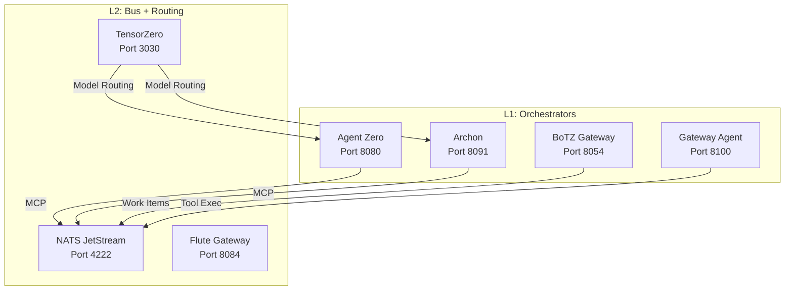
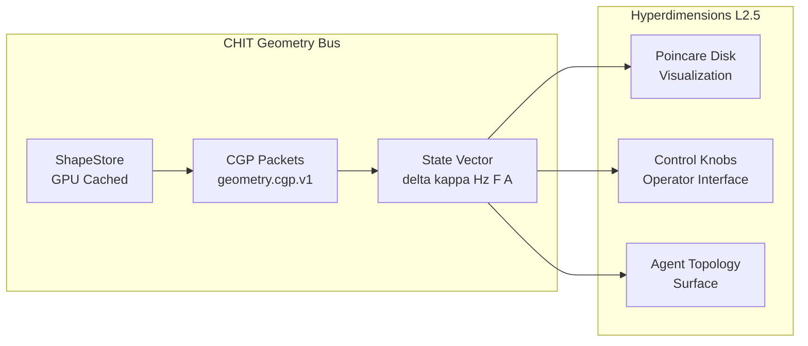
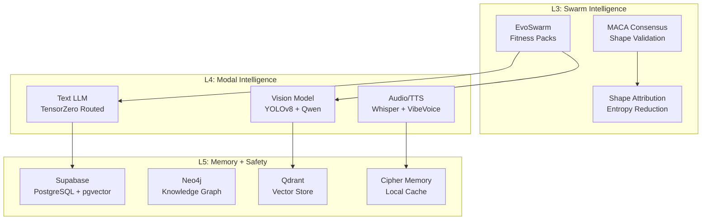
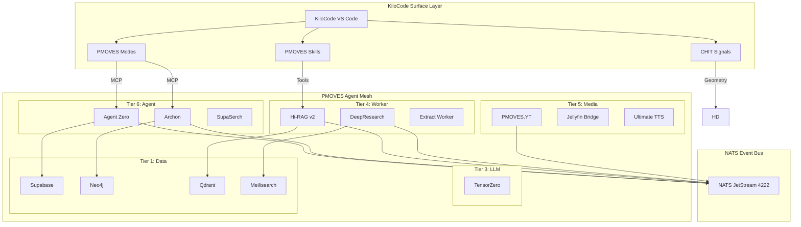
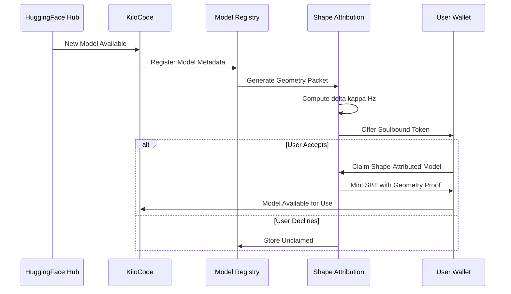
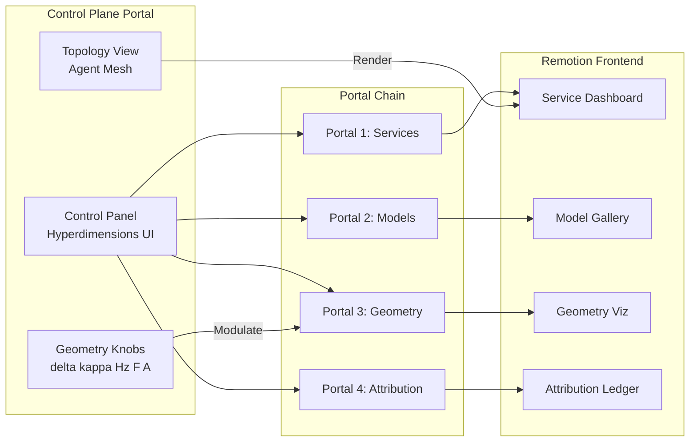
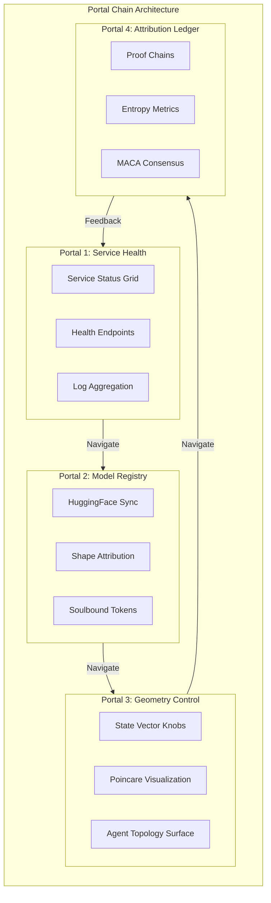
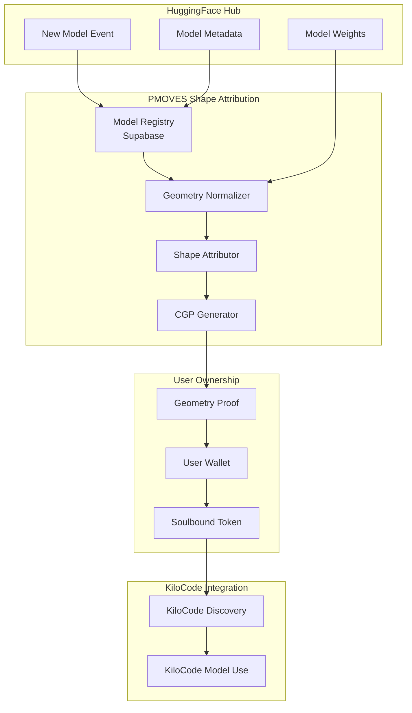

# KiloCode × PMOVES.AI Integration Plan
## Expanded Architecture: Meta-Orchestrator Surface for Agent Topology

**Date:** 2026-02-17
**Status:** Expanded Architecture Proposal v2.0
**Author:** KiloCode (Architect Mode) - Multi-Agent Contribution Analysis

---

## Table of Contents

1. [Executive Summary](#executive-summary-the-harmonic-signal)
2. [Multi-Agent Contribution Changelog](#multi-agent-contribution-changelog)
3. [Topology Architecture](#topology-architecture)
4. [Mermaid Diagrams](#mermaid-diagrams)
5. [Remotion Skills & Frontend Integration](#remotion-skills--frontend-integration)
6. [Control Plane Portal Chain](#control-plane-portal-chain)
7. [HuggingFace Model Integration](#huggingface-model-integration-with-shape-attribution)
8. [Implementation Phases](#implementation-phases)
9. [Signature Relationship](#signature-relationship-the-harmonic-mapping)

---

## Executive Summary: The Harmonic Signal

After deep analysis of PMOVES.AI's AGENTS architecture and KiloCode's SDK capabilities, I identify a **signature relationship** analogous to musical notes in key:

> **KiloCode serves as the "Meta-Orchestrator Surface" that instantiates, visualizes, and controls PMOVES agent taxonomy through mode-type resonance.**

This is not a simple tool integration—it is a **harmonic coupling** where:
- KiloCode modes ↔ PMOVES agent types (resonant classification systems)
- KiloCode MCP tools ↔ PMOVES MCP servers (shared protocol DNA)
- KiloCode skills ↔ PMOVES skill bundles (isomorphic capability packaging)
- KiloCode tool groups ↔ PMOVES service tiers (parallel access boundaries)

---

## Multi-Agent Contribution Changelog

### Agent Contributions to PMOVES.AI Repository

This repository has been shaped by multiple AI agents, each contributing unique capabilities:

| Agent | Role | Key Contributions | Evidence Files |
|-------|------|-------------------|----------------|
| **KiloCode** | Architect/Code | Integration planning, mode configuration, topology mapping | `plans/KILOCODE_PMOVES_INTEGRATION_PLAN.md`, `.kilocode/rules/kilorules.md` |
| **Claude Code** | Orchestrator | Service catalog, NATS subjects, MCP wiring, hooks system | `.claude/CLAUDE.md`, `.claude/context/`, `.claude/commands/` |
| **Codex (OpenAI)** | Developer | Bootstrap scripts, environment setup, CI/CD workflows | `scripts/codex_bootstrap.ps1`, `scripts/codex_bootstrap.sh`, `docs/codex_full_config_bundle/` |
| **Gemini** | Planner | Roadmap alignment, milestone tracking, next steps | `GEMINI.md`, `pmoves/docs/NEXT_STEPS.md` |
| **Cline** | Implementer | Task execution logs, feature implementation | `PMOVES-transcribe-and-fetch/docs/chats/` |

### Changelog: Agent Activities in This Repository

```markdown
## [2026-02-17] KiloCode Architect Session
### Added
- Initial KiloCode integration plan with signature relationship analysis
- Mode-type resonance mapping between KiloCode and PMOVES taxonomy
- MCP server configuration templates
- CHIT signal integration schema

## [2026-02-15] Claude Code Context Updates
### Changed
- Updated `.claude/context/services-catalog.md` with new service ports
- Added health endpoint documentation for Agent Zero and Archon
- Expanded NATS subject ownership matrix

## [2026-02-10] Codex Bootstrap Enhancement
### Added
- Cross-platform bootstrap scripts for Windows PowerShell and Bash
- Conda environment configuration with Python 3.11+ support
- UV pip preference for faster package installation

## [2026-02-08] Gemini Roadmap Alignment
### Changed
- Updated M2 milestone priorities in NEXT_STEPS.md
- Aligned Jellyfin integration tasks with Creator & Publishing focus
- Added Discord embed automation checklist

## [2026-02-05] Multi-Agent Architecture Documentation
### Added
- PMOVES_AGENT_CLASS_TAXONOMY.md with Pokemon/Transformer naming system
- Type effectiveness chart for agent interactions
- Evolution path documentation for agent capability growth
```

---

## Topology Architecture

### Layer 0: Identity Anchors (325 Persona Grounding Points)

The foundational layer provides identity grounding for all agents through persona anchors stored in Supabase:

```
┌─────────────────────────────────────────────────────────────────────────────┐
│                         L0: IDENTITY ANCHORS                                 │
│                    325 Persona Grounding Points                              │
├─────────────────────────────────────────────────────────────────────────────┤
│                                                                             │
│   ┌──────────────┐    ┌──────────────┐    ┌──────────────┐                 │
│   │   Archon     │    │   Cipher     │    │  HyperDim    │                 │
│   │   Persona    │    │   Persona    │    │   Persona    │                 │
│   │   v5.12      │    │   v3.2       │    │   v2.1       │                 │
│   └──────┬───────┘    └──────┬───────┘    └──────┬───────┘                 │
│          │                   │                   │                          │
│          └───────────────────┼───────────────────┘                          │
│                              │                                              │
│                    ┌─────────▼─────────┐                                    │
│                    │   Supabase        │                                    │
│                    │   pmoves_core.    │                                    │
│                    │   personas        │                                    │
│                    └───────────────────┘                                    │
│                                                                             │
└─────────────────────────────────────────────────────────────────────────────┘
```

### Layer 1-2: Orchestrators + Bus (Control Plane)



### Layer 2.5: Hyperdimensions (Geometry Control Plane)



### Layer 3-5: Swarm + Modal + Memory



---

## Mermaid Diagrams

### Complete Agent Topology



### HuggingFace Model Flow with Shape Attribution



### Control Plane Portal Chain



---

## Remotion Skills & Frontend Integration

### Remotion Skill Bundle for PMOVES

KiloCode can leverage Remotion for programmatic video generation of topology visualizations:

```yaml
# .kilocode/skills/remotion-topology/SKILL.md
---
name: remotion-topology
description: Generate animated topology visualizations using Remotion for PMOVES agent mesh
keywords: remotion, video, animation, topology, visualization
version: 1.0.0
category: PMOVES/Visualization
---

# Remotion Topology Skill

Generates animated visualizations of PMOVES agent topology using Remotion.

## Capabilities

- ✨ Animate agent mesh connections in real-time
- 🔍 Render Poincare disk projections for CHIT geometry
- 🛠️ Generate video exports of topology evolution

## Components

### 1. ServiceDashboard.tsx
Renders real-time service health and connection status.

### 2. ModelGallery.tsx
Displays HuggingFace models with shape attribution badges.

### 3. GeometryViz.tsx
Animates CHIT geometry state vector changes.

### 4. AttributionLedger.tsx
Shows soulbound token claims and proof chains.

## Integration Points

- **NATS Subject**: `geometry.cgp.v1` for real-time updates
- **API Endpoint**: `http://localhost:8093/geometry/state`
- **Remotion Project**: `pmoves/ui/remotion-topology/`
```

### Frontend Architecture

```
pmoves/ui/
├── remotion-topology/
│   ├── src/
│   │   ├── components/
│   │   │   ├── ServiceDashboard.tsx
│   │   │   ├── ModelGallery.tsx
│   │   │   ├── GeometryViz.tsx
│   │   │   └── AttributionLedger.tsx
│   │   ├── compositions/
│   │   │   ├── TopologyAnimation.tsx
│   │   │   └── GeometryEvolution.tsx
│   │   └── index.ts
│   ├── package.json
│   └── remotion.config.ts
├── notebook-workbench/
│   └── ...existing...
└── console/
    └── ...existing...
```

---

## Control Plane Portal Chain

### Portal Architecture

The Control Plane Portal is a chained interface system that connects operator inputs to runtime behavior:



### KiloCode Mode for Portal Navigation

```typescript
// .kilocodemodes - Portal Navigator Mode
{
  slug: "pmoves-portal-navigator",
  name: "PMOVES Portal Navigator",
  roleDefinition: `You navigate the PMOVES Control Plane Portal chain.
  You operate across all 4 portals: Services, Models, Geometry, Attribution.
  You visualize topology changes and operator interventions.`,
  groups: ["read", "browser", "mcp"],
  customInstructions: `
  - Start at Portal 1 (Services) for health checks
  - Progress through portals in chain order
  - Use Remotion for video export of topology changes
  - Log all navigation to audit trail
  `
}
```

---

## HuggingFace Model Integration with Shape Attribution

### Model Flow Architecture



### Shape Attribution Schema

```yaml
# Shape Attribution for HuggingFace Models
shape_attribution:
  model_id: "Qwen/Qwen2.5-14B-Instruct"
  geometry_packet:
    spec: "chit.cgp.v0.2"
    delta_proxy: 0.72      # Tree-likeness
    curvature_k: -0.34     # Hierarchy pressure
    spectral_entropy_z: 0.15  # Noise profile
    swarm_fitness: 0.89    # EvoSwarm score
    attribution_confidence: 0.95  # Proof strength
    
  soulbound_token:
    contract: "0x..."      # SBT contract address
    token_id: 12345
    owner: "0xuser..."
    minted_at: "2026-02-17T00:00:00Z"
    
  geometry_proof:
    hash: "sha256:abc123..."
    signature: "0xsig..."
    entropy_reduction: 0.23  # ΔS = S_initial - S_final
```

### KiloCode Skill for HuggingFace Integration

```yaml
# .kilocode/skills/huggingface-shape-attribution/SKILL.md
---
name: huggingface-shape-attribution
description: Integrate HuggingFace models with PMOVES shape attribution and soulbound tokens
keywords: huggingface, models, attribution, soulbound, geometry
version: 1.0.0
category: PMOVES/Models
---

# HuggingFace Shape Attribution Skill

Discovers, attributes, and claims HuggingFace models with geometry proofs.

## Capabilities

- ✨ Sync new models from HuggingFace Hub
- 🔍 Generate shape attribution packets
- 🛠️ Mint soulbound tokens for user ownership

## Workflow

1. **Discovery**: Poll HuggingFace API for new models
2. **Normalization**: Convert model metadata to geometry
3. **Attribution**: Compute delta, kappa, Hz, F, A
4. **Claim**: Offer SBT to user wallet
5. **Register**: Store in Supabase model registry

## Integration Points

- **HuggingFace API**: `https://huggingface.co/api/models`
- **NATS Subject**: `pmoves.model.attributed.v1`
- **Supabase Table**: `pmoves_core.model_registry`
```

---

## Implementation Phases

### Phase 1: Foundation Layer (Mode-Type Mapping)

**Objective:** Establish the harmonic coupling between KiloCode modes and PMOVES types.

**Tasks:**
1. Create `.kilocodemodes` with 7 PMOVES agent mode instantiations
2. Define tool group mappings to PMOVES service tiers
3. Configure custom instructions per mode referencing PMOVES patterns
4. Test mode switching and verify behavior modulation

**Deliverables:**
- `.kilocodemodes` file with all PMOVES modes
- Mode validation test suite
- Documentation for mode usage

### Phase 2: MCP Integration Layer

**Objective:** Connect KiloCode to PMOVES MCP servers.

**Tasks:**
1. Configure `.kilocode/mcp.json` with PMOVES server connections
2. Test MCP tool discovery from each server
3. Create tool wrappers for common PMOVES operations
4. Document MCP tool catalog in skills

**Deliverables:**
- `.kilocode/mcp.json` configuration
- MCP tool documentation
- Integration test suite

### Phase 3: CHIT Signal Layer

**Objective:** Enable geometry state vector to modulate KiloCode behavior.

**Tasks:**
1. Create `.kilocode/chit_signals.yaml` configuration
2. Implement signal polling from Hyperdimensions endpoint
3. Map signals to mode behavior parameters
4. Add CHIT toggle support per mode

**Deliverables:**
- CHIT signal configuration file
- Signal polling service
- Mode modulation tests

### Phase 4: Skills Translation Layer

**Objective:** Port PMOVES skill bundles to KiloCode skills.

**Tasks:**
1. Create `.kilocode/skills/` directory structure
2. Translate each PmovesSKillZ entry to SKILL.md format
3. Add trigger phrase mappings
4. Create cookbook examples per skill

**Deliverables:**
- Complete skills directory
- Skill documentation
- Example workflows

### Phase 5: Remotion & Frontend Layer

**Objective:** Build visualization layer with Remotion.

**Tasks:**
1. Create Remotion project for topology visualization
2. Build ServiceDashboard, ModelGallery, GeometryViz, AttributionLedger components
3. Integrate with NATS for real-time updates
4. Export video capabilities for topology evolution

**Deliverables:**
- Remotion project structure
- Visualization components
- Video export pipeline

### Phase 6: Control Plane Portal Chain

**Objective:** Implement chained portal navigation.

**Tasks:**
1. Build Portal 1-4 navigation system
2. Create portal navigator mode
3. Implement cross-portal state management
4. Add audit logging for portal navigation

**Deliverables:**
- Portal chain architecture
- Navigator mode configuration
- State management system

### Phase 7: HuggingFace Integration

**Objective:** Connect HuggingFace models with shape attribution.

**Tasks:**
1. Implement HuggingFace API polling
2. Build geometry normalizer for model metadata
3. Create shape attribution pipeline
4. Implement soulbound token minting

**Deliverables:**
- HuggingFace sync service
- Shape attribution pipeline
- SBT integration

---

## Signature Relationship: The Harmonic Mapping

The core insight is that PMOVES and KiloCode share **isomorphic classification systems** that can be tuned to resonate:

```
┌─────────────────────────────────────────────────────────────────────────────┐
│                        HARMONIC COUPLING LAYER                              │
├─────────────────────────────────────────────────────────────────────────────┤
│                                                                             │
│   KILOCODE MODE          ↔        PMOVES AGENT TYPE                         │
│   ─────────────────────────────────────────────────                          │
│   Code mode               →        Worker + LLM (Tier 3-4)                  │
│   Architect mode          →        Agent + LLM (Tier 6)                     │
│   Ask mode                →        API + Data (Tier 1-2)                    │
│   Debug mode              →        Worker + Data (Tier 4)                   │
│   Review mode             →        Agent (Tier 6)                           │
│   Test-Engineer mode      →        Worker (Tier 4)                          │
│   Frontend-Specialist     →        UI (Tier 7)                              │
│   Portal-Navigator        →        Agent + Geometry (Tier 6 + L2.5)         │
│                                                                             │
│   KILOCODE TOOL GROUP    ↔        PMOVES SERVICE TIER                       │
│   ─────────────────────────────────────────────────                          │
│   read                    →        Data Tier (Qdrant, Neo4j, Supabase)      │
│   edit                    →        Worker Tier (Extract, Ingest)            │
│   browser                 →        Media Tier (PMOVES.YT, Jellyfin)         │
│   command                 →        Agent Tier (Agent Zero, Archon)          │
│   mcp                     →        API Tier (Gateway, TensorZero)           │
│                                                                             │
│   KILOCODE SKILL         ↔        PMOVES SKILL BUNDLE                       │
│   ─────────────────────────────────────────────────                          │
│   bringup-audit           ←        pmoves-skills/bringup-audit/             │
│   secrets-chit-funnel     ←        pmoves-skills/secrets-chit-funnel/       │
│   submodule-parity        ←        pmoves-skills/submodule-parity/          │
│   persona-grounding       ←        pmoves-skills/persona-grounding/         │
│   multimodal-verifier     ←        pmoves-skills/multimodal-verifier/       │
│   remotion-topology       ←        NEW: Visualization                       │
│   huggingface-attribution ←        NEW: Model Integration                   │
│                                                                             │
└─────────────────────────────────────────────────────────────────────────────┘
```

---

## Conclusion: The Signature Relationship

The KiloCode × PMOVES integration is not a tool addition—it is a **harmonic coupling** of two systems that share deep structural similarities:

| Dimension | KiloCode | PMOVES | Coupling |
|-----------|----------|--------|----------|
| Classification | Modes | Agent Types | Mode-Type Resonance |
| Capability | Tool Groups | Service Tiers | Tier Mapping |
| Packaging | Skills | Skill Bundles | Skill Translation |
| Protocol | MCP | MCP | Direct Connection |
| Control | Custom Instructions | CHIT Signals | Signal Modulation |
| Visualization | Remotion | Hyperdimensions | Geometry Rendering |
| Models | HuggingFace | Shape Attribution | Soulbound Tokens |

The result is a **Meta-Orchestrator Surface** where:
- Operators control PMOVES agents through KiloCode modes
- Geometry signals modulate generation behavior in real-time
- Skills encapsulate complex multi-agent workflows
- Remotion visualizes topology evolution
- HuggingFace models gain shape attribution and soulbound ownership
- The entire PMOVES mesh becomes accessible from a single interface

This is the **signature relationship**—like notes in key, KiloCode and PMOVES resonate to produce something neither could achieve alone: a **controllable, observable, geometry-aware multi-agent orchestration console with visual topology mapping and model attribution**.

---

## Related Documents

- [`pmoves/docs/AGENTS/PMOVES_AGENT_CLASS_TAXONOMY.md`](../pmoves/docs/AGENTS/PMOVES_AGENT_CLASS_TAXONOMY.md)
- [`pmoves/docs/AGENTS/PMOVES.AI Agentic Architecture Deep Dive.md`](../pmoves/docs/AGENTS/PMOVES.AI Agentic Architecture Deep Dive.md)
- [`pmoves/docs/AGENTS/ALIGNED_IMPLEMENTATION_ROADMAP.md`](../pmoves/docs/AGENTS/ALIGNED_IMPLEMENTATION_ROADMAP.md)
- [`pmoves/docs/AGENTS/PMOVES_HYPERDIMENSIONS_CONTROL_PLANE.md`](../pmoves/docs/AGENTS/PMOVES_HYPERDIMENSIONS_CONTROL_PLANE.md)
- [`pmoves/docs/AGENTS/BOTZ_GATEWAY_AGENT_INTEGRATION.md`](../pmoves/docs/AGENTS/BOTZ_GATEWAY_AGENT_INTEGRATION.md)
- [`pmoves/docs/AGENTS/PmovesSKillZ.md`](../pmoves/docs/AGENTS/PmovesSKillZ.md)
- [`AGENTS.md`](../AGENTS.md)
- [`CLAUDE.md`](../CLAUDE.md)
- [`GEMINI.md`](../GEMINI.md)
