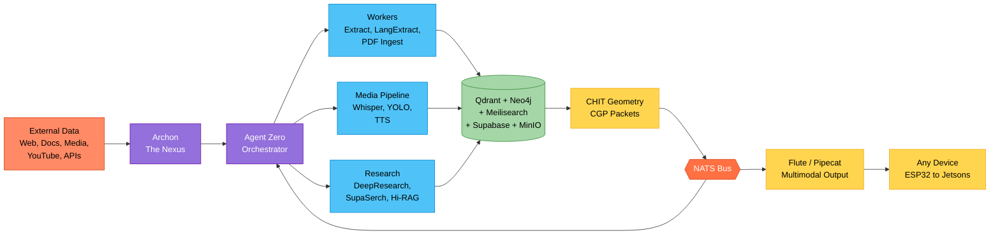
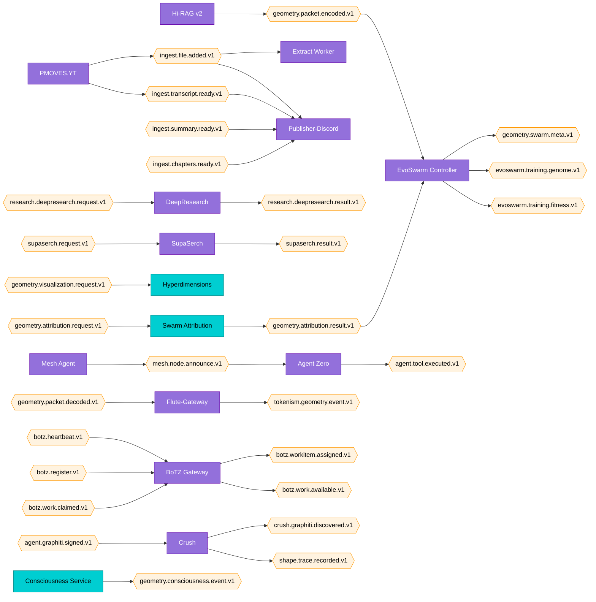

# PMOVES Agent Topology & TAC Tree

_v1.5.0 (76 agents; exact count varies per latest agent_registry.yaml scan) — Last updated: 2026-04-19_

Visual topology of the PMOVES.AI agent ecosystem. All diagrams are derived from the single source of truth at `pmoves/config/agent_registry.yaml` and can be regenerated with:

```bash
python -m pmoves.tools.agent_taxonomy_helper mermaid --style topology
python -m pmoves.tools.agent_taxonomy_helper mermaid --style tac
python -m pmoves.tools.agent_taxonomy_helper mermaid --style nats
```

---

## 1. Master Topology

The full agent network grouped by subsystem role. **Agent Zero** is the orchestrator at the center; all subsystems radiate from it.

- **Solid arrows** = MCP / direct API calls
- **Dashed arrows** (`-.-`) = NATS pub/sub
- **Dotted arrows** (`-.->`) = data flow

```mermaid
graph TD
    classDef legendary fill:#FFD700,stroke:#B8860B,color:#000
    classDef standard fill:#9370DB,stroke:#6A0DAD,color:#fff
    classDef specialized fill:#00CED1,stroke:#008B8B,color:#000
    classDef utility fill:#A9A9A9,stroke:#696969,color:#000

    subgraph AGENT_ZERO_CORE["Agent Zero Core — The Matrix"]
        agent_zero["Agent Zero<br/>:8080"]:::standard
    end

    subgraph ARCHON_NEXUS["Archon Nexus — External Data Gate"]
        archon["Archon<br/>:8091"]:::standard
    end

    subgraph BOTZ_SHIP["BoTZ Ship — Agent Runtime _(legacy)_"]
        botz_gateway["BoTZ Gateway<br/>:8054"]:::standard
        gateway_agent["Gateway Agent<br/>:8100"]:::standard
    end

    subgraph CLAWZ_DISCORD["ClaWZ — Discord Agent _(active)_"]
        clawz["ClaWZ<br/>PMOVES-ClawZ submodule"]:::standard
    end

    subgraph DOX_INTEL["DoX Intel — Document Intelligence"]
        dox["DoX"]:::standard
    end

    subgraph RESEARCH_KNOWLEDGE["Research & Knowledge"]
        supaserch["SupaSerch<br/>:8099"]:::standard
        deep_research["DeepResearch<br/>:8098"]:::standard
        hirag_v2["Hi-RAG v2<br/>:8086, :8087"]:::standard
        open_notebook["Open Notebook"]:::standard
    end

    subgraph MEDIA_PIPELINE["Media Pipeline"]
        pmoves_yt["PMOVES.YT<br/>:8077"]:::standard
        ffmpeg_whisper["FFmpeg-Whisper<br/>:8078"]:::standard
        media_video["Media-Video Analyzer<br/>:8079"]:::standard
        media_audio["Media-Audio Analyzer<br/>:8082"]:::standard
        channel_monitor["Channel Monitor<br/>:8097"]:::standard
        extract_worker["Extract Worker<br/>:8083"]:::standard
        langextract["LangExtract<br/>:8084"]:::standard
    end

    subgraph VOICE_COMMS["Voice & Comms — Flute"]
        flute_gateway["Flute-Gateway<br/>:8055"]:::standard
        ultimate_tts["Ultimate-TTS-Studio<br/>:7861"]:::standard
    end

    subgraph CIPHER_EVOLUTION["Cipher Evolution Backbone"]
        cipher_memory["Cipher Memory<br/>:8105"]:::specialized
        consciousness_service["Consciousness Service"]:::specialized
        evoswarm_controller["EvoSwarm Controller<br/>:8113"]:::standard
        swarm_attribution["Swarm Attribution"]:::specialized
    end

    subgraph AGENT_TRAINING["Agent Training & Sandbox"]
        agentgym["AgentGym"]:::standard
        agentgym_rl["AgentGym RL"]:::specialized
        e2b_danger_room["E2B Danger Room"]:::standard
        e2b_desktop["E2B Desktop"]:::standard
        danger_infra["Danger Infra"]:::utility
        e2b_spells["E2B Spells"]:::utility
        surf["Surf"]:::utility
    end

    subgraph UI_FRONTEND["UI & Frontend"]
        mai_ui["MAI-UI"]:::standard
        a2ui["A2UI"]:::standard
        crush["Crush"]:::standard
        hyperdimensions["Hyperdimensions"]:::specialized
    end

    subgraph PERSISTENCE["Persistence — CHIT Data Stores"]
        supabase["Supabase<br/>:3010"]:::utility
        qdrant["Qdrant<br/>:6333"]:::utility
        neo4j["Neo4j<br/>:7474"]:::utility
        meilisearch["Meilisearch<br/>:7700"]:::utility
        minio["MinIO<br/>:9000"]:::utility
    end

    subgraph INFRA["Infrastructure Backbone"]
        nats["NATS<br/>:4222"]:::utility
        tensorzero["TensorZero<br/>:3030"]:::standard
        prometheus["Prometheus<br/>:9090"]:::utility
        grafana["Grafana<br/>:3000"]:::utility
        loki["Loki<br/>:3100"]:::utility
        n8n_wf["n8n<br/>:5678"]:::utility
         headscale["Headscale<br/>:8096"]:::utility
        rustdesk["RustDesk<br/>:21115"]:::utility
        invidious["Invidious<br/>:3333"]:::utility
    end

    subgraph DOMAIN_APPS["Domain Applications"]
        wealth["Wealth"]:::specialized
        health_app["Health"]:::specialized
        creator["Creator"]:::standard
        llama_lab["Llama Throughput Lab"]:::specialized
        jellyfin_bridge["Jellyfin Bridge<br/>:8093"]:::specialized
        jellyfin_ai["Jellyfin AI"]:::specialized
        transcribe_and_fetch["Transcribe+Fetch"]:::specialized
        pdf_ingest["PDF Ingest<br/>:8092"]:::standard
        notebook_sync["Notebook Sync<br/>:8095"]:::standard
        publisher_discord["Publisher-Discord<br/>:8094"]:::standard
        presign["Presign<br/>:8088"]:::utility
        render_webhook["Render Webhook<br/>:8085"]:::utility
        mesh_agent["Mesh Agent"]:::standard
    end

    %% MCP / orchestration links
    agent_zero --> archon
    agent_zero --> botz_gateway %% _(legacy — Discord now via ClaWZ)_
    agent_zero --> supaserch
    agent_zero --> deep_research
    agent_zero --> dox
    agent_zero --> flute_gateway
    agent_zero --> cipher_memory
    agent_zero --> evoswarm_controller
    agent_zero --> mai_ui
    agent_zero --> clawz
    archon --> tensorzero
    botz_gateway --> gateway_agent

    %% Data flow
    extract_worker -.-> qdrant
    extract_worker -.-> meilisearch
    hirag_v2 -.-> qdrant
    hirag_v2 -.-> neo4j
    hirag_v2 -.-> meilisearch
    cipher_memory -.-> neo4j
    deep_research -.-> open_notebook
    pmoves_yt -.-> minio
    ffmpeg_whisper -.-> minio

    %% NATS pub/sub
    pmoves_yt -.- |NATS| extract_worker
    pmoves_yt -.- |NATS| publisher_discord
    mesh_agent -.- |NATS| agent_zero
    flute_gateway -.- |NATS| hirag_v2
    evoswarm_controller -.- |NATS| swarm_attribution
    consciousness_service -.- |NATS| hyperdimensions
    crush -.- |NATS| agent_zero
```

---

## 2. TAC Tree — Taxonomy-Agent-Connection

### 2.1 TAC Hierarchy

Shows the class-based hierarchy: POWERFULMOVES (Legendary) at the root, Agent Zero as the primary orchestrator, major subsystem heads branching below.

```mermaid
graph TD
    classDef legendary fill:#FFD700,stroke:#B8860B,color:#000
    classDef standard fill:#9370DB,stroke:#6A0DAD,color:#fff
    classDef specialized fill:#00CED1,stroke:#008B8B,color:#000
    classDef utility fill:#A9A9A9,stroke:#696969,color:#000

    PMOVES["POWERFULMOVES"]:::legendary
    PMOVES --> agent_zero["Agent Zero"]:::standard

    agent_zero --> archon["Archon"]:::standard
    agent_zero --> botz_gateway["BoTZ Gateway _(legacy)_"]:::standard
    agent_zero --> clawz["ClaWZ _(active Discord)_"]:::standard
    agent_zero --> supaserch["SupaSerch"]:::standard
    agent_zero --> deep_research["DeepResearch"]:::standard
    agent_zero --> dox["DoX"]:::standard
    agent_zero --> flute_gateway["Flute-Gateway"]:::standard
    agent_zero --> cipher_memory["Cipher Memory"]:::specialized
    agent_zero --> evoswarm_controller["EvoSwarm Controller"]:::standard
    agent_zero --> mai_ui["MAI-UI"]:::standard

    archon --> tensorzero["TensorZero"]:::standard
    botz_gateway --> gateway_agent["Gateway Agent"]:::standard
    supaserch --> hirag_v2["Hi-RAG v2"]:::standard
    deep_research --> open_notebook["Open Notebook"]:::standard
    cipher_memory --> consciousness_service["Consciousness Service"]:::specialized
    evoswarm_controller --> swarm_attribution["Swarm Attribution"]:::specialized

    %% Media sub-tree
    agent_zero --> pmoves_yt["PMOVES.YT"]:::standard
    pmoves_yt --> ffmpeg_whisper["FFmpeg-Whisper"]:::standard
    pmoves_yt --> media_video["Media-Video Analyzer"]:::standard
    pmoves_yt --> media_audio["Media-Audio Analyzer"]:::standard
    pmoves_yt --> channel_monitor["Channel Monitor"]:::standard
    pmoves_yt --> extract_worker["Extract Worker"]:::standard
    extract_worker --> langextract["LangExtract"]:::standard

    %% Training sub-tree
    agent_zero --> agentgym["AgentGym"]:::standard
    agentgym --> agentgym_rl["AgentGym RL"]:::specialized
    agentgym --> e2b_danger_room["E2B Danger Room"]:::standard
    e2b_danger_room --> e2b_desktop["E2B Desktop"]:::standard
    e2b_danger_room --> danger_infra["Danger Infra"]:::utility
    e2b_danger_room --> e2b_spells["E2B Spells"]:::utility
    agentgym --> surf["Surf"]:::utility

    %% UI sub-tree
    mai_ui --> a2ui["A2UI"]:::standard
    mai_ui --> crush["Crush"]:::standard
    mai_ui --> hyperdimensions["Hyperdimensions"]:::specialized

    %% Voice sub-tree
    flute_gateway --> ultimate_tts["Ultimate-TTS-Studio"]:::standard

    %% Persistence (utility backbone)
    agent_zero -.-> nats["NATS"]:::utility
    agent_zero -.-> supabase["Supabase"]:::utility
    hirag_v2 -.-> qdrant["Qdrant"]:::utility
    hirag_v2 -.-> neo4j["Neo4j"]:::utility
    hirag_v2 -.-> meilisearch["Meilisearch"]:::utility
    agent_zero -.-> minio["MinIO"]:::utility

    %% Infra
    agent_zero -.-> prometheus["Prometheus"]:::utility
    prometheus --> grafana["Grafana"]:::utility
    prometheus --> loki["Loki"]:::utility
    agent_zero -.-> n8n_wf["n8n"]:::utility
    agent_zero -.-> headscale["Headscale"]:::utility

    %% Domain apps
    agent_zero --> creator["Creator"]:::standard
    agent_zero --> pdf_ingest["PDF Ingest"]:::standard
    agent_zero --> notebook_sync["Notebook Sync"]:::standard
    agent_zero --> publisher_discord["Publisher-Discord"]:::standard
    agent_zero -.-> mesh_agent["Mesh Agent"]:::standard
    agent_zero -.-> jellyfin_bridge["Jellyfin Bridge"]:::specialized
    agent_zero -.-> jellyfin_ai["Jellyfin AI"]:::specialized
    agent_zero -.-> wealth["Wealth"]:::specialized
    agent_zero -.-> health_app["Health"]:::specialized
    agent_zero -.-> llama_lab["Llama Throughput Lab"]:::specialized
    agent_zero -.-> transcribe_and_fetch["Transcribe+Fetch"]:::specialized
    agent_zero -.-> presign["Presign"]:::utility
    agent_zero -.-> render_webhook["Render Webhook"]:::utility
    agent_zero -.-> rustdesk["RustDesk"]:::utility
    agent_zero -.-> invidious["Invidious"]:::utility
```



### 2.2 Assignment Table

Every registered agent mapped to its subsystem, class, type, tier, and NATS participation.

| Subsystem | Agent | Class | Type | Tier | Evo Stage | NATS Pub | NATS Sub |
|-----------|-------|-------|------|------|-----------|----------|----------|
| **Core** | Agent Zero | Standard | Agent/API | 6 | Mega | `agent.tool.executed.v1` | `mesh.node.announce.v1` |
| **Archon Nexus** | Archon | Standard | Agent/LLM | 6 | Stage 2 | — | — |
| **BoTZ Ship** | BoTZ Gateway | Standard | Agent/Worker | 6 | Stage 1 | `botz.workitem.assigned.v1`, `botz.work.available.v1` | `botz.heartbeat.v1`, `botz.register.v1`, `botz.work.claimed.v1` |
| **ClaWZ Discord** | ClaWZ | Standard | Agent/API | 6 | Stage 1 | — | — |
| **BoTZ Ship** | Gateway Agent | Standard | Agent/API | 6 | Stage 1 | — | — |
| **DoX Intel** | DoX | Standard | Worker/Data | 4 | Stage 1 | — | — |
| **Research** | SupaSerch | Standard | Agent/LLM | 6 | Stage 2 | `supaserch.result.v1` | `supaserch.request.v1` |
| **Research** | DeepResearch | Standard | LLM/Worker | 3 | Stage 1 | `research.deepresearch.result.v1` | `research.deepresearch.request.v1` |
| **Research** | Hi-RAG v2 | Standard | Worker/Data | 4 | Stage 2 | `geometry.packet.encoded.v1` | — |
| **Research** | Open Notebook | Standard | Data/UI | 1 | Stage 1 | — | — |
| **Media** | PMOVES.YT | Standard | Media/Worker | 5 | Stage 1 | `ingest.file.added.v1`, `ingest.transcript.ready.v1` | — |
| **Media** | FFmpeg-Whisper | Standard | Media/Worker | 5 | Stage 1 | — | — |
| **Media** | Media-Video Analyzer | Standard | Media/Worker | 5 | Stage 1 | — | — |
| **Media** | Media-Audio Analyzer | Standard | Media/Worker | 5 | Stage 1 | — | — |
| **Media** | Channel Monitor | Standard | Worker/Media | 4 | Base | — | — |
| **Media** | Extract Worker | Standard | Worker/Data | 4 | Stage 1 | — | `ingest.file.added.v1` |
| **Media** | LangExtract | Standard | Worker/LLM | 4 | Base | — | — |
| **Voice** | Flute-Gateway | Standard | API/Media | 2 | Stage 1 | `tokenism.geometry.event.v1` | `geometry.packet.decoded.v1` |
| **Voice** | Ultimate-TTS-Studio | Standard | Media/LLM | 5 | Base | — | — |
| **Cipher** | Cipher Memory | Specialized | Data/Agent | 1 | Base | — | — |
| **Cipher** | Consciousness Service | Specialized | Agent/LLM | 6 | Base | `geometry.consciousness.event.v1` | — |
| **Cipher** | EvoSwarm Controller | Standard | Worker/Agent | 4 | Stage 2 | `geometry.swarm.meta.v1`, `evoswarm.training.genome.v1`, `evoswarm.training.fitness.v1` | `geometry.packet.encoded.v1`, `geometry.attribution.result.v1` |
| **Cipher** | Swarm Attribution | Specialized | Worker/Data | 4 | Base | `geometry.attribution.result.v1` | `geometry.attribution.request.v1` |
| **Training** | AgentGym | Standard | Agent/Worker | 6 | Base | — | — |
| **Training** | AgentGym RL | Specialized | Agent/Worker | 6 | Base | — | — |
| **Training** | E2B Danger Room | Standard | Agent/Worker | 6 | Base | — | — |
| **Training** | E2B Desktop | Standard | UI/Agent | 7 | Base | — | — |
| **Training** | Danger Infra | Utility | Worker/Agent | 4 | Base | — | — |
| **Training** | E2B Spells | Utility | Agent/Worker | 6 | Base | — | — |
| **Training** | Surf | Utility | Agent/UI | 6 | Base | — | — |
| **UI** | MAI-UI | Standard | UI/Agent | 7 | Base | — | — |
| **UI** | A2UI | Standard | UI/Agent | 7 | Base | — | — |
| **UI** | Crush | Standard | UI/Agent | 7 | Stage 1 | `crush.graphiti.discovered.v1`, `shape.trace.recorded.v1` | `agent.graphiti.signed.v1` |
| **UI** | Hyperdimensions | Specialized | UI/Data | 7 | Base | — | `geometry.visualization.request.v1` |
| **Persistence** | Supabase | Utility | Data/API | 1 | Base | — | — |
| **Persistence** | Qdrant | Utility | Data/Worker | 1 | Base | — | — |
| **Persistence** | Neo4j | Utility | Data/Agent | 1 | Base | — | — |
| **Persistence** | Meilisearch | Utility | Data/API | 1 | Base | — | — |
| **Persistence** | MinIO | Utility | Data/API | 1 | Base | — | — |
| **Infra** | NATS | Utility | Data/API | 1 | Base | — | — |
| **Infra** | TensorZero Gateway | Standard | API/LLM | 2 | Stage 1 | — | — |
| **Infra** | Prometheus | Utility | Data/UI | 1 | Base | — | — |
| **Infra** | Grafana | Utility | UI/Data | 7 | Base | — | — |
| **Infra** | Loki | Utility | Data/API | 1 | Base | — | — |
| **Infra** | n8n | Utility | Worker/Agent | 4 | Base | — | — |
| **Infra** | Headscale | Utility | Data/API | 1 | Base | — | — |
| **Infra** | RustDesk | Utility | UI/API | 7 | Base | — | — |
| **Infra** | Invidious | Utility | UI/Media | 7 | Base | — | — |
| **Domain** | Wealth | Specialized | UI/Data | 7 | Base | — | — |
| **Domain** | Health | Specialized | UI/Data | 7 | Base | — | — |
| **Domain** | Creator | Standard | Media/UI | 5 | Base | — | — |
| **Domain** | Llama Throughput Lab | Specialized | LLM/Worker | 3 | Base | — | — |
| **Domain** | Jellyfin Bridge | Specialized | Media/Data | 5 | Base | — | — |
| **Domain** | Jellyfin AI Media Stack | Specialized | Media/LLM | 5 | Base | — | — |
| **Domain** | Transcribe and Fetch | Specialized | Media/Worker | 5 | Base | — | — |
| **Domain** | PDF Ingest | Standard | Worker/Data | 4 | Stage 1 | — | — |
| **Domain** | Notebook Sync | Standard | Worker/Data | 4 | Base | — | — |
| **Domain** | Publisher-Discord | Standard | Worker/API | 4 | Base | — | `ingest.file.added.v1`, `ingest.transcript.ready.v1`, `ingest.summary.ready.v1`, `ingest.chapters.ready.v1` |
| **Domain** | Presign | Utility | API/Data | 2 | Base | — | — |
| **Domain** | Render Webhook | Utility | API/Worker | 2 | Base | — | — |
| **Domain** | Mesh Agent | Standard | Agent/Data | 6 | Base | `mesh.node.announce.v1` | — |

---

## 3. Agent Evolution Path

The CLI-to-Mega evolution pipeline. Agents grow through use: context accumulates, Cipher stores reasoning traces, CHIT persists geometric state, and teams form when context limits are reached.

```mermaid
graph LR
    classDef base fill:#E0E0E0,stroke:#9E9E9E,color:#000
    classDef stage1 fill:#B39DDB,stroke:#7E57C2,color:#fff
    classDef stage2 fill:#7E57C2,stroke:#4527A0,color:#fff
    classDef mega fill:#FFD700,stroke:#B8860B,color:#000
    classDef cipher fill:#00CED1,stroke:#008B8B,color:#000
    classDef team fill:#FF7043,stroke:#D84315,color:#fff
    classDef chit fill:#66BB6A,stroke:#388E3C,color:#000

    CLI_BASE["CLI Agent<br/>Base stage<br/>1-2 layers"]:::base
    STAGE1["Stage 1<br/>3-4 layers<br/>NATS connected"]:::stage1
    CIPHER_STORE["Cipher stores<br/>reasoning trace<br/>(agent_plan)"]:::cipher
    STAGE2["Stage 2<br/>5+ layers<br/>CHIT-enabled<br/>CGP packets"]:::stage2
    MEGA["Mega Evolution<br/>all layers<br/>all planes"]:::mega

    CLI_BASE -->|"simple tasks"| STAGE1
    STAGE1 -->|"context grows"| CIPHER_STORE
    CIPHER_STORE -->|"patterns learned<br/>(agent_checkpoint)"| STAGE2
    STAGE2 -->|"full integration<br/>(agent_completion)"| MEGA

    subgraph TEAM_FORMATION["Team Formation"]
        LISTENING["Listening agents<br/>detect context limit"]:::team
        ACTIVATE["Team activates<br/>via NATS"]:::team
        AUTONOMOUS["Safe autonomous<br/>tool execution"]:::team
    end

    STAGE1 -->|"context limit"| LISTENING
    LISTENING --> ACTIVATE
    ACTIVATE --> AUTONOMOUS
    AUTONOMOUS -->|"persist"| CHIT["CHIT State<br/>Reproducible Feats<br/>CGP Packets"]:::chit
    CHIT --> STAGE2
```



**Cipher Memory Categories in the Evolution Flow:**

| Category | When | Purpose |
|----------|------|---------|
| `agent_plan` | Task starts | Stores intent, scope, and approach |
| `agent_checkpoint` | Mid-operation | Intermediate state for recovery |
| `agent_completion` | Task ends | Final result, patterns learned |

---

## 4. Data Flow

External data enters through Archon (the Nexus), flows through Agent Zero to workers, research, and media pipelines, persists in data stores, and exits through Flute/Pipecat to any device.



---

## 5. NATS Nervous System

Only agents with declared NATS subjects (from registry `nats.publishes` / `nats.subscribes`). Directed edges: publisher --> subject --> subscriber.



---

## Related Documents

- [`PMOVES_AGENT_CLASS_TAXONOMY.md`](./PMOVES_AGENT_CLASS_TAXONOMY.md) — Class hierarchy, type system, evolution stages
- [`AGENT_TAXONOMY_CROSS_REFERENCE.md`](./AGENT_TAXONOMY_CROSS_REFERENCE.md) — Master cross-reference hub
- [`AGENT_RESILIENCE_PATTERNS.md`](./AGENT_RESILIENCE_PATTERNS.md) — Resilience protocol and patterns
- [`../PMOVESCHIT/LIVING_TEMPLATE_AGENT_TAXONOMY.md`](../PMOVESCHIT/LIVING_TEMPLATE_AGENT_TAXONOMY.md) — Living template with CHIT examples
- `pmoves/tools/agent_taxonomy_helper.py` — CLI query tool (`mermaid` subcommand)
- `pmoves/config/agent_registry.yaml` — Single source of truth (machine-readable)

---

## Topology Update Notes (2026-04-19)

### ClaWZ — Active Discord Agent
ClaWZ (PMOVES-ClawZ submodule) is now the **active** Discord agent, replacing the BoTZ Gateway pattern for Discord-mediated interactions. BoTZ Ship subgraphs and references are retained for historical context but marked as `_(legacy)_`.

### A2A Server Topology (PR #1293)
A2A (Agent-to-Agent) protocol is now wired into the compose stack. Agent Zero exposes an A2A endpoint for cross-agent communication. See `docker-compose.yml` and `.claude/mcp.json` for wiring details.

### Sidecar Topology (PR #1299)
Portable sidecar configuration enables Agent Zero to run as a standalone container on any device with Docker, using `host.docker.internal` for host service access. See `deploy/sidecar/` and `PMOVES_AI_CONFIG.promptinclude.md` for sidecar topology notes.

### Publisher-Discord Gap
Publisher-Discord remains **planned but not yet implemented**. It is listed in the assignment table but has no active service code. ClaWZ coding plan identifies this as a gap to close.
