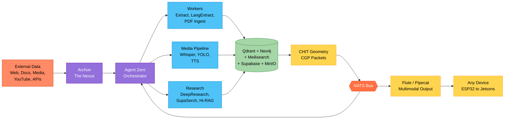

# PMOVES Agent Topology & TAC Tree

_v1.5.0 (79 agents; regenerated from agent_registry.yaml) — Last updated: 2026-07-02_

Visual topology of the PMOVES.AI agent ecosystem. All diagrams are derived from the single source of truth at `pmoves/config/agent_registry.yaml` and can be regenerated with:

```bash
python -m pmoves.tools.agent_taxonomy_helper mermaid --style topology
python -m pmoves.tools.agent_taxonomy_helper mermaid --style tac
python -m pmoves.tools.agent_taxonomy_helper mermaid --style nats
```

---

## 1. Master Topology

The full agent network grouped by subsystem role. **Agent Zero** is the orchestrator at the center; all subsystems radiate from it.

- **Solid arrows** = MCP / direct API calls
- **Dashed arrows** (`-.-`) = NATS pub/sub
- **Dotted arrows** (`-.->`) = data flow

```mermaid
graph TD
    classDef legendary fill:#FFD700,stroke:#B8860B,color:#000
    classDef standard fill:#9370DB,stroke:#6A0DAD,color:#fff
    classDef specialized fill:#00CED1,stroke:#008B8B,color:#000
    classDef utility fill:#A9A9A9,stroke:#696969,color:#000

    subgraph AGENT_ZERO_CORE["Agent Zero Core — The Matrix"]
        agent_zero["Agent Zero<br/>:8080"]:::standard
    end

    subgraph ARCHON_NEXUS["Archon Nexus — External Data Gate"]
        archon["Archon<br/>:8091"]:::standard
    end

    subgraph BOTZ_SHIP["BoTZ Ship — Agent Runtime"]
        botz_gateway["BoTZ Gateway<br/>:8054"]:::standard
        gateway_agent["Gateway Agent<br/>:8111"]:::standard
    end

    subgraph DOX_INTEL["DoX Intel — Document Intelligence"]
        dox["DoX"]:::standard
    end

    subgraph RESEARCH_KNOWLEDGE["Research & Knowledge"]
        supaserch["SupaSerch<br/>:8099"]:::standard
        deep_research["DeepResearch<br/>:8098"]:::standard
        hirag_v2["Hi-RAG v2<br/>:8086"]:::standard
        open_notebook["Open Notebook"]:::standard
    end

    subgraph MEDIA_PIPELINE["Media Pipeline"]
        pmoves_yt["PMOVES.YT<br/>:8077"]:::standard
        ffmpeg_whisper["FFmpeg-Whisper<br/>:8078"]:::standard
        media_video["Media-Video Analyzer<br/>:8079"]:::standard
        media_audio["Media-Audio Analyzer<br/>:8082"]:::standard
        channel_monitor["Channel Monitor<br/>:8097"]:::standard
        extract_worker["Extract Worker<br/>:8083"]:::standard
        langextract["LangExtract<br/>:8084"]:::standard
    end

    subgraph VOICE_COMMS["Voice & Comms — Flute"]
        flute_gateway["Flute-Gateway<br/>:8055"]:::standard
        ultimate_tts["Ultimate-TTS-Studio<br/>:7861"]:::standard
    end

    subgraph CIPHER_EVOLUTION["Cipher Evolution Backbone"]
        cipher_memory["Cipher Memory<br/>:8105"]:::specialized
        consciousness_service["Consciousness Service"]:::specialized
        evoswarm_controller["EvoSwarm Controller<br/>:8113"]:::standard
        swarm_attribution["Swarm Attribution"]:::specialized
    end

    subgraph AGENT_TRAINING["Agent Training & Sandbox"]
        agentgym["AgentGym"]:::standard
        agentgym_rl["AgentGym RL"]:::specialized
        e2b_danger_room["E2B Danger Room"]:::standard
        e2b_desktop["E2B Desktop"]:::standard
        danger_infra["Danger Infra"]:::utility
        e2b_spells["E2B Spells"]:::utility
        surf["Surf"]:::utility
    end

    subgraph UI_FRONTEND["UI & Frontend"]
        mai_ui["MAI-UI"]:::standard
        a2ui["A2UI"]:::standard
        crush["Crush"]:::standard
        hyperdimensions["Hyperdimensions"]:::specialized
    end

    subgraph PERSISTENCE["Persistence — CHIT Data Stores"]
        supabase["Supabase<br/>:3010"]:::utility
        qdrant["Qdrant<br/>:6333"]:::utility
        neo4j["Neo4j<br/>:7474"]:::utility
        meilisearch["Meilisearch<br/>:7700"]:::utility
        minio["MinIO<br/>:9000"]:::utility
    end

    subgraph INFRA["Infrastructure Backbone"]
        nats["NATS<br/>:4222"]:::utility
        tensorzero["TensorZero Gateway<br/>:3030"]:::standard
        prometheus["Prometheus<br/>:9090"]:::utility
        grafana["Grafana<br/>:3002"]:::utility
        loki["Loki<br/>:3100"]:::utility
        n8n["n8n<br/>:5678"]:::utility
        headscale["Headscale<br/>:8096"]:::utility
        rustdesk["RustDesk<br/>:21115"]:::utility
        invidious["Invidious<br/>:3333"]:::utility
    end

    subgraph DOMAIN_APPS["Domain Applications"]
        wealth["Wealth (Firefly III)"]:::specialized
        health["Health (wger)"]:::specialized
        creator["Creator"]:::standard
        llama_lab["Llama Throughput Lab"]:::specialized
        jellyfin_bridge["Jellyfin Bridge<br/>:8093"]:::specialized
        jellyfin_ai["Jellyfin AI Media Stack"]:::specialized
        transcribe_and_fetch["Transcribe and Fetch"]:::specialized
        pdf_ingest["PDF Ingest<br/>:8092"]:::standard
        notebook_sync["Notebook Sync<br/>:8095"]:::standard
        publisher_discord["Publisher-Discord<br/>:8094"]:::standard
        presign["Presign<br/>:8088"]:::utility
        render_webhook["Render Webhook<br/>:8085"]:::utility
        mesh_agent["Mesh Agent"]:::standard
    end

    %% MCP / orchestration links
    agent_zero --> archon
    agent_zero --> botz_gateway
    agent_zero --> mesh_agent
    agent_zero --> supaserch
    agent_zero --> deep_research
    archon --> tensorzero
    botz_gateway --> gateway_agent

    %% Data flow
    extract_worker -.-> qdrant
    extract_worker -.-> meilisearch
    hirag_v2 -.-> qdrant
    hirag_v2 -.-> neo4j
    hirag_v2 -.-> meilisearch
    cipher_memory -.-> neo4j

    %% NATS pub/sub
    pmoves_yt -.- |NATS| extract_worker
    pmoves_yt -.- |NATS| publisher_discord
    mesh_agent -.- |NATS| agent_zero
    flute_gateway -.- |NATS| hirag_v2
    evoswarm_controller -.- |NATS| swarm_attribution
```



---

## 2. TAC Tree — Taxonomy-Agent-Connection

### 2.1 TAC Hierarchy

Shows the class-based hierarchy: POWERFULMOVES (Legendary) at the root, Agent Zero as the primary orchestrator, major subsystem heads branching below.

```mermaid
graph TD
    classDef legendary fill:#FFD700,stroke:#B8860B,color:#000
    classDef standard fill:#9370DB,stroke:#6A0DAD,color:#fff
    classDef specialized fill:#00CED1,stroke:#008B8B,color:#000
    classDef utility fill:#A9A9A9,stroke:#696969,color:#000

    PMOVES["POWERFULMOVES"]:::legendary
    PMOVES --> agent_zero

    a2ui["A2UI"]:::standard
    agent_zero["Agent Zero"]:::standard
    agentgym["AgentGym"]:::standard
    archon["Archon"]:::standard
    botz_architect["BoTZ Architect"]:::standard
    botz_auditor["BoTZ Auditor"]:::standard
    botz_builder["BoTZ Builder"]:::standard
    botz_gateway["BoTZ Gateway"]:::standard
    cast_tts_gateway["Cast TTS Gateway"]:::standard
    channel_monitor["Channel Monitor"]:::standard
    clawz["ClawZ (OpenClaw)"]:::standard
    creator["Creator"]:::standard
    crush["Crush"]:::standard
    deep_research["DeepResearch"]:::standard
    dox["DoX"]:::standard
    e2b_danger_room["E2B Danger Room"]:::standard
    e2b_desktop["E2B Desktop"]:::standard
    evoswarm_controller["EvoSwarm Controller"]:::standard
    extract_worker["Extract Worker"]:::standard
    ffmpeg_whisper["FFmpeg-Whisper"]:::standard
    flute_gateway["Flute-Gateway"]:::standard
    gateway_agent["Gateway Agent"]:::standard
    hirag_v2["Hi-RAG v2"]:::standard
    langextract["LangExtract"]:::standard
    mai_ui["MAI-UI"]:::standard
    media_audio["Media-Audio Analyzer"]:::standard
    media_video["Media-Video Analyzer"]:::standard
    mesh_agent["Mesh Agent"]:::standard
    notebook_sync["Notebook Sync"]:::standard
    open_notebook["Open Notebook"]:::standard
    pdf_ingest["PDF Ingest"]:::standard
    pmoves_yt["PMOVES.YT"]:::standard
    publisher_discord["Publisher-Discord"]:::standard
    space_agent["PMOVES Space-Agent"]:::standard
    supaserch["SupaSerch"]:::standard
    tensorzero["TensorZero Gateway"]:::standard
    ultimate_tts["Ultimate-TTS-Studio"]:::standard
    agentgym_rl["AgentGym RL"]:::specialized
    autoresearch["autoresearch"]:::specialized
    cipher_beats_analyst["Cipher Beats Analyst"]:::specialized
    cipher_memory["Cipher Memory"]:::specialized
    consciousness_service["Consciousness Service"]:::specialized
    dashboard_specialist["Grafana Dashboard Specialist"]:::specialized
    health["Health (wger)"]:::specialized
    hyperdimensions["Hyperdimensions"]:::specialized
    jellyfin_ai["Jellyfin AI Media Stack"]:::specialized
    jellyfin_bridge["Jellyfin Bridge"]:::specialized
    llama_lab["Llama Throughput Lab"]:::specialized
    llm_observability["TensorZero LLM Observability Specialist"]:::specialized
    logs_specialist["Loki Logs Specialist"]:::specialized
    metrics_specialist["Prometheus Metrics Specialist"]:::specialized
    swarm_attribution["Swarm Attribution"]:::specialized
    tracing_specialist["Jaeger Tracing Specialist"]:::specialized
    transcribe_and_fetch["Transcribe and Fetch"]:::specialized
    wealth["Wealth (Firefly III)"]:::specialized
    a0_plugins["a0-plugins"]:::utility
    danger_infra["Danger Infra"]:::utility
    e2b_spells["E2B Spells"]:::utility
    grafana["Grafana"]:::utility
    headscale["Headscale"]:::utility
    hermes_agent["HERMES Agent"]:::utility
    invidious["Invidious"]:::utility
    loki["Loki"]:::utility
    meilisearch["Meilisearch"]:::utility
    minio["MinIO"]:::utility
    n8n["n8n"]:::utility
    nats["NATS"]:::utility
    neo4j["Neo4j"]:::utility
    pmoves_e2b_mcp_server["E2B MCP Server"]:::utility
    pr_hedge_trim["PR Hedge Trim"]:::utility
    presign["Presign"]:::utility
    prometheus["Prometheus"]:::utility
    qdrant["Qdrant"]:::utility
    render_webhook["Render Webhook"]:::utility
    rustdesk["RustDesk"]:::utility
    supabase["Supabase"]:::utility
    surf["Surf"]:::utility
    vps_fleet_manager["VPS Fleet Manager"]:::utility

    agent_zero --> archon
    agent_zero --> botz_gateway
    agent_zero --> supaserch
    agent_zero --> deep_research
    agent_zero --> dox
    agent_zero --> flute_gateway
    agent_zero --> cipher_memory
    agent_zero --> evoswarm_controller
    agent_zero --> mai_ui

    archon --> tensorzero
    botz_gateway --> gateway_agent
    supaserch --> hirag_v2
    deep_research --> open_notebook
```



### 2.2 Assignment Table

Every registered agent mapped to its subsystem, class, type, tier, and NATS participation.

| Subsystem | Agent | Class | Type | Tier | Evo Stage | NATS Pub | NATS Sub |
|-----------|-------|-------|------|------|-----------|----------|----------|
| **Core** | Agent Zero | Standard | Agent/API | 6 | Mega | `agent.tool.executed.v1` | `mesh.node.announce.v1` |
| **Archon Nexus** | Archon | Standard | Agent/LLM | 6 | Stage 2 | — | — |
| **BoTZ Ship** | BoTZ Gateway | Standard | Agent/Worker | 6 | Stage 1 | `botz.workitem.assigned.v1`, `botz.work.available.v1` | `botz.heartbeat.v1`, `botz.register.v1`, `botz.work.claimed.v1` |
| **ClaWZ Discord** | ClaWZ | Standard | Agent/API | 6 | Stage 1 | — | — |
| **BoTZ Ship** | Gateway Agent | Standard | Agent/API | 6 | Stage 1 | — | — |
| **DoX Intel** | DoX | Standard | Worker/Data | 4 | Stage 1 | — | — |
| **Research** | SupaSerch | Standard | Agent/LLM | 6 | Stage 2 | `supaserch.result.v1` | `supaserch.request.v1` |
| **Research** | DeepResearch | Standard | LLM/Worker | 3 | Stage 1 | `research.deepresearch.result.v1` | `research.deepresearch.request.v1` |
| **Research** | Hi-RAG v2 | Standard | Worker/Data | 4 | Stage 2 | `geometry.packet.encoded.v1` | — |
| **Research** | Open Notebook | Standard | Data/UI | 1 | Stage 1 | — | — |
| **Media** | PMOVES.YT | Standard | Media/Worker | 5 | Stage 1 | `ingest.file.added.v1`, `ingest.transcript.ready.v1` | — |
| **Media** | FFmpeg-Whisper | Standard | Media/Worker | 5 | Stage 1 | — | — |
| **Media** | Media-Video Analyzer | Standard | Media/Worker | 5 | Stage 1 | — | — |
| **Media** | Media-Audio Analyzer | Standard | Media/Worker | 5 | Stage 1 | — | — |
| **Media** | Channel Monitor | Standard | Worker/Media | 4 | Base | — | — |
| **Media** | Extract Worker | Standard | Worker/Data | 4 | Stage 1 | — | `ingest.file.added.v1` |
| **Media** | LangExtract | Standard | Worker/LLM | 4 | Base | — | — |
| **Voice** | Flute-Gateway | Standard | API/Media | 2 | Stage 1 | `tokenism.geometry.event.v1` | `geometry.packet.decoded.v1` |
| **Voice** | Ultimate-TTS-Studio | Standard | Media/LLM | 5 | Base | — | — |
| **Cipher** | Cipher Memory | Specialized | Data/Agent | 1 | Base | — | — |
| **Cipher** | Consciousness Service | Specialized | Agent/LLM | 6 | Base | `geometry.consciousness.event.v1` | — |
| **Cipher** | EvoSwarm Controller | Standard | Worker/Agent | 4 | Stage 2 | `geometry.swarm.meta.v1`, `evoswarm.training.genome.v1`, `evoswarm.training.fitness.v1` | `geometry.packet.encoded.v1`, `geometry.attribution.result.v1` |
| **Cipher** | Swarm Attribution | Specialized | Worker/Data | 4 | Base | `geometry.attribution.result.v1` | `geometry.attribution.request.v1` |
| **Training** | AgentGym | Standard | Agent/Worker | 6 | Base | — | — |
| **Training** | AgentGym RL | Specialized | Agent/Worker | 6 | Base | — | — |
| **Training** | E2B Danger Room | Standard | Agent/Worker | 6 | Base | — | — |
| **Training** | E2B Desktop | Standard | UI/Agent | 7 | Base | — | — |
| **Training** | Danger Infra | Utility | Worker/Agent | 4 | Base | — | — |
| **Training** | E2B Spells | Utility | Agent/Worker | 6 | Base | — | — |
| **Training** | Surf | Utility | Agent/UI | 6 | Base | — | — |
| **UI** | MAI-UI | Standard | UI/Agent | 7 | Base | — | — |
| **UI** | A2UI | Standard | UI/Agent | 7 | Base | — | — |
| **UI** | Crush | Standard | UI/Agent | 7 | Stage 1 | `crush.graphiti.discovered.v1`, `shape.trace.recorded.v1` | `agent.graphiti.signed.v1` |
| **UI** | Hyperdimensions | Specialized | UI/Data | 7 | Base | — | `geometry.visualization.request.v1` |
| **Persistence** | Supabase | Utility | Data/API | 1 | Base | — | — |
| **Persistence** | Qdrant | Utility | Data/Worker | 1 | Base | — | — |
| **Persistence** | Neo4j | Utility | Data/Agent | 1 | Base | — | — |
| **Persistence** | Meilisearch | Utility | Data/API | 1 | Base | — | — |
| **Persistence** | MinIO | Utility | Data/API | 1 | Base | — | — |
| **Infra** | NATS | Utility | Data/API | 1 | Base | — | — |
| **Infra** | TensorZero Gateway | Standard | API/LLM | 2 | Stage 1 | — | — |
| **Infra** | Prometheus | Utility | Data/UI | 1 | Base | — | — |
| **Infra** | Grafana | Utility | UI/Data | 7 | Base | — | — |
| **Infra** | Loki | Utility | Data/API | 1 | Base | — | — |
| **Infra** | n8n | Utility | Worker/Agent | 4 | Base | — | — |
| **Infra** | Headscale | Utility | Data/API | 1 | Base | — | — |
| **Infra** | RustDesk | Utility | UI/API | 7 | Base | — | — |
| **Infra** | Invidious | Utility | UI/Media | 7 | Base | — | — |
| **Domain** | Wealth | Specialized | UI/Data | 7 | Base | — | — |
| **Domain** | Health | Specialized | UI/Data | 7 | Base | — | — |
| **Domain** | Creator | Standard | Media/UI | 5 | Base | — | — |
| **Domain** | Llama Throughput Lab | Specialized | LLM/Worker | 3 | Base | — | — |
| **Domain** | Jellyfin Bridge | Specialized | Media/Data | 5 | Base | — | — |
| **Domain** | Jellyfin AI Media Stack | Specialized | Media/LLM | 5 | Base | — | — |
| **Domain** | Transcribe and Fetch | Specialized | Media/Worker | 5 | Base | — | — |
| **Domain** | PDF Ingest | Standard | Worker/Data | 4 | Stage 1 | — | — |
| **Domain** | Notebook Sync | Standard | Worker/Data | 4 | Base | — | — |
| **Domain** | Publisher-Discord | Standard | Worker/API | 4 | Base | — | `ingest.file.added.v1`, `ingest.transcript.ready.v1`, `ingest.summary.ready.v1`, `ingest.chapters.ready.v1` |
| **Domain** | Presign | Utility | API/Data | 2 | Base | — | — |
| **Domain** | Render Webhook | Utility | API/Worker | 2 | Base | — | — |
| **Domain** | Mesh Agent | Standard | Agent/Data | 6 | Base | `mesh.node.announce.v1` | — |

---

## 3. Agent Evolution Path

The CLI-to-Mega evolution pipeline. Agents grow through use: context accumulates, Cipher stores reasoning traces, CHIT persists geometric state, and teams form when context limits are reached.

```mermaid
graph LR
    classDef base fill:#E0E0E0,stroke:#9E9E9E,color:#000
    classDef stage1 fill:#B39DDB,stroke:#7E57C2,color:#fff
    classDef stage2 fill:#7E57C2,stroke:#4527A0,color:#fff
    classDef mega fill:#FFD700,stroke:#B8860B,color:#000
    classDef cipher fill:#00CED1,stroke:#008B8B,color:#000
    classDef team fill:#FF7043,stroke:#D84315,color:#fff
    classDef chit fill:#66BB6A,stroke:#388E3C,color:#000

    CLI_BASE["CLI Agent<br/>Base stage<br/>1-2 layers"]:::base
    STAGE1["Stage 1<br/>3-4 layers<br/>NATS connected"]:::stage1
    CIPHER_STORE["Cipher stores<br/>reasoning trace<br/>(agent_plan)"]:::cipher
    STAGE2["Stage 2<br/>5+ layers<br/>CHIT-enabled<br/>CGP packets"]:::stage2
    MEGA["Mega Evolution<br/>all layers<br/>all planes"]:::mega

    CLI_BASE -->|"simple tasks"| STAGE1
    STAGE1 -->|"context grows"| CIPHER_STORE
    CIPHER_STORE -->|"patterns learned<br/>(agent_checkpoint)"| STAGE2
    STAGE2 -->|"full integration<br/>(agent_completion)"| MEGA

    subgraph TEAM_FORMATION["Team Formation"]
        LISTENING["Listening agents<br/>detect context limit"]:::team
        ACTIVATE["Team activates<br/>via NATS"]:::team
        AUTONOMOUS["Safe autonomous<br/>tool execution"]:::team
    end

    STAGE1 -->|"context limit"| LISTENING
    LISTENING --> ACTIVATE
    ACTIVATE --> AUTONOMOUS
    AUTONOMOUS -->|"persist"| CHIT["CHIT State<br/>Reproducible Feats<br/>CGP Packets"]:::chit
    CHIT --> STAGE2
```



**Cipher Memory Categories in the Evolution Flow:**

| Category | When | Purpose |
|----------|------|---------|
| `agent_plan` | Task starts | Stores intent, scope, and approach |
| `agent_checkpoint` | Mid-operation | Intermediate state for recovery |
| `agent_completion` | Task ends | Final result, patterns learned |

---

## 4. Data Flow

External data enters through Archon (the Nexus), flows through Agent Zero to workers, research, and media pipelines, persists in data stores, and exits through Flute/Pipecat to any device.



---

## 5. NATS Nervous System

Only agents with declared NATS subjects (from registry `nats.publishes` / `nats.subscribes`). Directed edges: publisher --> subject --> subscriber.

```mermaid
graph LR
    classDef legendary fill:#FFD700,stroke:#B8860B,color:#000
    classDef standard fill:#9370DB,stroke:#6A0DAD,color:#fff
    classDef specialized fill:#00CED1,stroke:#008B8B,color:#000
    classDef utility fill:#A9A9A9,stroke:#696969,color:#000
    classDef subject fill:#FFF3E0,stroke:#FF9800,color:#000

    agent_zero["Agent Zero"]:::standard
    space_agent["PMOVES Space-Agent"]:::standard
    supaserch["SupaSerch"]:::standard
    botz_gateway["BoTZ Gateway"]:::standard
    botz_architect["BoTZ Architect"]:::standard
    botz_builder["BoTZ Builder"]:::standard
    botz_auditor["BoTZ Auditor"]:::standard
    mesh_agent["Mesh Agent"]:::standard
    hirag_v2["Hi-RAG v2"]:::standard
    deep_research["DeepResearch"]:::standard
    flute_gateway["Flute-Gateway"]:::standard
    cast_tts_gateway["Cast TTS Gateway"]:::standard
    pmoves_yt["PMOVES.YT"]:::standard
    extract_worker["Extract Worker"]:::standard
    publisher_discord["Publisher-Discord"]:::standard
    crush["Crush"]:::standard
    cipher_memory["Cipher Memory"]:::specialized
    hyperdimensions["Hyperdimensions"]:::specialized
    vps_fleet_manager["VPS Fleet Manager"]:::utility
    pr_hedge_trim["PR Hedge Trim"]:::utility
    consciousness_service["Consciousness Service"]:::specialized
    wealth["Wealth (Firefly III)"]:::specialized
    health["Health (wger)"]:::specialized
    evoswarm_controller["EvoSwarm Controller"]:::standard
    swarm_attribution["Swarm Attribution"]:::specialized
    autoresearch["autoresearch"]:::specialized
    clawz["ClawZ (OpenClaw)"]:::standard
    metrics_specialist["Prometheus Metrics Specialist"]:::specialized
    dashboard_specialist["Grafana Dashboard Specialist"]:::specialized
    logs_specialist["Loki Logs Specialist"]:::specialized
    tracing_specialist["Jaeger Tracing Specialist"]:::specialized
    llm_observability["TensorZero LLM Observability Specialist"]:::specialized
    cipher_beats_analyst["Cipher Beats Analyst"]:::specialized
    pmoves_ci_bot["PMOVES CI Bot"]:::ci
    hermes_agent["HERMES Agent"]:::utility

    agent_graphiti_signed_v1{"agent.graphiti.signed.v1"}:::subject
    agent_tool_executed_v1{"agent.tool.executed.v1"}:::subject
    botz_audit_completed_v1{"botz.audit.completed.v1"}:::subject
    botz_build_completed_v1{"botz.build.completed.v1"}:::subject
    botz_heartbeat_v1{"botz.heartbeat.v1"}:::subject
    botz_plan_created_v1{"botz.plan.created.v1"}:::subject
    botz_register_v1{"botz.register.v1"}:::subject
    botz_work_available_v1{"botz.work.available.v1"}:::subject
    botz_work_claimed_v1{"botz.work.claimed.v1"}:::subject
    botz_workitem_assigned_v1{"botz.workitem.assigned.v1"}:::subject
    branch_<path-segments>_trail_v1{"branch.<path-segments>.trail.v1"}:::subject
    cipher_memory_searched_v1{"cipher.memory.searched.v1"}:::subject
    cipher_memory_stored_v1{"cipher.memory.stored.v1"}:::subject
    cipher_reasoning_stored_v1{"cipher.reasoning.stored.v1"}:::subject
    crush_graphiti_discovered_v1{"crush.graphiti.discovered.v1"}:::subject
    device_cast_discovered_v1{"device.cast.discovered.v1"}:::subject
    evoswarm_training_fitness_v1{"evoswarm.training.fitness.v1"}:::subject
    evoswarm_training_genome_v1{"evoswarm.training.genome.v1"}:::subject
    finance_budget_alert_v1{"finance.budget.alert.v1"}:::subject
    finance_monthly_summary_v1{"finance.monthly.summary.v1"}:::subject
    finance_transactions_ingested_v1{"finance.transactions.ingested.v1"}:::subject
    geometry_attribution_request_v1{"geometry.attribution.request.v1"}:::subject
    geometry_attribution_result_v1{"geometry.attribution.result.v1"}:::subject
    geometry_consciousness_event_v1{"geometry.consciousness.event.v1"}:::subject
    geometry_packet_decoded_v1{"geometry.packet.decoded.v1"}:::subject
    geometry_packet_encoded_v1{"geometry.packet.encoded.v1"}:::subject
    geometry_swarm_meta_v1{"geometry.swarm.meta.v1"}:::subject
    geometry_visualization_request_v1{"geometry.visualization.request.v1"}:::subject
    health_metrics_updated_v1{"health.metrics.updated.v1"}:::subject
    health_weekly_summary_v1{"health.weekly.summary.v1"}:::subject
    health_workout_completed_v1{"health.workout.completed.v1"}:::subject
    hermes_cron_executed_v1{"hermes.cron.executed.v1"}:::subject
    hermes_delegate_completed_v1{"hermes.delegate.completed.v1"}:::subject
    hermes_gateway_health_v1{"hermes.gateway.health.v1"}:::subject
    hermes_gateway_launched_v1{"hermes.gateway.launched.v1"}:::subject
    hermes_mcp_toolcall_v1{"hermes.mcp.toolcall.v1"}:::subject
    hermes_skill_curated_v1{"hermes.skill.curated.v1"}:::subject
    ingest_chapters_ready_v1{"ingest.chapters.ready.v1"}:::subject
    ingest_file_added_v1{"ingest.file.added.v1"}:::subject
    ingest_summary_ready_v1{"ingest.summary.ready.v1"}:::subject
    ingest_transcript_ready_v1{"ingest.transcript.ready.v1"}:::subject
    media_ingest_request_v1{"media.ingest.request.v1"}:::subject
    mesh_gpu_model_loaded_v1{"mesh.gpu.model.loaded.v1"}:::subject
    mesh_node_announce_v1{"mesh.node.announce.v1"}:::subject
    mesh_vps_command_v1{"mesh.vps.command.v1"}:::subject
    mesh_vps_deploy_v1{"mesh.vps.deploy.v1"}:::subject
    mesh_vps_status_v1{"mesh.vps.status.v1"}:::subject
    observability_alert_configured_v1{"observability.alert.configured.v1"}:::subject
    observability_dashboard_updated_v1{"observability.dashboard.updated.v1"}:::subject
    observability_llm_cost_v1{"observability.llm.cost.v1"}:::subject
    observability_llm_model_comparison_v1{"observability.llm.model_comparison.v1"}:::subject
    observability_llm_performance_v1{"observability.llm.performance.v1"}:::subject
    observability_logs_correlation_v1{"observability.logs.correlation.v1"}:::subject
    observability_logs_error_v1{"observability.logs.error.v1"}:::subject
    observability_logs_pattern_v1{"observability.logs.pattern.v1"}:::subject
    observability_metrics_anomaly_v1{"observability.metrics.anomaly.v1"}:::subject
    observability_metrics_trend_v1{"observability.metrics.trend.v1"}:::subject
    observability_query_request_v1{"observability.query.request.v1"}:::subject
    observability_trace_bottleneck_v1{"observability.trace.bottleneck.v1"}:::subject
    observability_trace_correlation_v1{"observability.trace.correlation.v1"}:::subject
    openclaw_channel_connected_v1{"openclaw.channel.connected.v1"}:::subject
    openclaw_message_received_v1{"openclaw.message.received.v1"}:::subject
    openclaw_message_sent_v1{"openclaw.message.sent.v1"}:::subject
    ops_pr_monitor_completed_v1{"ops.pr.monitor.completed.v1"}:::subject
    ops_pr_trim_completed_v1{"ops.pr.trim.completed.v1"}:::subject
    p7_nats_launch{"p7.nats.launch"}:::subject
    p7_nats_session{"p7.nats.session"}:::subject
    pmoves_darkxside_beats_group_v1{"pmoves.darkxside.beats.group.v1"}:::subject
    pmoves_space_action_v1{"pmoves.space.action.v1"}:::subject
    pmoves_space_event_v1{"pmoves.space.event.v1"}:::subject
    research_autoresearch_result_v1{"research.autoresearch.result.v1"}:::subject
    research_deepresearch_request_v1{"research.deepresearch.request.v1"}:::subject
    research_deepresearch_result_v1{"research.deepresearch.result.v1"}:::subject
    shape_trace_recorded_v1{"shape.trace.recorded.v1"}:::subject
    supaserch_request_v1{"supaserch.request.v1"}:::subject
    supaserch_result_v1{"supaserch.result.v1"}:::subject
    tokenism_geometry_event_v1{"tokenism.geometry.event.v1"}:::subject
    tokenism_prosodic_bpm_v1{"tokenism.prosodic.bpm.v1"}:::subject
    voice_cast_completed_v1{"voice.cast.completed.v1"}:::subject
    voice_cast_failed_v1{"voice.cast.failed.v1"}:::subject
    voice_cast_health_alert_v1{"voice.cast.health_alert.v1"}:::subject

    agent_graphiti_signed_v1 --> crush
    agent_zero --> agent_tool_executed_v1
    agent_tool_executed_v1 --> tracing_specialist
    botz_auditor --> botz_audit_completed_v1
    botz_builder --> botz_build_completed_v1
    botz_build_completed_v1 --> botz_auditor
    botz_heartbeat_v1 --> botz_gateway
    botz_architect --> botz_plan_created_v1
    botz_plan_created_v1 --> botz_builder
    botz_register_v1 --> botz_gateway
    botz_gateway --> botz_work_available_v1
    botz_work_claimed_v1 --> botz_gateway
    botz_gateway --> botz_workitem_assigned_v1
    botz_workitem_assigned_v1 --> botz_architect
    pmoves_ci_bot --> branch_<path-segments>_trail_v1
    cipher_memory --> cipher_memory_searched_v1
    cipher_memory --> cipher_memory_stored_v1
    cipher_memory --> cipher_reasoning_stored_v1
    crush --> crush_graphiti_discovered_v1
    cast_tts_gateway --> device_cast_discovered_v1
    evoswarm_controller --> evoswarm_training_fitness_v1
    evoswarm_controller --> evoswarm_training_genome_v1
    wealth --> finance_budget_alert_v1
    wealth --> finance_monthly_summary_v1
    wealth --> finance_transactions_ingested_v1
    geometry_attribution_request_v1 --> swarm_attribution
    swarm_attribution --> geometry_attribution_result_v1
    geometry_attribution_result_v1 --> evoswarm_controller
    consciousness_service --> geometry_consciousness_event_v1
    geometry_packet_decoded_v1 --> flute_gateway
    hirag_v2 --> geometry_packet_encoded_v1
    geometry_packet_encoded_v1 --> evoswarm_controller
    evoswarm_controller --> geometry_swarm_meta_v1
    geometry_visualization_request_v1 --> hyperdimensions
    health --> health_metrics_updated_v1
    health --> health_weekly_summary_v1
    health --> health_workout_completed_v1
    hermes_agent --> hermes_cron_executed_v1
    hermes_agent --> hermes_delegate_completed_v1
    hermes_agent --> hermes_gateway_health_v1
    hermes_agent --> hermes_gateway_launched_v1
    hermes_agent --> hermes_mcp_toolcall_v1
    hermes_agent --> hermes_skill_curated_v1
    ingest_chapters_ready_v1 --> publisher_discord
    pmoves_yt --> ingest_file_added_v1
    ingest_file_added_v1 --> extract_worker
    ingest_file_added_v1 --> publisher_discord
    ingest_file_added_v1 --> logs_specialist
    ingest_summary_ready_v1 --> publisher_discord
    pmoves_yt --> ingest_transcript_ready_v1
    ingest_transcript_ready_v1 --> publisher_discord
    cipher_beats_analyst --> media_ingest_request_v1
    mesh_gpu_model_loaded_v1 --> llm_observability
    mesh_agent --> mesh_node_announce_v1
    mesh_node_announce_v1 --> agent_zero
    mesh_node_announce_v1 --> metrics_specialist
    mesh_node_announce_v1 --> hermes_agent
    mesh_vps_command_v1 --> vps_fleet_manager
    vps_fleet_manager --> mesh_vps_deploy_v1
    vps_fleet_manager --> mesh_vps_status_v1
    dashboard_specialist --> observability_alert_configured_v1
    dashboard_specialist --> observability_dashboard_updated_v1
    llm_observability --> observability_llm_cost_v1
    llm_observability --> observability_llm_model_comparison_v1
    llm_observability --> observability_llm_performance_v1
    logs_specialist --> observability_logs_correlation_v1
    logs_specialist --> observability_logs_error_v1
    logs_specialist --> observability_logs_pattern_v1
    metrics_specialist --> observability_metrics_anomaly_v1
    observability_metrics_anomaly_v1 --> dashboard_specialist
    metrics_specialist --> observability_metrics_trend_v1
    observability_query_request_v1 --> metrics_specialist
    observability_query_request_v1 --> dashboard_specialist
    observability_query_request_v1 --> logs_specialist
    observability_query_request_v1 --> tracing_specialist
    observability_query_request_v1 --> llm_observability
    tracing_specialist --> observability_trace_bottleneck_v1
    tracing_specialist --> observability_trace_correlation_v1
    clawz --> openclaw_channel_connected_v1
    clawz --> openclaw_message_received_v1
    clawz --> openclaw_message_sent_v1
    ops_pr_monitor_completed_v1 --> pr_hedge_trim
    pr_hedge_trim --> ops_pr_trim_completed_v1
    p7_nats_launch --> hermes_agent
    p7_nats_session --> hermes_agent
    cipher_beats_analyst --> pmoves_darkxside_beats_group_v1
    space_agent --> pmoves_space_action_v1
    space_agent --> pmoves_space_event_v1
    autoresearch --> research_autoresearch_result_v1
    research_deepresearch_request_v1 --> deep_research
    deep_research --> research_deepresearch_result_v1
    crush --> shape_trace_recorded_v1
    supaserch_request_v1 --> supaserch
    supaserch --> supaserch_result_v1
    flute_gateway --> tokenism_geometry_event_v1
    flute_gateway --> tokenism_prosodic_bpm_v1
    cast_tts_gateway --> voice_cast_completed_v1
    cast_tts_gateway --> voice_cast_failed_v1
    cast_tts_gateway --> voice_cast_health_alert_v1
```

---

## Related Documents

- [`PMOVES_AGENT_CLASS_TAXONOMY.md`](./PMOVES_AGENT_CLASS_TAXONOMY.md) — Class hierarchy, type system, evolution stages
- [`AGENT_TAXONOMY_CROSS_REFERENCE.md`](./AGENT_TAXONOMY_CROSS_REFERENCE.md) — Master cross-reference hub
- [`AGENT_RESILIENCE_PATTERNS.md`](./AGENT_RESILIENCE_PATTERNS.md) — Resilience protocol and patterns
- [`../PMOVESCHIT/LIVING_TEMPLATE_AGENT_TAXONOMY.md`](../PMOVESCHIT/LIVING_TEMPLATE_AGENT_TAXONOMY.md) — Living template with CHIT examples
- `pmoves/tools/agent_taxonomy_helper.py` — CLI query tool (`mermaid` subcommand)
- `pmoves/config/agent_registry.yaml` — Single source of truth (machine-readable)

---

## Topology Update Notes (2026-04-19)

### ClaWZ — Active Discord Agent
ClaWZ (PMOVES-ClawZ submodule) is now the **active** Discord agent, replacing the BoTZ Gateway pattern for Discord-mediated interactions. BoTZ Ship subgraphs and references are retained for historical context but marked as `_(legacy)_`.

### A2A Server Topology (PR #1293)
A2A (Agent-to-Agent) protocol is now wired into the compose stack. Agent Zero exposes an A2A endpoint for cross-agent communication. See `docker-compose.yml` and `.claude/mcp.json` for wiring details.

### Sidecar Topology (PR #1299)
Portable sidecar configuration enables Agent Zero to run as a standalone container on any device with Docker, using `host.docker.internal` for host service access. See `deploy/sidecar/` and `PMOVES_AI_CONFIG.promptinclude.md` for sidecar topology notes.

### Publisher-Discord Gap
Publisher-Discord remains **planned but not yet implemented**. It is listed in the assignment table but has no active service code. ClaWZ coding plan identifies this as a gap to close.
