# PMOVES Network Fabric & Provisioning Blueprint

_Last updated: 2025-11-05_

## Key Findings from Compose & Runbooks Review
- `pmoves/docker-compose*.yml` attaches nearly every service to the external `pmoves-net` bridge without constraining the subnet, leaving homelab and VPS installs to inherit host-specific defaults.
- Data plane workloads (Postgres, Qdrant, MinIO, Neo4j) publish host ports on the same bridge as edge-exposed APIs (Cloudflared, presign), so lateral movement remains possible if a single exposed container is compromised.
- Provisioning docs (`pmoves/docs/LOCAL_DEV.md`, `FIRST_RUN.md`) describe how to run `make first-run`, but they do not assert that `pmoves-net`/`cataclysm-net` exist with deterministic CIDR blocks before the stack is booted.
- The Cataclysm provisioning bundle seeds env overlays but does not yet create Docker networks or Tailnet routes, so remote VPS rollouts frequently require manual `docker network create` commands.
- Cloud access helpers (`cloudflared`, Tailscale hints) share the default bridge, preventing clean separation of ingress and internal-only surfaces.

## Recommended Configuration Enhancements
1. **Deterministic network bootstrap** – extend `pmoves/tools/mini_cli.py` (and its provisioning bundle export) to create `pmoves-net` and `cataclysm-net` with repo-owned defaults (e.g., `172.31.10.0/24` & `172.31.20.0/24`, `attachable: true`, `com.docker.network.bridge.enable_ip_masquerade=false`). Surface the chosen CIDRs via `env.shared.generated` (`PMOVES_NET_SUBNET`, `PMOVES_NET_GATEWAY`) so compose files can reference them.
2. **Data-plane isolation** – introduce an internal-only network (proposed `pmoves-data-net`) for Postgres/Qdrant/Neo4j/MinIO and remove their published host ports by default. Provide opt-in port publishing via profile (e.g., `data-debug`) for developers who still need host access. Update `make supa-status` and docs to reference service DNS (`postgres:5432`).
3. **Edge ingress hardening** – place `cloudflared`, future Traefik/NGINX sidecars, and any VPN/Tailscale connectors on a dedicated `pmoves-edge-net` with only explicit links into the internal bridge. Bind the ingress services to `0.0.0.0` only when `PMOVES_EDGE_EXPOSE=true`.
4. **Homelab ↔ VPS routing guardrails** – document a `tailscale up --advertise-tags=pmoves --accept-routes` flow and add Make helpers that push `tailscale` ACL templates aligning with the new subnets. Provisioning bundles should emit per-host route tables so the mesh honors the same CIDRs across environments.
5. **Compose anchors for resource classes** – add shared anchors (e.g., `x-common-networks`, `x-data-service`) that apply the correct network mix and `sysctls` per tier. This keeps new services (like upcoming A/V analyzers) from accidentally landing on the edge bridge.
6. **Health & smoke updates** – once the networks are segmented, refresh `pmoves/docs/SMOKETESTS.md` and `SERVICE_HEALTH_ENDPOINTS.md` to confirm all smokes resolve services through internal DNS and that Cloudflare/Tailscale checks run from the edge network.

## Provisioning Bundle Touchpoints
- `CATACLYSM_STUDIOS_INC/PMOVES-PROVISIONS/...` should embed the new network creation step and export hostvars for the CIDRs so Ansible/Terraform inventory stays aligned.
- Add a `network-plan.json` artifact referencing the CIDRs, ingress tags, and Tailnet ACL expectations. Link it from `pmoves/docs/FIRST_RUN.md` and the ARC index.
- Capture the new Make targets (`make net-bootstrap`, `make net-status`) in `pmoves/docs/LOCAL_TOOLING_REFERENCE.md`.

## Repo & Services Overlay Diagram

```mermaid
graph TB
    classDef repo fill:#636e72,stroke:#2d3436,stroke-width:2px,color:#ffffff
    classDef docs fill:#74b9ff,stroke:#0984e3,stroke-width:2px,color:#ffffff
    classDef service fill:#a29bfe,stroke:#6c5ce7,stroke-width:2px,color:#ffffff
    classDef data fill:#ffeaa7,stroke:#fdcb6e,stroke-width:2px,color:#000000
    classDef infra fill:#fd79a8,stroke:#e84393,stroke-width:2px,color:#ffffff
    classDef network fill:#4ecdc4,stroke:#00b894,stroke-width:2px,color:#ffffff
    classDef edge fill:#ff6b6b,stroke:#d63031,stroke-width:2px,color:#ffffff

    subgraph Repo[Repository Surfaces]
        repo_core[pmoves/\nCore services & Make targets]:::repo
        repo_docs[pmoves/docs/\nRunbooks, smoke evidence, ARC]:::docs
        repo_prov[CATACLYSM_STUDIOS_INC/PMOVES-PROVISIONS\nProvisioning bundle templates]:::infra
        repo_integrations[integrations-workspace/\nAgent Zero & Archon forks]:::repo
    end

    subgraph Services[Runtime Layers]
        direction TB
        subgraph Agents[Agent & Workflow Tier]
            agents_stack[Agent Zero, Archon, mesh-agent, publisher-discord]:::service
            n8n_stack[n8n flows & automation bridge]:::service
        end
        subgraph AI[AI & Retrieval Tier]
            ai_gateways[hi-rag-gateway-v2, langextract, extract-worker]:::service
            media_pipeline[pmoves-yt, media-video/audio, ffmpeg-whisper]:::service
        end
        subgraph Data[State & Knowledge Tier]
            data_core[Postgres, Supabase overlays, PostgREST]:::data
            vector_layer[Qdrant, Meilisearch, Neo4j graph seeds]:::data
            object_store[MinIO buckets, tensorzero-clickhouse]:::data
        end
        subgraph External[External & Companion Stacks]
            external_stack[Firefly III, Wger, Jellyfin, Invidious, TensorZero UI]:::service
            cloud_access[Cloudflared tunnels, Tailscale ingress hooks]:::edge
        end
    end

    subgraph Networks[Network Fabric]
        pmoves_net[pmoves-net\nPrimary overlay/bridge network]:::network
        cataclysm_net[cataclysm-net\nJellyfin AI overlay]:::network
        tailscale_net[Tailscale or WireGuard tailnet\nSite-to-site mesh]:::network
        edge_proxy[Edge ingress via Cloudflare or HTTPS load balancer]:::edge
    end

    %% Relationships
    repo_core --> agents_stack
    repo_core --> ai_gateways
    repo_core --> media_pipeline
    repo_core --> data_core
    repo_core --> vector_layer
    repo_core --> object_store
    repo_docs --> agents_stack
    repo_docs --> ai_gateways
    repo_docs --> data_core
    repo_docs --> external_stack
    repo_prov --> pmoves_net
    repo_prov --> cataclysm_net
    repo_prov --> tailscale_net
    repo_integrations --> agents_stack
    repo_integrations --> n8n_stack

    agents_stack --> pmoves_net
    n8n_stack --> pmoves_net
    ai_gateways --> pmoves_net
    media_pipeline --> pmoves_net
    data_core --> pmoves_net
    vector_layer --> pmoves_net
    object_store --> pmoves_net
    external_stack --> cataclysm_net
    external_stack --> pmoves_net
    cloud_access --> edge_proxy
    edge_proxy --> pmoves_net
    edge_proxy --> tailscale_net
    tailscale_net --> pmoves_net
    tailscale_net --> cataclysm_net
```

## Tailscale overlay & admin guards

PMOVES gateways apply optional Tailnet scoping for sensitive endpoints:

- hi‑rag‑gateway‑v2 uses `TAILSCALE_ONLY`, `TAILSCALE_ADMIN_ONLY`, and `TAILSCALE_CIDRS` to restrict access. Admin routes like `/hirag/upsert-batch` depend on `require_admin_tailscale` and will return 403 when the caller IP is outside configured Tailnet CIDRs (default `100.64.0.0/10`).

Operations quickstart:
- Save key: `make -C pmoves tailscale-save-key` (writes to `CATACLYSM_STUDIOS_INC/PMOVES-PROVISIONS/tailscale/tailscale_authkey.txt`, 0600).
- Auto-join during first-run: add `TAILSCALE_AUTO_JOIN=true` in `pmoves/env.shared`.
- Manual join: `make -C pmoves tailscale-join` (force re-auth with `tailscale-rejoin`).
- Tagging/routes: `TAILSCALE_TAGS=tag:pmoves,tag:homelab`, `TAILSCALE_ADVERTISE_ROUTES=172.31.10.0/24`, `TAILSCALE_ACCEPT_ROUTES=true`.

See also: pmoves/docs/ENVIRONMENT_POLICY.md (Tailscale section) for environment variables and safety notes.

