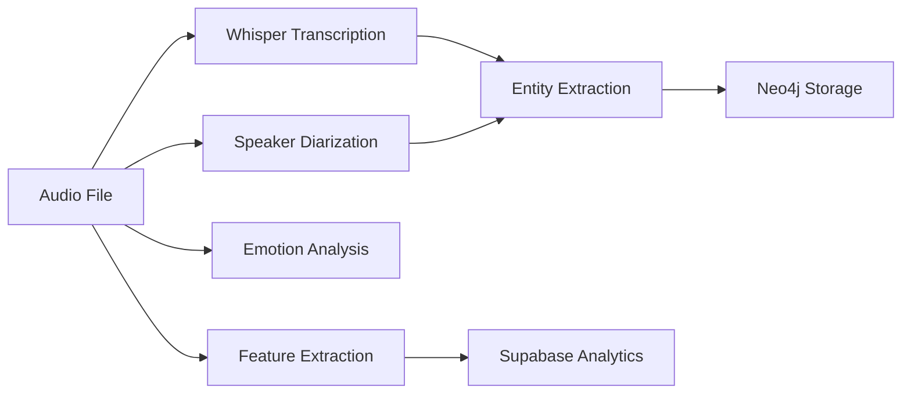
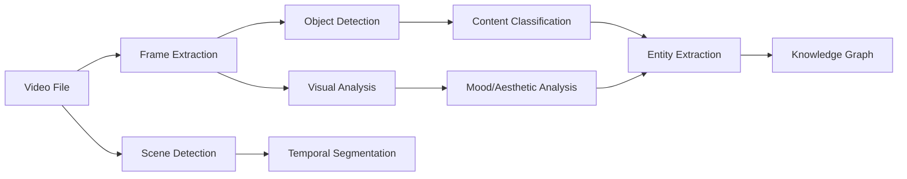
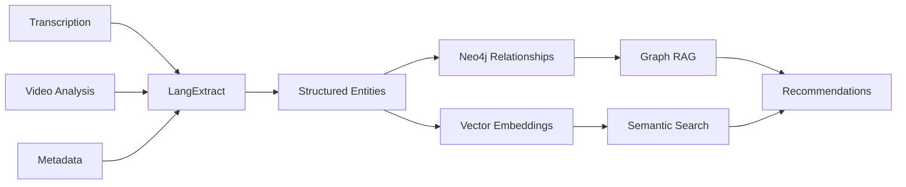

# AI-Enhanced Media Stack with Advanced Audio/Video Analysis

## 🚀 Complete Integration Guide for 2025

This enhanced version of your Jellyfin media stack integrates the **latest AI models** for comprehensive audio/video analysis, YouTube content downloading with **yt-dlp**, **FFmpeg** video processing, and **Google LangExtract** for entity extraction and RAG strategies.

## 🎯 AI Models Suite (Latest 2025)

### **Audio Analysis Models**

#### **1. Whisper Large v3 Turbo** - OpenAI's flagship transcription model
- **Accuracy**: State-of-the-art multilingual transcription
- **Performance**: 70x realtime processing with optimizations
- **Languages**: 99+ languages supported
- **Integration**: Primary transcription engine

#### **2. WhisperX** - Enhanced Whisper with diarization
- **Features**: Word-level timestamps, built-in speaker separation
- **Performance**: Batched inference for efficiency
- **Accuracy**: Improved timestamp alignment using wav2vec2
- **Integration**: Advanced transcription with speaker identification

#### **3. Pyannote Audio 3.1** - Advanced speaker diarization
- **Capability**: Multi-speaker identification and separation
- **Technology**: Deep learning speaker embeddings
- **Real-time**: Live processing capable
- **Integration**: Primary diarization engine

#### **4. NVIDIA Sortformer** - Next-generation diarization
- **Architecture**: Transformer-based speaker diarization
- **Performance**: Superior accuracy on complex audio
- **Optimization**: GPU-accelerated processing
- **Use case**: High-accuracy speaker separation

#### **5. SeaLLMs-Audio-7B** - Multimodal audio-language model
- **Capability**: Audio understanding and conversation
- **Features**: Real-time audio analysis and reasoning
- **Languages**: Southeast Asian language specialization
- **Integration**: Advanced content analysis and summarization

#### **6. Emotion Recognition Models**
- **HuBERT-Large**: Emotion classification from audio
- **SuperB**: Multi-task audio understanding
- **Integration**: Mood and sentiment analysis for content

### **Video Analysis Models**

#### **1. YOLO v11** - Real-time object detection
- **Speed**: Ultra-fast inference for video streams
- **Accuracy**: High precision multi-object detection
- **Tracking**: Object persistence across frames
- **Integration**: Scene analysis and content identification

#### **2. Vision Transformers (ViT)** - Advanced image understanding
- **Capability**: Scene classification and content categorization
- **Performance**: Superior accuracy on complex visual scenes
- **Integration**: Visual content analysis and tagging

#### **3. CLIP** - Vision-language understanding
- **Features**: Zero-shot image/video classification
- **Capability**: Natural language scene descriptions
- **Integration**: Content-based search and retrieval

#### **4. Flamingo (DeepMind)** - Video-language reasoning
- **Capability**: Few-shot learning on video content
- **Features**: Temporal reasoning and context awareness
- **Integration**: Advanced video content analysis

### **Entity Extraction & RAG**

#### **Google LangExtract** - Structured information extraction
- **Technology**: Gemini-powered entity extraction
- **Templates**: Pre-built extraction patterns for media, music, finance
- **Integration**: Creates structured data for Neo4j knowledge graphs
- **RAG Strategy**: Enables semantic search and content relationships

## 📦 Enhanced Docker Architecture

The complete stack now includes 6 specialized microservices:

### **Core Services**
1. **Jellyfin** - Media server with plugin integration
2. **Neo4j** - Graph database for content relationships  
3. **Supabase** - Backend database and authentication
4. **Redis** - Caching and job queue management

### **AI Services**
5. **Audio AI Service** - Multi-model audio analysis
6. **Video AI Service** - Computer vision and video analysis
7. **YouTube Downloader** - yt-dlp integration with metadata
8. **Entity Extraction** - LangExtract powered entity recognition
9. **Orchestrator** - Workflow coordination and API gateway

## 🔄 Complete Workflow

### **1. Content Ingestion**
- **YouTube Download**: yt-dlp downloads video/audio with metadata
- **Local Files**: Direct media file processing
- **Jellyfin Integration**: Automatic library updates via webhooks

### **2. Audio Analysis Pipeline**


### **3. Video Analysis Pipeline**


### 🎬 Media-Video Microservice API (YOLO + ViT + CLIP + Flamingo)

The `media-video` FastAPI worker now orchestrates multi-model inference for each sampled frame. It extracts YOLO objects, scene
classifications (ViT), CLIP-style captions, sentiment-driven mood scores, and Flamingo/BLIP2-style video-language reasoning.

**POST** `http://localhost:8079/detect`

```json
{
  "bucket": "media",
  "key": "videos/demo.mp4",
  "namespace": "pmoves",
  "video_id": "demo-001",
  "prompt": "Summarize the emotional arc in this clip"
}
```

**Response excerpt**

```json
{
  "ok": true,
  "count": 18,
  "detections": [
    {
      "label": "person",
      "score": 0.91,
      "ts_seconds": 5,
      "frame_uri": "s3://media-frames/pmoves/demo-001/frame_000002.jpg",
      "scene": {"label": "studio", "score": 0.77},
      "caption": "Two presenters smile on stage",
      "mood": {"label": "POSITIVE", "score": 0.98}
    }
  ],
  "scenes": [
    {
      "label": "studio",
      "score": 0.77,
      "ts_start": 2.5,
      "ts_end": 7.5,
      "frame_uri": "s3://media-frames/pmoves/demo-001/frame_000002.jpg"
    }
  ],
  "captions": [
    {
      "ts_seconds": 5,
      "text": "Two presenters smile on stage"
    }
  ],
  "moods": [
    {
      "ts_seconds": 5,
      "label": "POSITIVE",
      "score": 0.98
    }
  ],
  "reasoning": {
    "response": "The hosts introduce the show with high energy while the audience applauds.",
    "samples": [
      {"ts_seconds": 0, "frame_uri": "s3://.../frame_000001.jpg"},
      {"ts_seconds": 5, "frame_uri": "s3://.../frame_000002.jpg"}
    ]
  }
}
```

All detections, scene segments, and mood scores are persisted in Supabase (`detections`, `segments`, and `emotions` tables) and a
rich `analysis.entities.v1` event is emitted to NATS for downstream consumers.

#### Key environment variables

| Variable | Description |
| --- | --- |
| `YOLO_MODEL` | Ultralytics checkpoint for object detection (default `yolov8n.pt`). |
| `SCENE_MODEL` | Hugging Face ViT scene classifier (default `dima806/scene_classification_vit`). |
| `CAPTION_MODEL` | Image captioning model used for CLIP-style descriptions (default `Salesforce/blip-image-captioning-base`). |
| `MOOD_MODEL` | Text sentiment pipeline that converts captions into mood scores (default `distilbert-base-uncased-finetuned-sst-2-english`). |
| `VIDEO_REASONER_MODEL` | Flamingo/BLIP2-style video-language reasoner (default `Salesforce/blip2-flan-t5-base`). |
| `VIDEO_REASONER_MAX_FRAMES` | Maximum number of frames passed to the video reasoner (default `4`). |

The accompanying Docker image now targets `pytorch/pytorch:2.3.1-cuda12.1-cudnn8-runtime` to provide CUDA-enabled inference for
ViT, BLIP, and Flamingo-class models. Ensure `nvidia-container-toolkit` is installed and run with `--gpus all` for full
acceleration.

### **4. Entity Extraction & RAG Strategy**


## 🛠️ Installation & Setup

### **Prerequisites**
- Docker & Docker Compose
- NVIDIA GPU (recommended for AI processing)
- 16GB+ RAM
- 500GB+ storage

### **Environment Setup**
```bash
# Clone or create project structure
mkdir ai-media-stack && cd ai-media-stack

# Copy enhanced configuration files
# docker-compose-enhanced.yml
# All service directories with Dockerfiles

# Configure environment
cp .env.template .env
# Edit with your API keys:
# - GEMINI_API_KEY (for LangExtract)
# - HF_TOKEN (Hugging Face models)
# - SUPABASE_URL & SUPABASE_KEY
# - YOUTUBE_API_KEY (optional)
```

### **Deployment**
```bash
# Build and start all services
docker-compose -f docker-compose-enhanced.yml up -d

# Check service health
docker-compose ps
curl http://localhost:8000/health  # Orchestrator
curl http://localhost:8001/health  # Audio AI
curl http://localhost:8003/health  # YouTube DL
curl http://localhost:8004/health  # Entity Extraction
```

## 🎵 Advanced Audio Features

### **Real-time Processing**
- **Streaming Analysis**: Process audio as it's being recorded/streamed
- **Live Diarization**: Real-time speaker identification
- **Emotion Tracking**: Continuous mood analysis

### **Multi-language Support**
- **99+ Languages**: Whisper's extensive language support
- **Code-switching**: Handling multiple languages in single audio
- **Dialect Recognition**: Regional accent and dialect identification

### **Music-specific Analysis**
- **Genre Classification**: Automatic music genre detection
- **Instrument Recognition**: Individual instrument identification
- **Tempo/Key Detection**: Musical technical analysis
- **Mood Extraction**: Emotional content of music

## 📺 Advanced Video Features

### **Scene Understanding**
- **Object Tracking**: Persistent object identification across frames
- **Activity Recognition**: Human action and behavior analysis
- **Scene Classification**: Indoor/outdoor, setting identification

### **Content Optimization**
- **Quality Assessment**: Video quality metrics and analysis
- **Thumbnail Generation**: AI-selected optimal thumbnails
- **Chapter Detection**: Automatic video segmentation

### **FFmpeg Integration**
- **Format Conversion**: Automated video/audio format optimization
- **Quality Enhancement**: AI-powered upscaling and noise reduction
- **Clip Extraction**: Automatic highlight and clip generation

## 🧠 RAG & Knowledge Graph Strategy

### **Entity Relationships**
```cypher
// Example Neo4j relationships created
(video:Video)-[:CONTAINS_AUDIO]->(audio:AudioTrack)
(audio)-[:TRANSCRIBED_TO]->(transcript:Transcript)
(transcript)-[:HAS_ENTITY]->(entity:Entity)
(entity)-[:SIMILAR_TO]->(similar:Entity)
(video)-[:HAS_MOOD]->(mood:Emotion)
(artist:Person)-[:PERFORMED_IN]->(audio)
```

### **Semantic Search**
- **Vector Embeddings**: Content-based similarity search
- **Hybrid Search**: Combining graph traversal with vector similarity
- **Contextual Retrieval**: Understanding user intent and context

### **Content Recommendations**
- **Graph-based**: Relationship traversal for recommendations
- **Embedding-based**: Semantic similarity recommendations
- **Hybrid Approach**: Combining multiple recommendation strategies

## 🚀 YouTube Content Creation Integration

### **Content Analysis for Video Creation**
- **Audio Analysis**: Extract key moments, emotional peaks
- **Transcript Processing**: Generate talking points, timestamps
- **Entity Extraction**: Identify key topics, people, concepts for tags

### **Automated Workflows**
- **Download**: yt-dlp fetches content with metadata
- **Analysis**: Multi-model processing pipeline
- **Output**: Structured data for video editing and optimization

### **SEO & Optimization**
- **Tag Generation**: AI-generated relevant tags from content
- **Description Creation**: Automatic video descriptions
- **Thumbnail Analysis**: Optimal thumbnail suggestions

## 🔧 API Integration Examples

### **Audio Analysis API**
```python
import requests

# Analyze audio file
response = requests.post("http://localhost:8001/analyze", json={
    "file_path": "/path/to/audio.mp3",
    "analysis_type": "full",
    "language": "en"
})

result = response.json()
transcription = result['analysis_results']['transcription']['text']
speakers = result['analysis_results']['speakers']['speaker_count']
emotions = result['analysis_results']['emotions']['dominant_emotions']
```

### **YouTube Download & Analysis**
```python
# Download YouTube content
response = requests.post("http://localhost:8003/download", json={
    "url": "https://youtube.com/watch?v=example",
    "download_type": "audio",
    "quality": "best",
    "extract_metadata": True
})

task_id = response.json()['task_id']

# Check download status
status = requests.get(f"http://localhost:8003/status/{task_id}")

# Once complete, analyze the downloaded audio
if status.json()['status'] == 'completed':
    file_path = status.json()['file_paths'][0]
    # Trigger analysis...
```

### **Entity Extraction Integration**
```python
# Extract entities from transcription
response = requests.post("http://localhost:8004/extract", json={
    "text": transcription_text,
    "extraction_type": "music_analysis",
    "model_id": "gemini-2.0-flash-exp"
})

entities = response.json()['extractions']
# Use entities for Neo4j relationships, recommendations, etc.
```

This comprehensive AI-enhanced media stack provides a complete solution for modern content analysis, creation, and management, leveraging the latest 2025 AI models and technologies for maximum capability and accuracy.