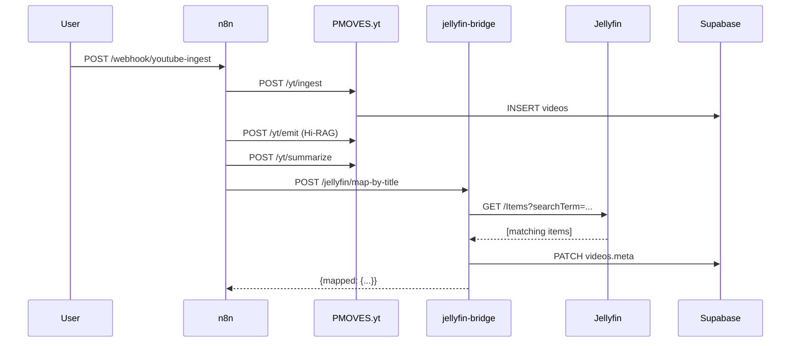

# Jellyfin Bridge Integration Guide

## Overview

The **Jellyfin Bridge** (`jellyfin-bridge` service on port 8093) provides bidirectional integration between Jellyfin media server and PMOVES services, enabling:

1. **Metadata Linking** - Associate YouTube videos with Jellyfin library items
2. **Playback URLs** - Generate deep links to Jellyfin player with timestamps
3. **Auto-mapping** - Automatic title-based matching between videos and Jellyfin items
4. **Search** - Query Jellyfin library for media matching video titles
5. **Refresh Triggers** - Webhook endpoint for Jellyfin library updates

## Architecture

```
Jellyfin Library
    ↓
jellyfin-bridge (8093)
    ↓
├─→ PMOVES.yt (8077) - YouTube ingestion & transcripts
├─→ Supabase/PostgREST - videos, transcripts, studio_board
└─→ Agent Zero (8080) - Event publishing for downstream workflows
```

## Service Configuration

### Docker Compose

```yaml
jellyfin-bridge:
  build: ./services/jellyfin-bridge
  ports: ["8093:8093"]
  profiles: ["orchestration"]
  environment:
      - JELLYFIN_URL=http://jellyfin-ai:8096
    - JELLYFIN_API_KEY=${JELLYFIN_API_KEY}
    - JELLYFIN_USER_ID=${JELLYFIN_USER_ID}
    - SUPA_REST_URL=${SUPA_REST_INTERNAL_URL:-${SUPA_REST_URL:-http://host.docker.internal:65421/rest/v1}}
    - JELLYFIN_AUTOLINK=true  # Enable auto-mapping
    - AUTOLINK_INTERVAL_SEC=60  # Auto-map every 60 seconds
```

### Environment Variables

| Variable | Description | Required | Default |
|----------|-------------|----------|---------|
| `JELLYFIN_URL` | Jellyfin server base URL (internal) | Yes | `http://jellyfin-ai:8096` (overlay container; host access continues on `http://localhost:9096`) |
| `JELLYFIN_API_KEY` | Jellyfin API key for authentication | Yes | - |
| `JELLYFIN_USER_ID` | Jellyfin user ID for library access | Yes | - |
| `SUPA_REST_URL` | Supabase REST base URL (CLI or PostgREST) | Yes | `http://host.docker.internal:65421/rest/v1` (Supabase CLI) |
| `JELLYFIN_AUTOLINK` | Enable automatic title-based mapping | No | `false` |
| `AUTOLINK_INTERVAL_SEC` | Auto-map check interval (seconds) | No | `60` |
| `JELLYFIN_DEFAULT_LIBRARY_IDS` | Comma-separated library IDs applied to search when callers omit `library_ids` | No | - |
| `JELLYFIN_DEFAULT_MEDIA_TYPES` | Comma-separated Jellyfin item types included in search requests | No | `Movie,Video` |
| `JELLYFIN_SERVER_ID` | Default server identifier appended to playback URLs | No | `local` |
| `JELLYFIN_DEVICE_ID` | Optional device identifier appended to playback URLs | No | - |
| `JELLYFIN_BRAND_NAME` | Admin dashboard display name | No | `PMOVES Jellyfin` |
| `JELLYFIN_BRAND_TAGLINE` | Subtitle rendered under the dashboard heading | No | `Curate, sync, and stream` |
| `JELLYFIN_BRAND_PRIMARY_COLOR` | HEX code for navigation/header backgrounds | No | `#1F2937` |
| `JELLYFIN_BRAND_ACCENT_COLOR` | HEX code used for buttons and highlights | No | `#38BDF8` |
| `JELLYFIN_BRAND_LOGO_URL` | URL to square logo asset | No | - |
| `JELLYFIN_BRAND_BACKGROUND_URL` | Hero/background image for admin login cards | No | - |
| `JELLYFIN_BRAND_SUPPORT_LINK` | Support/help center link surfaced in footer | No | - |
| `JELLYFIN_BRANDING_TABLE` | Optional Supabase table to persist branding JSON | No | - |
| `JELLYFIN_BRANDING_KEY` | Row identifier used when persisting branding JSON | No | `default` |
| `JELLYFIN_BRANDING_KEY_COLUMN` | Column storing the row identifier in the branding table | No | `key` |
| `JELLYFIN_BRANDING_VALUE_COLUMN` | Column storing the branding JSON document | No | `value` |

> **Tip:** If you use the compose-hosted PostgREST bundle instead of the Supabase CLI, override `SUPA_REST_URL` and `SUPA_REST_INTERNAL_URL` to `http://postgrest:3000` so the bridge shares the same database connection as the rest of the stack.

## Jellyfin 10.11 Upgrade Runbook

### Maintenance Window

- **Duration:** Reserve a 10-minute window to pull the new Jellyfin container, restart `jellyfin-bridge`, and allow the publisher to reconnect.
- **Expected downtime:** Jellyfin UI/API is unavailable for 3–5 minutes while the image re-pulls and migrations complete. The bridge and publisher report retry loops during this span but automatically recover once Jellyfin is serving requests again.

### Required Overrides

- Set `JELLYFIN_IMAGE=ghcr.io/cataclysm-studios-inc/pmoves-jellyfin:pmoves-latest` before invoking `make up-external` or `make up-jellyfin` so the bridge uses the PMOVES-published 10.11 build (updated tags track upstream releases). Override with a specific version if you need to pin.
- For the optional AI stack, ensure `docker-compose.jellyfin-ai.yml` is picked up (via `make up-jellyfin-ai`) so the bundled LinuxServer build (`lscr.io/linuxserver/jellyfin:10.11.0`) is used.
- Keep `JELLYFIN_EXPECTED_SERVER_NAME` aligned with production branding if you changed it from the default; the credential check enforces this string after restart.

### Post-Upgrade Validation

1. Wait for `jellyfin`, `jellyfin-bridge`, and `publisher` containers to report healthy in `docker compose ps`.
2. Run `make jellyfin-verify` to confirm `/System/Info`, `/Library/Refresh`, and any configured refresh webhook all succeed against the 10.11 runtime.
3. Inspect the publisher logs for the next publish event to ensure refresh attempts no longer surface warning or retry messages.

### Getting Jellyfin Credentials

```bash
# 1. Get API Key from Jellyfin Dashboard
# Navigate to: Dashboard → Advanced → API Keys → Create new API key

# 2. Get User ID
curl -s "http://localhost:8096/Users" \
  -H "X-Emby-Token: YOUR_API_KEY" | jq -r '.[] | select(.Name=="YourUsername") | .Id'

# 3. Add to .env.local
echo "JELLYFIN_API_KEY=YOUR_API_KEY_HERE" >> pmoves/.env.local
echo "JELLYFIN_USER_ID=YOUR_USER_ID_HERE" >> pmoves/.env.local
```


### Branding Configuration (Jellyfin 10.11+)

Jellyfin 10.11 introduces richer admin branding controls. The bridge exposes them through `/jellyfin/branding` so operators can adjust titles, colors, and hero imagery without redeploying the service.

```bash
# Inspect current branding (combines environment defaults + stored overrides)
curl http://localhost:8093/jellyfin/branding | jq

# Update branding values at runtime
curl -X POST http://localhost:8093/jellyfin/branding \
  -H "Content-Type: application/json" \
  -d '{
        "brand_name": "PMOVES Studio",
        "brand_tagline": "Sync Jellyfin with PMOVES.ai",
        "accent_color": "#6366F1",
        "support_link": "https://pmoves.ai/support"
      }'

# Reset the admin styling back to environment defaults
curl -X POST http://localhost:8093/jellyfin/branding \
  -H "Content-Type: application/json" \
  -d '{"reset": true}'

# Optional: persist overrides to Supabase by providing JELLYFIN_BRANDING_* env vars
```

The `/jellyfin/config` endpoint aggregates the default search scopes and the currently effective branding document. Use it to prime UI forms when building an admin console:

```bash
curl http://localhost:8093/jellyfin/config | jq '.search_defaults'
```

### Dashboard Preview

To capture the refreshed Jellyfin Bridge dashboard with advanced filters and the
branding preview card, open the admin console at
`http://localhost:8093/jellyfin/admin` after applying your configuration. Use
your operating system's screenshot tooling to document the state for release
notes or runbooks. Store the artifact in your knowledge base (e.g., Notion or
Supabase storage) rather than this repository so the workflow remains text only
for PR automation.

## Backup & Restore

- Automated provisioning flows call `scripts/jellyfin_backup.sh` before Docker restarts. Manual procedures (backup, Supabase upload, and restore) are documented in the [Jellyfin AI media stack guide](../../../CATACLYSM_STUDIOS_INC/PMOVES-PROVISIONS/docker-stacks/jellyfin-ai/jellyfin-ai-media-stack-guide.md#-backup--restore-runbook).


## API Endpoints

### Health Check

```bash
GET /healthz
```

**Response:**
```json
{"ok": true}
```

---

### Link Video to Jellyfin Item

```bash
POST /jellyfin/link
Content-Type: application/json

{
  "video_id": "dQw4w9WgXcQ",
  "jellyfin_item_id": "abc123..."
}
```

**Purpose:** Manually associate a YouTube video with a Jellyfin library item.

**Response:**
```json
{"ok": true}
```

**Updates:** Sets `videos.meta.jellyfin_item_id` in Supabase.

---

### Refresh Jellyfin Library

```bash
POST /jellyfin/refresh
Content-Type: application/json
{}
```

**Purpose:** Trigger Jellyfin library refresh (calls `/System/Info` to verify connection).

**Response:**
```json
{
  "ok": true,
  "system": "10.11.0"
}
```

---

### Get Playback URL

```bash
POST /jellyfin/playback-url
Content-Type: application/json

{
  "video_id": "dQw4w9WgXcQ",
  "t": 120.5,
  "media_source_id": "12345abc"
}
```

**Purpose:** Generate Jellyfin deep link for video playback at specific timestamp. Optional keys (`media_source_id`, `server_id`, `device_id`, `audio_stream_index`, `subtitle_stream_index`) override the defaults returned from Supabase metadata or environment variables.

**Response:**
```json
{
  "ok": true,
  "url": "http://jellyfin:8096/web/index.html#!/details?id=abc123&serverId=local&startTime=120&startTimeTicks=1200000000",
  "params": {
    "id": "abc123",
    "serverId": "local",
    "startTime": "120",
    "startTimeTicks": "1200000000",
    "mediaSourceId": "12345abc"
  }
}
```

**Note:** If video not linked to Jellyfin item, returns placeholder URL.

---

### Search Jellyfin Library

```bash
GET /jellyfin/search?query=Example&library_ids=Movies&library_ids=Clips&media_types=Movie&exclude_item_types=Episode&sort_by=ProductionYear&sort_order=Descending&year=2023
```

**Purpose:** Query Jellyfin library for media matching search terms with Jellyfin 10.11 filters. Supported query params include:

- `library_ids` / `library_scope`: restrict search to one or more library IDs.
- `media_types` or `include_item_types`: include explicit Jellyfin item types (e.g., `Movie,Series`).
- `exclude_item_types`: omit specific types such as `Episode` or `Trailer`.
- `fields`: request additional metadata (e.g., `Overview`, `Path`, `RunTimeTicks`).
- `sort_by` / `sort_order`: control ordering (example: `ProductionYear` + `Descending`).
- `parent_id`: limit search under a specific collection.
- `year`: prefer results from a target production year.
- `recursive`: `true` by default; set `false` to avoid traversing child libraries.
- `limit`: cap results (1–200).

**Response:**
```json
{
  "ok": true,
  "items": [
    {
      "Id": "item-a",
      "Name": "Example Project Extended",
      "ProductionYear": 2023,
      "Type": "Movie",
      "Path": "/movies/example-project-extended"
    }
  ],
  "applied_filters": {
    "searchTerm": "Example",
    "LibraryIds": "Movies,Clips",
    "IncludeItemTypes": "Movie",
    "ExcludeItemTypes": "Episode",
    "SortBy": "ProductionYear",
    "SortOrder": "Descending",
    "Years": "2023",
    "Recursive": "true",
    "Limit": "25"
  }
}
```

---

### Auto-Map by Title

```bash
POST /jellyfin/map-by-title
Content-Type: application/json

{
  "video_id": "dQw4w9WgXcQ",
  "title": "Rick Astley"  # Optional, uses video title from DB if omitted
}
```

**Purpose:** Automatically find and link best-matching Jellyfin item by title.

**Matching Logic (10.11-aware):**
1. Builds search parameters from request body + defaults (`library_ids`, `media_types`, optional `year`).
2. Invokes `/Users/{id}/Items` with those filters.
3. Scores each candidate using case-insensitive token matching and fuzzy ratio (SequenceMatcher).
4. Adds a year bonus when production year matches the target video.
5. Chooses the highest-scoring item above the 0.25 threshold and patches Supabase metadata.

**Response:**
```json
{
  "ok": true,
  "mapped": {
    "video_id": "dQw4w9WgXcQ",
    "jellyfin_item_id": "abc123...",
    "name": "Rick Astley - Never Gonna Give You Up",
    "score": 0.87
  },
  "applied_filters": {
    "searchTerm": "Rick Astley",
    "LibraryIds": "Movies",
    "IncludeItemTypes": "Movie,Video"
  }
}
```

---

### Inspect Bridge Configuration

```bash
GET /jellyfin/config
```

**Purpose:** Retrieve the effective default search filters (`library_ids`, `media_types`, `server_id`, `device_id`) alongside the current branding document.

**Response (excerpt):**
```json
{
  "ok": true,
  "search_defaults": {
    "library_ids": ["Movies", "Shows"],
    "media_types": ["Movie", "Series"],
    "server_id": "local",
    "device_id": ""
  },
  "branding": {
    "brand_name": "PMOVES Jellyfin",
    "accent_color": "#38BDF8"
  }
}
```

### View Branding Metadata

```bash
GET /jellyfin/branding
```

**Purpose:** Return the currently active branding payload plus the editable field metadata (environment variable, default, description).

### Update Branding Metadata

```bash
POST /jellyfin/branding
Content-Type: application/json

{
  "brand_name": "PMOVES Studio",
  "accent_color": "#6366F1",
  "background_url": "https://cdn.pmoves.ai/jellyfin/background.png"
}
```

**Purpose:** Override admin branding fields at runtime. Include `{ "reset": true }` to revert to environment defaults.

---

## Integration with PMOVES.yt

### Workflow: YouTube Video → Jellyfin Library



### Backfill Script Integration

The backfill script (`scripts/backfill_jellyfin_metadata.py`) uses the bridge for:

1. **Fetching Jellyfin Items** - Queries Jellyfin library via bridge search
2. **YouTube Transcript Search** - Uses PMOVES.yt `/yt/search` for semantic matching
3. **Metadata Enrichment** - Combines Jellyfin + YouTube data in `content.published.v1` events
4. **Auto-linking** - Optionally links YouTube transcripts to Jellyfin items via bridge

**Example Usage:**

```bash
# Backfill with YouTube transcript linking
python pmoves/scripts/backfill_jellyfin_metadata.py \
  --limit 25 \
  --link-youtube \
  --youtube-threshold 0.70 \
  --sleep 1.5
```

**What it does:**
1. Fetches `studio_board` entries without Jellyfin metadata
2. For each entry, searches PMOVES.yt corpus for semantically similar YouTube videos
3. Links top matching YouTube transcripts to Jellyfin items
4. Publishes enriched `content.published.v1` events to Agent Zero
5. Updates `studio_board.meta` with YouTube links and Jellyfin metadata

---

## Auto-Linking Feature

When `JELLYFIN_AUTOLINK=true`, the bridge runs a background loop that:

1. Fetches recent unmapped videos from Supabase (25 at a time)
2. For each video without `jellyfin_item_id`, calls `/jellyfin/map-by-title`
3. Sleeps for `AUTOLINK_INTERVAL_SEC` (default 60s)
4. Repeats indefinitely

**Enable in docker-compose:**

```yaml
jellyfin-bridge:
  environment:
    - JELLYFIN_AUTOLINK=true
    - AUTOLINK_INTERVAL_SEC=120  # Check every 2 minutes
```

**Logs:**

```bash
docker logs -f pmoves-jellyfin-bridge-1 --tail 50
```

---

## n8n Workflow Integration

### Enhanced Workflow with Auto-Mapping

Update the n8n workflow JSON to add Jellyfin bridge step:

```json
{
  "parameters": {
    "method": "POST",
    "url": "http://jellyfin-bridge:8093/jellyfin/map-by-title",
    "sendBody": true,
    "bodyParameters": {
      "parameters": [
        {
          "name": "video_id",
          "value": "={{ $json.video_id }}"
        }
      ]
    }
  },
  "name": "Auto-Map to Jellyfin",
  "type": "n8n-nodes-base.httpRequest",
  "position": [1120, 600]
}
```

**Updated Workflow:**

```
Webhook → /yt/ingest → Extract Video ID
              ├→ /yt/emit (Hi-RAG)
              ├→ /yt/summarize (AI)
              └→ /jellyfin/map-by-title (NEW!)
                    └→ Response + Discord notification
```

---

## Testing

### Test Jellyfin Bridge Connection

```bash
# Health check
curl http://localhost:8093/healthz

# Test search (requires credentials)
curl "http://localhost:8093/jellyfin/search?query=test"

# Test auto-map
curl -X POST http://localhost:8093/jellyfin/map-by-title \
  -H "Content-Type: application/json" \
  -d '{"video_id": "dQw4w9WgXcQ"}'
```

### Test Full Integration

```bash
# 1. Ingest YouTube video via n8n
curl -X POST http://localhost:5678/webhook/youtube-ingest \
  -H "Content-Type: application/json" \
  -d '{"url": "https://youtube.com/watch?v=dQw4w9WgXcQ"}'

# 2. Verify video in Supabase
docker exec supabase_db_pmoves psql -U postgres -c \
  "SELECT video_id, title, meta->>'jellyfin_item_id' FROM videos WHERE video_id='dQw4w9WgXcQ';"

# 3. Check if auto-mapped to Jellyfin
# Should show jellyfin_item_id if match found in Jellyfin library

# 4. Test playback URL generation
curl -X POST http://localhost:8093/jellyfin/playback-url \
  -H "Content-Type: application/json" \
  -d '{"video_id": "dQw4w9WgXcQ", "t": 30}'
```

### Smoketest Expectations

- `make jellyfin-smoke` (also triggered at the end of `make yt-jellyfin-smoke`) now attempts `/jellyfin/map-by-title` for the most recent Supabase video and logs the HTTP status. If the lookup misses, it links the video to the newest Jellyfin library item via `/jellyfin/link` before requesting `/jellyfin/playback-url`, ensuring the smoke always returns a non-empty URL.
- Keep at least one asset in the overlay libraries—`python scripts/seed_jellyfin_media.py` drops a lightweight tone clip under `pmoves/jellyfin-ai/media/music`, which doubles as the fallback target for smoke runs on fresh machines.
- Host access remains on `http://localhost:9096`; the bridge talks to the container alias (`http://jellyfin-ai:8096`) through the shared `cataclysm-net` network so both stacks stay in sync.

---

## Dashboard Gate for Post-Upgrade Agent Start-Up

Leverage the Jellyfin AI dashboard (`http://localhost:3001`) as the last checkpoint before restarting the agent stack after a schema or package upgrade:

1. **Refresh the view:** Click **Refresh** to pull the latest `/api/migrations/latest` snapshot and bridge/publisher log excerpts from the API gateway. A successful migration replay should populate the checklist with green indicators for Supabase, Neo4j, bridge, and publisher health.
2. **Validate webhook latency:** The **Webhook Latency** card should report steady-state timings (sub-second averages in healthy environments). Investigate spikes before letting Agent Zero drain backlogs; latency telemetry comes directly from the migration payload so unexpected gaps usually indicate stalled publishers.
3. **Inspect logs:** Review the **Log Viewer** panels. Jellyfin bridge logs should show `mapped` or `healthz` activity without repeated auth failures, and publisher logs should be free of Discord webhook errors. Use the dashboard for a quick skim, then fall back to `docker logs` if something looks off.
4. **Gate agent bring-up:** Only run `make up-agents` (or restart Agent Zero/publisher individually) once the checklist and logs are clean. Capture the dashboard state in the runbook when promoting changes between environments.

Treat the dashboard as the operational go/no-go signal—if any panel reports stale data, errors, or missing telemetry, pause the rollout and resolve the underlying issue before rejoining Jellyfin automations to the broader agent mesh.


## Troubleshooting

### Bridge Not Starting

```bash
# Check logs
docker logs pmoves-jellyfin-bridge-1 --tail 100

# Check environment
docker exec pmoves-jellyfin-bridge-1 env | grep JELLYFIN

# Rebuild
cd /home/pmoves/PMOVES.AI/pmoves
docker-compose build jellyfin-bridge
docker-compose up -d jellyfin-bridge
```

### Auto-Map Not Working

**Symptoms:** Videos not getting `jellyfin_item_id` set automatically.

**Checks:**
1. Is `JELLYFIN_AUTOLINK=true` set?
2. Are Jellyfin credentials valid? Test: `curl http://localhost:8093/jellyfin/search?query=test`
3. Do video titles match Jellyfin library items? Check: `docker exec supabase_db_pmoves psql -U postgres -c "SELECT title FROM videos LIMIT 10;"`

### Search Returns Empty Results

**Cause:** Jellyfin library may not contain matching items, or search is too specific.

**Solution:**
1. Check Jellyfin library manually: http://localhost:8096
2. Use broader search terms
3. Ensure `JELLYFIN_USER_ID` has access to library

### Playback URLs Not Working

**Cause:** Video not linked to Jellyfin item, or Jellyfin URL misconfigured.

**Solution:**
1. Verify `videos.meta.jellyfin_item_id` is set: `SELECT meta FROM videos WHERE video_id='...'`
2. Check `JELLYFIN_URL` matches actual Jellyfin server
3. Test Jellyfin access: `curl http://localhost:8096/System/Info -H "X-Emby-Token: $JELLYFIN_API_KEY"`

---

## Production Recommendations

### 1. Enable Auto-Linking

```bash
echo "JELLYFIN_AUTOLINK=true" >> pmoves/.env.local
echo "AUTOLINK_INTERVAL_SEC=300" >> pmoves/.env.local  # 5 minutes
docker-compose restart jellyfin-bridge
```

### 2. Update n8n Workflow

Add Jellyfin auto-map step after `/yt/ingest` completes (see n8n workflow section above).

### 3. Schedule Backfill Job

```bash
# Add to crontab for periodic backfill
0 2 * * * cd /home/pmoves/PMOVES.AI/pmoves && python scripts/backfill_jellyfin_metadata.py --limit 50 --link-youtube --sleep 2 >> /var/log/pmoves-backfill.log 2>&1
```

### 4. Monitor Bridge Logs

```bash
# Add to monitoring dashboard
docker logs -f pmoves-jellyfin-bridge-1 | grep -E "ERROR|mapped|search"
```

### 5. Rate Limiting

For large libraries, add rate limiting to prevent overwhelming Jellyfin:

```python
# In backfill script
import time
for item in items:
    process_item(item)
    time.sleep(2)  # 2 second delay between items
```

---

## Related Documentation

- [PMOVES.YT Service](./PMOVES_YT.md) - YouTube ingestion endpoints
- [n8n Workflow](./PMOVES.yt/README.md) - Automated YouTube pipeline
- [Backfill Script](../scripts/backfill_jellyfin_metadata.py) - Metadata enrichment
- [Agent Zero Events](./AGENT_ZERO.md) - Event publishing system

## API Client Examples

### Python

```python
import httpx

async def link_video_to_jellyfin(video_id: str, jellyfin_item_id: str):
    async with httpx.AsyncClient(base_url="http://localhost:8093") as client:
        resp = await client.post("/jellyfin/link", json={
            "video_id": video_id,
            "jellyfin_item_id": jellyfin_item_id
        })
        return resp.json()

async def auto_map_video(video_id: str):
    async with httpx.AsyncClient(base_url="http://localhost:8093") as client:
        resp = await client.post("/jellyfin/map-by-title", json={
            "video_id": video_id
        })
        return resp.json()

async def get_playback_url(video_id: str, timestamp: float = 0.0):
    async with httpx.AsyncClient(base_url="http://localhost:8093") as client:
        resp = await client.post("/jellyfin/playback-url", json={
            "video_id": video_id,
            "t": timestamp
        })
        return resp.json()
```

### Bash

```bash
#!/bin/bash
BRIDGE_URL="http://localhost:8093"

# Link video to Jellyfin item
link_video() {
    local video_id="$1"
    local jellyfin_item_id="$2"
    curl -X POST "$BRIDGE_URL/jellyfin/link" \
        -H "Content-Type: application/json" \
        -d "{\"video_id\":\"$video_id\",\"jellyfin_item_id\":\"$jellyfin_item_id\"}"
}

# Auto-map by title
auto_map() {
    local video_id="$1"
    curl -X POST "$BRIDGE_URL/jellyfin/map-by-title" \
        -H "Content-Type: application/json" \
        -d "{\"video_id\":\"$video_id\"}"
}

# Get playback URL
playback_url() {
    local video_id="$1"
    local timestamp="${2:-0}"
    curl -X POST "$BRIDGE_URL/jellyfin/playback-url" \
        -H "Content-Type: application/json" \
        -d "{\"video_id\":\"$video_id\",\"t\":$timestamp}"
}

# Usage
link_video "dQw4w9WgXcQ" "abc123..."
auto_map "dQw4w9WgXcQ"
playback_url "dQw4w9WgXcQ" 120.5
```

---

**Status:** ✅ Fully Operational  
**Services:** jellyfin-bridge (8093), pmoves-yt (8077)  
**Last Updated:** October 17, 2025
