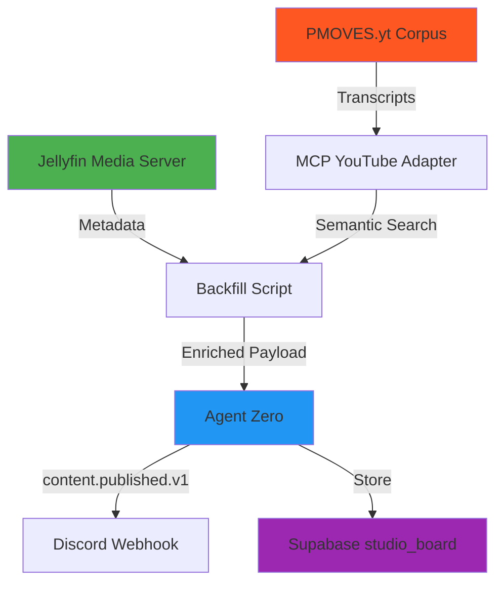

# Jellyfin + YouTube Integration Guide

**PMOVES.AI Content Enrichment Pipeline**

This guide explains how the Jellyfin backfill system integrates with the PMOVES.yt YouTube transcript corpus to create semantically enriched content metadata.

## Architecture Overview



## Components

### 1. Jellyfin Backfill Script
**Location**: `pmoves/scripts/backfill_jellyfin_metadata.py`

**Purpose**: Enrich historic `studio_board` records with Jellyfin metadata and semantically linked YouTube content.

**Key Features**:
- Fetches Jellyfin item metadata (duration, thumbnails, play URLs)
- Optional YouTube transcript semantic search via `--link-youtube` flag
- Publishes enriched `content.published.v1` events to Agent Zero
- Updates Supabase with complete metadata

**Usage**:
```bash
# Dry run without YouTube linking
python scripts/backfill_jellyfin_metadata.py --limit 5 --dry-run

# Production run with YouTube linking
python scripts/backfill_jellyfin_metadata.py \
  --limit 25 \
  --sleep 2 \
  --link-youtube \
  --youtube-threshold 0.75
```

### 2. MCP YouTube Adapter
**Location**: `pmoves/services/mcp_youtube_adapter.py`

**Purpose**: REST API for semantic search across YouTube transcript corpus.

**Endpoints**:
- `POST /youtube/search` - Semantic search with embedding similarity
- `GET /youtube/video/{video_id}` - Fetch video metadata and transcript
- `POST /youtube/ingest` - Add new videos to corpus (future)
- `GET /health` - Service health check

**Start Service**:
```bash
cd pmoves
uvicorn services.mcp_youtube_adapter:app --host 0.0.0.0 --port 8081
```

### 3. PMOVES.yt Batch Processor
**Location**: `pmoves/docs/PMOVES.yt/batch_docker_coolify.md`

**Purpose**: Automated YouTube video ingestion, transcript extraction, and embedding generation.

**Components**:
- n8n workflow automation
- MCP Docker YouTube tools
- Redis queue management
- Batch processing with rate limiting

## Setup Instructions

### Step 1: Deploy YouTube Transcript Infrastructure

1. **Create Supabase table**:
```sql
-- In Supabase SQL editor
create table if not exists youtube_transcripts (
  video_id text primary key,
  title text not null,
  description text,
  channel text,
  url text not null,
  published_at timestamptz,
  duration float,
  transcript text,
  embedding vector(384),  -- all-MiniLM-L6-v2 dimensions
  meta jsonb default '{}'::jsonb,
  created_at timestamptz default now(),
  updated_at timestamptz default now()
);

-- Enable pgvector similarity search
create index youtube_embedding_idx on youtube_transcripts 
using ivfflat (embedding vector_cosine_ops) with (lists = 100);

-- RLS policies (adjust as needed)
alter table youtube_transcripts enable row level security;

create policy "Public read access"
  on youtube_transcripts for select
  using (true);

create policy "Service role insert"
  on youtube_transcripts for insert
  with check (auth.role() = 'service_role');
```

2. **Install dependencies**:
```bash
cd pmoves
pip install fastapi uvicorn sentence-transformers pydantic httpx numpy
```

3. **Start MCP YouTube Adapter**:
```bash
# Set environment variables
export SUPA_REST_URL="http://localhost:65421"
export SUPABASE_SERVICE_ROLE_KEY="your-service-role-key"
export YOUTUBE_EMBEDDING_MODEL="sentence-transformers/all-MiniLM-L6-v2"

# Start service
uvicorn services.mcp_youtube_adapter:app --host 0.0.0.0 --port 8081 --reload
```

4. **Verify service**:
```bash
curl http://localhost:8081/health
# Expected: {"status":"ok","service":"mcp-youtube-adapter","timestamp":"..."}
```

### Step 2: Populate YouTube Corpus (Optional)

If you have YouTube videos to index, deploy the PMOVES.yt batch processor:

1. **Review deployment config**:
```bash
cat pmoves/docs/PMOVES.yt/batch_docker_coolify.md
```

2. **Deploy services**:
```bash
# Use docker-compose from the PMOVES.yt documentation
cd pmoves
# docker-compose -f docker-compose.yt.yml up -d
```

3. **Add videos to queue**:
```bash
# Example: Add videos from a file
curl -X POST http://localhost:8081/queue/add \
  -H "Content-Type: application/json" \
  -d '{
    "urls": [
      "https://youtube.com/watch?v=dQw4w9WgXcQ",
      "https://youtube.com/watch?v=example123"
    ],
    "priority": 0
  }'
```

### Step 3: Run Jellyfin Backfill

1. **Verify Jellyfin credentials**:
```bash
cd pmoves
make jellyfin-verify
```

2. **Check studio_board candidates**:
```bash
# In psql or Supabase SQL editor
select id, title, meta->>'jellyfin_item_id' as jellyfin_id
from studio_board
where status = 'published'
  and (meta->>'jellyfin_public_url') is null
limit 10;
```

3. **Dry run backfill**:
```bash
python scripts/backfill_jellyfin_metadata.py \
  --limit 5 \
  --dry-run \
  --link-youtube \
  --youtube-threshold 0.75
```

Expected output:
```
Found 5 candidate(s) for Jellyfin backfill.
🔗 YouTube transcript linking enabled (threshold: 0.75)
  🎥 Found 3 YouTube matches for 'Example Video Title...'
📝 Dry-run row abc123: would publish Jellyfin xyz789 with duration=123.4, youtube_links=3
...
```

4. **Production run**:
```bash
# Process in batches to respect rate limits
python scripts/backfill_jellyfin_metadata.py \
  --limit 25 \
  --sleep 2 \
  --link-youtube \
  --youtube-threshold 0.70
```

## Payload Structure

### Enriched `content.published.v1` Event

```json
{
  "artifact_uri": "s3://outputs/demo/example.mp4",
  "published_path": "pmoves/2025/10/example.mp4",
  "namespace": "pmoves",
  "title": "Example Video",
  "description": "Demo content",
  "tags": ["demo", "youtube-linked"],
  "duration": 123.4,
  "jellyfin_item_id": "abc123def456",
  "jellyfin_public_url": "http://localhost:8096/web/index.html#!/details?id=abc123def456",
  "thumbnail_url": "http://localhost:8096/Items/abc123def456/Images/Primary?tag=xyz",
  "meta": {
    "jellyfin_meta": {
      "id": "abc123def456",
      "path": "/media/videos/example.mp4",
      "container": "mp4",
      "related_youtube": [
        {
          "video_id": "dQw4w9WgXcQ",
          "title": "Related YouTube Video",
          "url": "https://youtube.com/watch?v=dQw4w9WgXcQ",
          "similarity": 0.856,
          "transcript_excerpt": "This is an excerpt from the related YouTube video transcript..."
        }
      ]
    },
    "backfill_version": "2025-10-17",
    "youtube_linked_count": 3,
    "youtube_top_match": "dQw4w9WgXcQ"
  }
}
```

### YouTube Search API Response

```json
{
  "query": "machine learning tutorial",
  "results": [
    {
      "video_id": "example123",
      "title": "Introduction to Machine Learning",
      "url": "https://youtube.com/watch?v=example123",
      "similarity": 0.892,
      "excerpt": "In this tutorial, we'll cover the basics of machine learning...",
      "channel": "AI Learning Channel",
      "published_at": "2024-09-15T10:30:00Z",
      "duration": 1234.5
    }
  ],
  "total": 1,
  "threshold": 0.70
}
```

## Environment Variables

### Required for Backfill Script

```bash
# Supabase
SUPA_REST_URL="http://localhost:54321"
SUPABASE_SERVICE_ROLE_KEY="your-service-role-key"

# Jellyfin
JELLYFIN_URL="http://localhost:8096"
JELLYFIN_PUBLIC_BASE_URL="http://172.21.119.177:8096"
JELLYFIN_API_KEY="your-jellyfin-api-key"

# Agent Zero
AGENT_ZERO_BASE_URL="http://localhost:8080"

# MCP YouTube Adapter (optional, for --link-youtube)
MCP_DOCKER_URL="http://localhost:8081"
```

### Required for MCP YouTube Adapter

```bash
# Supabase
SUPA_REST_URL="http://localhost:54321"
SUPABASE_SERVICE_ROLE_KEY="your-service-role-key"

# Embedding Model
YOUTUBE_EMBEDDING_MODEL="sentence-transformers/all-MiniLM-L6-v2"
```

## Troubleshooting

### MCP YouTube Adapter Issues

**Problem**: Service fails to start with "SUPABASE_SERVICE_ROLE_KEY not set"

**Solution**:
```bash
# Source environment from .env
cd pmoves
set -a; source .env; set +a
uvicorn services.mcp_youtube_adapter:app --port 8081
```

**Problem**: No YouTube transcripts found in search

**Solution**: Populate the corpus first using PMOVES.yt batch processor or manually insert test data:
```sql
insert into youtube_transcripts (video_id, title, url, transcript, embedding)
values (
  'test123',
  'Test Video',
  'https://youtube.com/watch?v=test123',
  'This is a test transcript about machine learning and AI.',
  array_fill(0.1::float, array[384])::vector  -- Replace with real embedding
);
```

### Backfill Script Issues

**Problem**: `--link-youtube` fails with connection error

**Solution**: Ensure MCP YouTube Adapter is running:
```bash
curl http://localhost:8081/health
# If no response, start the service:
uvicorn services.mcp_youtube_adapter:app --port 8081
```

**Problem**: Backfill skips all rows with "no jellyfin_item_id present"

**Solution**: Update `studio_board` rows to include Jellyfin item IDs:
```sql
update studio_board
set meta = jsonb_set(
  coalesce(meta, '{}'::jsonb),
  '{jellyfin_item_id}',
  '"abc123def456"'::jsonb
)
where id = 'your-row-id';
```

## Performance Considerations

### Batch Processing

- Use `--limit` to process in batches (recommended: 25-50 per run)
- Use `--sleep` to add delays between publishes (recommended: 1-2 seconds)
- Monitor Discord rate limits (avoid exceeding 5 requests/second)

### Semantic Search

- Default threshold: 0.70 (cosine similarity)
- Higher threshold (0.80+) = more precise matches, fewer results
- Lower threshold (0.60-0.70) = more matches, may include loosely related content
- Adjust via `--youtube-threshold` flag

### Database Performance

- pgvector ivfflat index improves search speed for large corpora (>10k videos)
- Consider increasing `lists` parameter for larger datasets:
  ```sql
  create index youtube_embedding_idx on youtube_transcripts 
  using ivfflat (embedding vector_cosine_ops) with (lists = 500);
  ```

## Future Enhancements

1. **Real-time YouTube ingestion**: Webhook-triggered transcript extraction when new content is published
2. **CHIT geometry integration**: Use CGP packets for multi-modal content linking
3. **Automatic re-backfill**: Scheduled task to update metadata when new transcripts are added
4. **Advanced search**: Filter by channel, date range, duration, or topic categories
5. **Multi-language support**: Transcript extraction in multiple languages with cross-lingual search

## References

- [Jellyfin Backfill Plan](./JELLYFIN_BACKFILL_PLAN.md)
- [PMOVES.yt Batch Processor](./PMOVES.yt/batch_docker_coolify.md)
- [CHIT Decoder Documentation](./understand/PMOVESCHIT_DECODERv0.1.md)
- [Content Published Schema](../contracts/samples/content.published.v1.sample.json)
