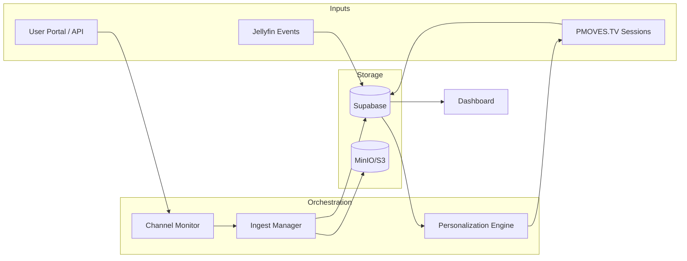

# PMOVES.YT • User Personalization & Engagement Insights
_Drafted: 2025-10-23 — Status: Proposed_

This proposal extends the PMOVES.YT ingestion stack so individual users can
curate their own channel feeds, ingest personal playlists/liked videos, and
review downstream engagement metrics across Jellyfin and PMOVES.TV. It builds on
the yt-dlp extractor matrix (see `supportedsites.md`) and the enhanced
`yt_options` plumbing introduced in the channel monitor service.

---

## 1. Goals
- Allow each PMOVES user to register YouTube/Twitch/etc. channels, playlists, and
  liked videos for automatic ingestion.
- Capture user-generated signals (ratings, watch progress, playlist additions)
  from Jellyfin + PMOVES.TV and feed them back into personalized scheduling.
- Provide a self-service analytics dashboard (usage, top sources, trending
  content) with exportable reports.
- Support multi-source ingestion (YouTube, Twitch, Vimeo, SoundCloud, podcasts)
  via yt-dlp extractor profiles while preserving DRM/compliance boundaries.

---

## 2. Personas & Use Cases
1. **Subscriber**: Links personal YouTube playlists + likes; wants a private
   Jellyfin library that mirrors their subscriptions and surfaces highlights in
   PMOVES.TV.
2. **Curator/Admin**: Manages team-wide channels (company webinars, livestreams)
   and monitors engagement at cohort level.
3. **Analyst**: Generates weekly insight packs (most watched, completion rates,
   new sources) for editorial or marketing teams.

---

## 3. Architecture Overview



Key additions:
- **User Portal/API**: form for linking playlists, liked videos, tokens (OAuth or
  API keys). Captures preferences (desired formats, subtitles, frequency).
- **Ingest Manager**: upgraded pmoves-yt service that supports extractor-specific
  presets and writes user ownership metadata.
- **Personalization Engine**: jobs that compute recommendations, schedule
  PMOVES.TV channel slots, and push “new for you” notifications.

---

## 4. Data Model (Supabase)

| Table | Purpose | Key Columns |
|-------|---------|-------------|
| `pmoves.user_profiles` | Extends existing auth data with media preferences. | `user_id`, `display_name`, `timezone`, `default_namespace` |
| `pmoves.user_sources` | Sources the user wants to track. | `id`, `user_id`, `platform`, `source_type` (`channel`/`playlist`/`likes`), `external_id`, `config` (JSON), `status`, `last_check_at` |
| `pmoves.user_ingest_runs` | Audit of ingests per user/source. | `id`, `user_source_id`, `video_id`, `status`, `duration_ms`, `metadata` |
| `pmoves.user_preferences` | Overrides for format/subtitles/postprocessors. | `user_id`, `media_type`, `options` (JSON) |
| `pmoves.user_engagement` | Jellyfin watch stats + PMOVES.TV sessions. | `id`, `user_id`, `video_id`, `platform`, `event_type`, `progress`, `duration`, `captured_at` |
| `pmoves.tv_channels` | Personalized PMOVES.TV “streams”. | `id`, `user_id` (nullable for shared channels), `title`, `schedule_config`, `status` |
| `pmoves.tv_schedule` | Upcoming/archived items per channel. | `id`, `channel_id`, `video_id`, `slot_start`, `slot_end`, `metadata` |

Additional views/materialized reports can summarize engagement by week or by
source.

---

## 5. Ingestion Flow Enhancements
1. **User Registration**
   - UI/API collects platform (YouTube/Twitch/etc.), source type, ID/URL, and
     optional OAuth token/cookies.
   - Validates extractor availability using `yt-dlp --list-formats` or `--simulate`.
   - Stores compressed cookies (if provided) in Supabase secrets bucket or Vault.

2. **Channel Monitor Update**
   - Polls `pmoves.user_sources` by `user_id` and enqueues jobs with merged
     options (user-global + source-specific + platform defaults).
   - Writes to new `yt_options` envelope:
     ```json
     {
       "download_archive": "/data/yt-dlp/users/<user_id>/<source>.archive",
       "subtitle_langs": ["en", "es"],
       "postprocessors": [{"key":"FFmpegMetadata"}, {"key":"EmbedThumbnail"}],
       "cookies": "supabase://secrets/<user_id>/<source>.txt"
     }
     ```

3. **Ingest Manager**
   - Persists user ownership in `videos.meta.user_ids` array.
   - For liked videos, fetches the playlist ID (`LL`) via yt-dlp and applies
     `--dateafter` to limit to new entries.
   - For multi-clip playlists, optionally generate sequential Jellyfin episodes
     (season = playlist title, episode = index).

4. **Post-Ingest Hooks**
   - Trigger `user_ingest_runs` row + event `user.ingest.completed.v1` for UI.
   - Update PMOVES.TV channel schedules if user enabled “auto-rotate new content”.

---

## 6. Personalization Engine

### Signals
- Ingest recency, tags, channel metadata.
- Jellyfin watch metrics (start, completion, rating, time-of-day).
- PMOVES.TV interactions (channel switches, watch duration, likes).
- Optional explicit feedback (thumbs-up, skip) captured in future UI.

### Outputs
- Ranked “For You” playlists (Supabase view `user_recommendations_v1`).
- Channel scheduling suggestion (e.g., top VOD + live placeholders).
- Engagement summary (weekly digest, top creators, completion percentage).

### Initial Algorithms
1. **Heuristic Baseline**: Weighted blend of recency (40%), affinity by channel
   (30%), completion rate (20%), global popularity (10%).
2. **User Clustering**: Group by shared sources/tags; recommend cross-cluster
   material.
3. **Temporal Boosts**: Elevate content matching user’s typical viewing slot
   (weekday mornings vs evenings) using Jellyfin watch history.

Later phases can adopt matrix factorization or sequence models once enough data
is available.

---

## 7. Jellyfin & PMOVES.TV Integration
- Provision per-user Jellyfin libraries (Audio, Video, Podcasts) via the API.
- Sync Jellyfin playback events (`/Sessions`, `/UserData`) into Supabase through
  the existing publisher pipeline or a lightweight webhook.
- Expose PMOVES.TV as a configurable set of “channels”: curated loops, live
  stream passthrough, or user-personal feeds (e.g., “Mix Weekly”).
- Provide UI toggles to opt into sharing anonymized engagement for community
  recommendations.

---

## 8. Privacy & Compliance
- Offer per-source consent and easy revocation (deleting `user_sources` stops
  polling and purges archives).
- Encrypt stored cookies/tokens (Supabase secret storage or Vault) and rotate on
  failure.
- Respect platform terms: live stream recording may require explicit user
  attestation; default to metadata-only mode for DRM-protected sites.

---

## 9. Implementation Roadmap
1. **Foundation (Sprint 1)**
   - Create new Supabase tables + policies for user-owned sources and ingests.
   - Extend channel monitor to pull from `user_sources` and forward `yt_options`.
   - Update pmoves-yt to record `user_id` associations and cookies path.

2. **Personalization MVP (Sprint 2)**
   - Capture Jellyfin watch events into `user_engagement`.
   - Build baseline recommendation query + dashboard (Metabase/Supabase UI).
   - Auto-generate download archives per user; expose status in UI.

3. **PMOVES.TV Integration (Sprint 3)**
   - Implement `pmoves.tv_channels` CRUD + scheduler.
   - Launch first personalized channel type (e.g., “New from your playlists”).
   - Add notifications digest (Supabase Edge Function → email/Discord).

4. **Extended Sources (Sprint 4)**
   - Bring additional platforms (Twitch, SoundCloud, Vimeo) online with extractor
     presets and consent flows.
   - Validate ingestion + metadata mapping for each library type.

5. **Advanced Analytics (Sprint 5)**
   - Add cohort-level dashboards, retention curves, session heatmaps.
   - Evaluate ML-based recommendation refinement (optional).

---

## 10. Open Questions
1. Preferred authentication method for YouTube “Liked videos” (OAuth vs.
   cookies). Requires secure storage + refresh flow.
2. Handling of geo-restricted or DRM-protected sources—should we skip or prompt
   for proxy configuration?
3. Retention policy for user-generated archives and derived analytics.
4. Extent of PMOVES.TV automation (always-on channel vs. scheduled events
   overlays).

Document updates as decisions land; cross-link back to
`CHANNEL_MONITOR_IMPLEMENTATION.md` and `PMOVES_YT.md` once features graduate
from proposal to implementation.

