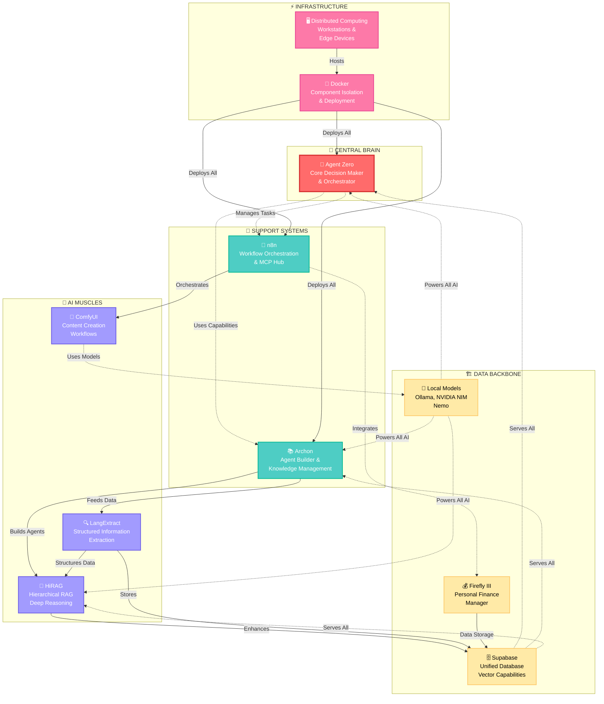
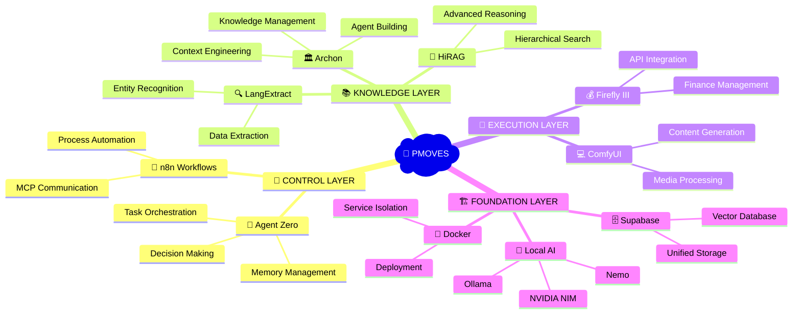
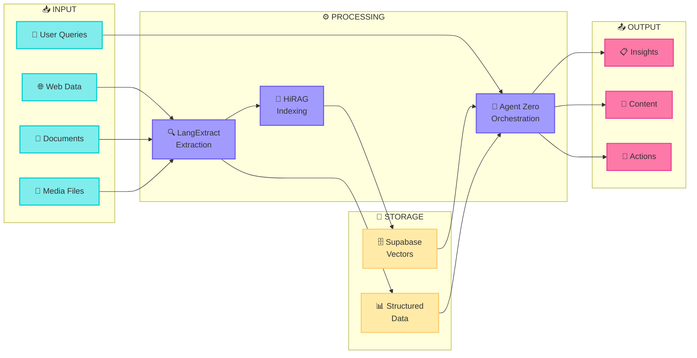
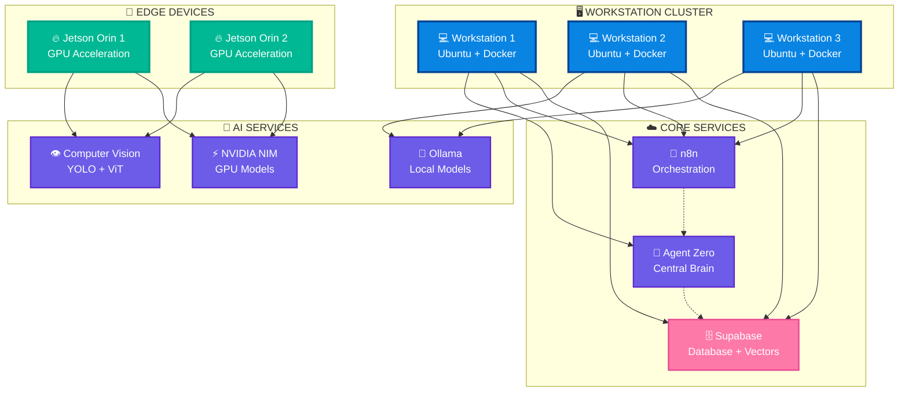
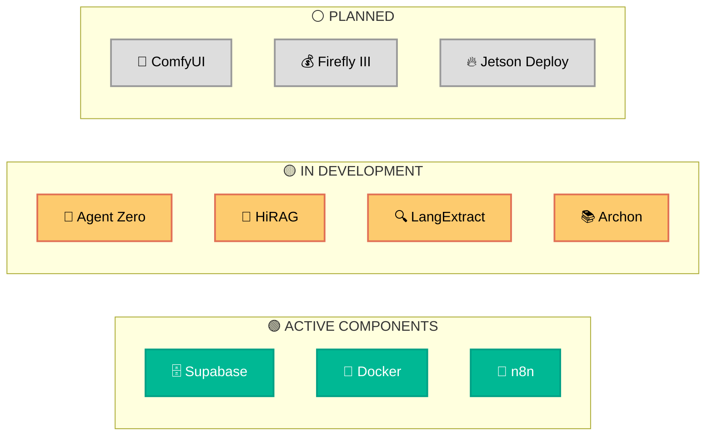

# PMOVES: Enhanced Visual Architecture Diagrams

> **DEPRECATED (2026-02-18):** These diagrams cover ~15 services and are outdated. The canonical visual topology covering all 60 agents is now at [`../AGENTS/PMOVES_AGENT_TOPOLOGY.md`](../AGENTS/PMOVES_AGENT_TOPOLOGY.md). This file is preserved for historical reference only.

## 1. High-Level Architecture (Color-Coded & Enhanced)

## 2. Simplified Component Overview

## 3. Data Flow Visualization

## 4. Deployment Architecture

## 5. Component Status Dashboard Layout

