# PMOVES: Enhanced Visual Architecture Diagrams

## 1. High-Level Architecture (Color-Coded & Enhanced)

```mermaid
graph TD
    %% Define styles for better visibility
    classDef centralBrain fill:#ff6b6b,stroke:#d63031,stroke-width:3px,color:#fff
    classDef supportSys fill:#4ecdc4,stroke:#00b894,stroke-width:2px,color:#fff
    classDef aiMuscles fill:#a29bfe,stroke:#6c5ce7,stroke-width:2px,color:#fff
    classDef dataBackbone fill:#ffeaa7,stroke:#fdcb6e,stroke-width:2px,color:#000
    classDef infrastructure fill:#fd79a8,stroke:#e84393,stroke-width:2px,color:#fff

    subgraph "🧠 CENTRAL BRAIN"
        A["🎯 Agent Zero<br/>Core Decision Maker<br/>& Orchestrator"]:::centralBrain
    end

    subgraph "🔧 SUPPORT SYSTEMS"
        B["📚 Archon<br/>Agent Builder &<br/>Knowledge Management"]:::supportSys
        C["🌊 n8n<br/>Workflow Orchestration<br/>& MCP Hub"]:::supportSys
    end

    subgraph "💪 AI MUSCLES"
        D["🧬 HiRAG<br/>Hierarchical RAG<br/>Deep Reasoning"]:::aiMuscles
        E["🔍 LangExtract<br/>Structured Information<br/>Extraction"]:::aiMuscles
        F["🎨 ComfyUI<br/>Content Creation<br/>Workflows"]:::aiMuscles
    end

    subgraph "🏗️ DATA BACKBONE"
        G["💰 Firefly III<br/>Personal Finance<br/>Manager"]:::dataBackbone
        H["🗄️ Supabase<br/>Unified Database<br/>Vector Capabilities"]:::dataBackbone
        I["🤖 Local Models<br/>Ollama, NVIDIA NIM<br/>Nemo"]:::dataBackbone
    end

    subgraph "⚡ INFRASTRUCTURE"
        J["🖥️ Distributed Computing<br/>Workstations &<br/>Edge Devices"]:::infrastructure
        K["🐳 Docker<br/>Component Isolation<br/>& Deployment"]:::infrastructure
    end

    %% Connections with better visibility
    A -.->|"Manages Tasks"| C
    A -.->|"Uses Capabilities"| B
    B -->|"Builds Agents"| D
    B -->|"Feeds Data"| E
    E -->|"Structures Data"| D
    C -->|"Orchestrates"| F
    C -.->|"Integrates"| G
    D -->|"Enhances"| H
    E -->|"Stores"| H
    F -.->|"Uses Models"| I
    G -->|"Data Storage"| H
    H -.->|"Serves All"| A
    H -.->|"Serves All"| B
    H -.->|"Serves All"| D
    I -.->|"Powers All AI"| A
    I -.->|"Powers All AI"| B
    I -.->|"Powers All AI"| D
    J -->|"Hosts"| K
    K -->|"Deploys All"| A
    K -->|"Deploys All"| B
    K -->|"Deploys All"| C
```

## 2. Simplified Component Overview

```mermaid
mindmap
  root)🚀 PMOVES(
    🧠 CONTROL LAYER
      🎯 Agent Zero
        Decision Making
        Task Orchestration
        Memory Management
      🌊 n8n Workflows
        MCP Communication
        Process Automation
    📚 KNOWLEDGE LAYER
      🏛️ Archon
        Agent Building
        Knowledge Management
        Context Engineering
      🔍 LangExtract
        Data Extraction
        Entity Recognition
      🧬 HiRAG
        Hierarchical Search
        Advanced Reasoning
    🎨 EXECUTION LAYER
      💻 ComfyUI
        Content Generation
        Media Processing
      💰 Firefly III
        Finance Management
        API Integration
    🏗️ FOUNDATION LAYER
      🗄️ Supabase
        Vector Database
        Unified Storage
      🤖 Local AI
        Ollama
        NVIDIA NIM
        Nemo
      🐳 Docker
        Service Isolation
        Deployment
```

## 3. Data Flow Visualization

```mermaid
flowchart LR
    %% Styling
    classDef inputData fill:#81ecec,stroke:#00cec9,stroke-width:2px
    classDef processing fill:#a29bfe,stroke:#6c5ce7,stroke-width:2px
    classDef storage fill:#ffeaa7,stroke:#fdcb6e,stroke-width:2px
    classDef output fill:#fd79a8,stroke:#e84393,stroke-width:2px

    subgraph "📥 INPUT"
        A1["🌐 Web Data"]:::inputData
        A2["📄 Documents"]:::inputData
        A3["🎥 Media Files"]:::inputData
        A4["💬 User Queries"]:::inputData
    end

    subgraph "⚙️ PROCESSING"
        B1["🔍 LangExtract<br/>Extraction"]:::processing
        B2["🧬 HiRAG<br/>Indexing"]:::processing
        B3["🎯 Agent Zero<br/>Orchestration"]:::processing
    end

    subgraph "💾 STORAGE"
        C1["🗄️ Supabase<br/>Vectors"]:::storage
        C2["📊 Structured<br/>Data"]:::storage
    end

    subgraph "📤 OUTPUT"
        D1["📋 Insights"]:::output
        D2["🎨 Content"]:::output
        D3["🔄 Actions"]:::output
    end

    A1 & A2 & A3 --> B1
    A4 --> B3
    B1 --> B2
    B2 --> C1
    B1 --> C2
    C1 & C2 --> B3
    B3 --> D1 & D2 & D3
```

## 4. Deployment Architecture

```mermaid
graph TB
    %% Enhanced styling
    classDef edge fill:#00b894,stroke:#00a085,stroke-width:3px,color:#fff
    classDef workstation fill:#0984e3,stroke:#074492,stroke-width:3px,color:#fff
    classDef service fill:#6c5ce7,stroke:#5f27cd,stroke-width:2px,color:#fff
    classDef data fill:#fd79a8,stroke:#e84393,stroke-width:2px,color:#fff

    subgraph "🖥️ WORKSTATION CLUSTER"
        WS1["💻 Workstation 1<br/>Ubuntu + Docker"]:::workstation
        WS2["💻 Workstation 2<br/>Ubuntu + Docker"]:::workstation
        WS3["💻 Workstation 3<br/>Ubuntu + Docker"]:::workstation
    end

    subgraph "📱 EDGE DEVICES"
        ED1["🔥 Jetson Orin 1<br/>GPU Acceleration"]:::edge
        ED2["🔥 Jetson Orin 2<br/>GPU Acceleration"]:::edge
    end

    subgraph "☁️ CORE SERVICES"
        SB["🗄️ Supabase<br/>Database + Vectors"]:::data
        N8N["🌊 n8n<br/>Orchestration"]:::service
        AZ["🎯 Agent Zero<br/>Central Brain"]:::service
    end

    subgraph "🤖 AI SERVICES"
        LLM1["🧠 Ollama<br/>Local Models"]:::service
        LLM2["⚡ NVIDIA NIM<br/>GPU Models"]:::service
        CV["👁️ Computer Vision<br/>YOLO + ViT"]:::service
    end

    %% Connections
    WS1 & WS2 & WS3 --> SB
    WS1 & WS2 & WS3 --> N8N
    WS1 --> AZ
    ED1 & ED2 --> LLM2
    ED1 & ED2 --> CV
    WS2 & WS3 --> LLM1
    N8N -.-> AZ
    AZ -.-> SB
```

## 5. Component Status Dashboard Layout

```mermaid
graph LR
    %% Status indicators
    classDef active fill:#00b894,stroke:#00a085,stroke-width:2px,color:#fff
    classDef dev fill:#fdcb6e,stroke:#e17055,stroke-width:2px,color:#000
    classDef planned fill:#ddd,stroke:#999,stroke-width:2px,color:#000

    subgraph "🟢 ACTIVE COMPONENTS"
        AC1["🗄️ Supabase"]:::active
        AC2["🐳 Docker"]:::active
        AC3["🌊 n8n"]:::active
    end

    subgraph "🟡 IN DEVELOPMENT"
        DC1["🎯 Agent Zero"]:::dev
        DC2["🧬 HiRAG"]:::dev
        DC3["🔍 LangExtract"]:::dev
        DC4["📚 Archon"]:::dev
    end

    subgraph "⚪ PLANNED"
        PC1["🎨 ComfyUI"]:::planned
        PC2["💰 Firefly III"]:::planned
        PC3["🔥 Jetson Deploy"]:::planned
    end
```

