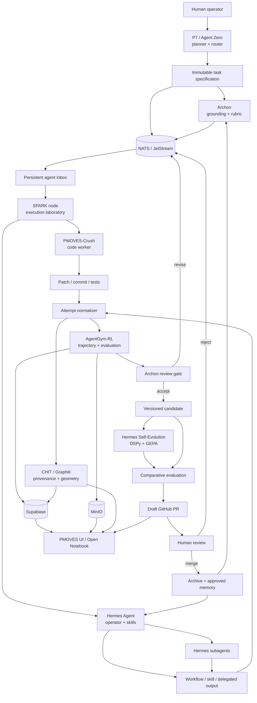
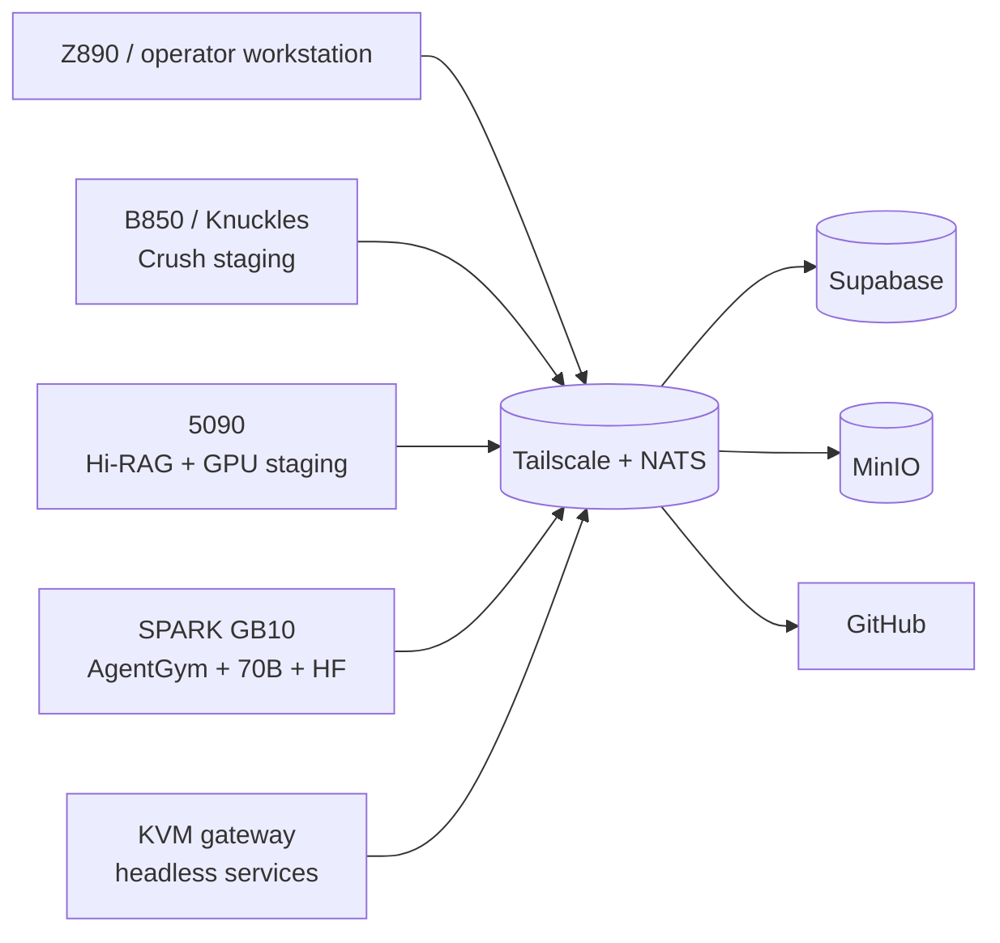

# Evolution Fabric Dependency Graph

**Status:** Proposed
**Version:** 0.1.0

## Purpose

This document maps the existing PMOVES components required for the Evolution Fabric and identifies which relationships are already implemented, planned, or newly proposed.

## System graph



## Existing components and extension points

| Component | Existing evidence | Evolution Fabric use | Required change |
|---|---|---|---|
| Agent Zero | Agent registry, MCP runtime, P7 room lifecycle | Planner, task issuer, router | Add task-envelope awareness; do not create a new planner service |
| P7 | Room/session command and fact subjects | Stage gate and room selection | Bind evolution tasks to room/stage facts |
| Archon | Knowledge manager and grounding plane | Teacher, rubric source, independent reviewer | Add review/lesson adapters; preserve no-self-review boundary |
| PMOVES-Crush | `CRUSH.md`, PMOVES integration contract, Graphiti trail, SPARK handoff | Bounded code/config/docs worker | Add attempt export hook and normalized completion envelope |
| Hermes Agent | Dedicated room, TAC tree, registry, profiles, planned NATS bridge | Persistent operator, skill curator, scheduler, subagent manager | Implement planned NATS/MCP bridge and isolated evolution-memory scope |
| Hermes Self-Evolution | DSPy/GEPA skill evolution with PR guardrails | Candidate optimizer | Add PMOVES dataset/trace adapter and GitHub target config |
| AgentGym-RL | Coordinator, geometry subscriptions, storage, training/eval APIs | Trajectory store, scoring, optional training | Extend attempt schema or add additive evolution tables; avoid duplicate service |
| EvoSwarm | Existing AgentGym integration docs and controller | Optional population search and candidate generation | Integrate only after deterministic baseline is stable |
| CHIT Geometry Bus | Geometry events, gateway, ShapeStore, calibration | Provenance, trajectory geometry, replay fingerprints | Define attempt/review shape references |
| AI Graphiti | Signed agent trail and contributor identities | Attribution and handoff evidence | Require signed production-candidate trail |
| Supabase | AgentGym storage, realtime, UI backend | Task/attempt/review/promotion records | Add additive schema and realtime publications |
| MinIO | AgentGym checkpoints and PMOVES media assets | Large artifacts, logs, patches, recordings | Define immutable artifact keys and checksums |
| NATS | P7, geometry, CLAW, AgentGym, messaging subjects | Event fabric | Add only missing evolution subjects and catalog them |
| GitHub | Branch/PR promotion, checks, reviews | Production boundary | Draft PR only; no direct main mutation |
| Gum | Interactive shell UI | Operator menus, approvals, task selection | Add theme-driven launch flow after core contracts work |
| Glow | Markdown terminal renderer | Render RFCs, reviews, scorecards, handoffs | Add report commands and theme styles |
| VHS | Reproducible terminal recordings | Capture benchmark and demo evidence | Add tapes for bootstrap and first pilot |
| Open Notebook | Durable research/notebook plane | Mirror tasks, attempts, reviews, lessons | Add notebook-sync mapping after storage schema lands |

## Node topology



### SPARK node responsibilities

SPARK is the preferred first execution node because it already aligns with:

- 70B+ local-model routing;
- AgentGym and Hugging Face infrastructure;
- ARM64 GitHub runner support;
- large unified memory for comparative runs;
- the existing Crush-awakening handoff;
- the planned Hermes SPARK profile.

SPARK is **not** the source of truth. Supabase, MinIO, GitHub, CHIT trails, and NATS facts remain the durable system record.

## Control-plane versus data-plane boundaries

### Control plane

- Agent Zero/P7 task creation and stage control.
- NATS commands and facts.
- Archon review decisions.
- GitHub branch and PR lifecycle.
- Operator approval.

### Data plane

- PMOVES-Crush/Hermes tool transcripts.
- Patches, commits, test output, benchmark data.
- AgentGym trajectories and model checkpoints.
- CHIT packets and Graphiti trails.
- Open Notebook mirrors and UI state.

A command must not be treated as a durable fact until the relevant service emits the versioned fact and persistence succeeds.

## Workflow role mapping

| Workflow phase | Primary role | Default implementation |
|---|---|---|
| Pre-work planning | planner / Control Body | Agent Zero with Archon grounding |
| Execution | worker / Delivery Body | PMOVES-Crush or Hermes Agent/subagent |
| Evaluation | system evaluator | AgentGym-RL + deterministic checks |
| Review | reviewer / Control Body | Archon or designated reviewer agent |
| Memory custody | Memory Body | CHIT, Graphiti, Archon/Cipher, Supabase |
| Promotion | human owner + GitHub | Draft PR → checks → review → merge |

## Dependency rules

1. Workers may query Archon, but Archon review must use a fresh review context and cannot silently modify the candidate.
2. Hermes may delegate to Crush or subagents, but the producing identities must remain visible in the normalized attempt.
3. AgentGym scores evidence; it does not approve production deployment.
4. CHIT/Graphiti records provenance; they do not replace tests or security gates.
5. SPARK may execute and benchmark, but it may not become the only storage location.
6. The UI reads durable records and facts; it must not infer promotion state from transient terminal output.
7. Self-evolution consumes approved or explicitly experimental traces only.

## Failure domains and fallbacks

| Failure | Fallback |
|---|---|
| SPARK offline | Route small/medium tasks to B850, 5090, or Z890 based on registry affinity |
| NATS transient loss | Persistent inbox + JetStream where configured; do not assume fire-and-forget delivery |
| AgentGym unavailable | Preserve attempt artifacts and mark evaluation pending; no promotion |
| Archon unavailable | Manual reviewer may proceed with documented rubric; no automatic approval |
| Hermes gateway unavailable | Run local CLI profile and export attempt later |
| Crush unavailable | Hermes bounded code subagent or Codex may produce an experimental attempt, still subject to the same gates |
| MinIO unavailable | Keep local sandbox artifacts temporarily and block archive/promotion |
| GitHub unavailable | Preserve signed candidate artifact; no production promotion |

## First-pilot dependency slice

The Experience Layer skin-manifest validator pilot requires only:

```text
Agent Zero/P7
  → Archon grounding pack
  → SPARK persistent inbox
  → PMOVES-Crush + Hermes Agent
  → TypeScript/JSON-schema tests
  → AgentGym attempt scoring
  → Archon review
  → CHIT/Graphiti trail
  → GitHub draft PR
```

The pilot explicitly does not require model-weight training, EvoSwarm, or a production evolution dashboard.
