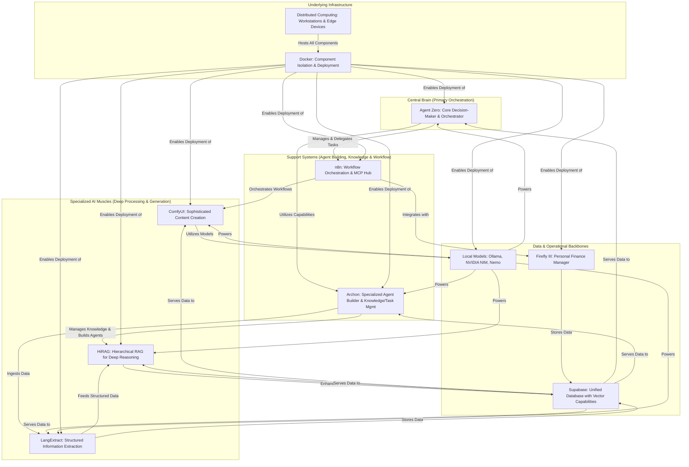
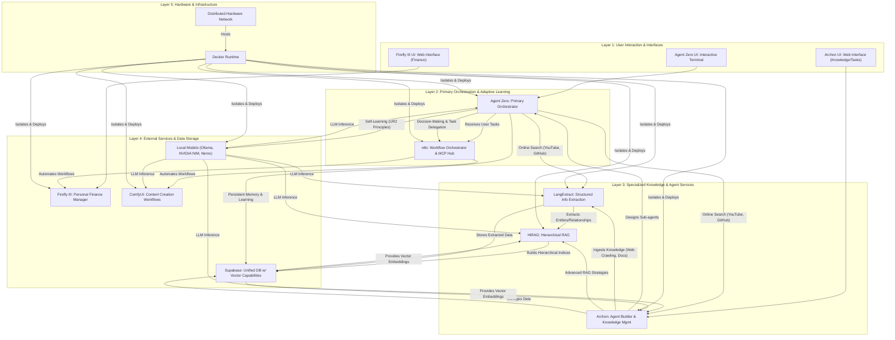
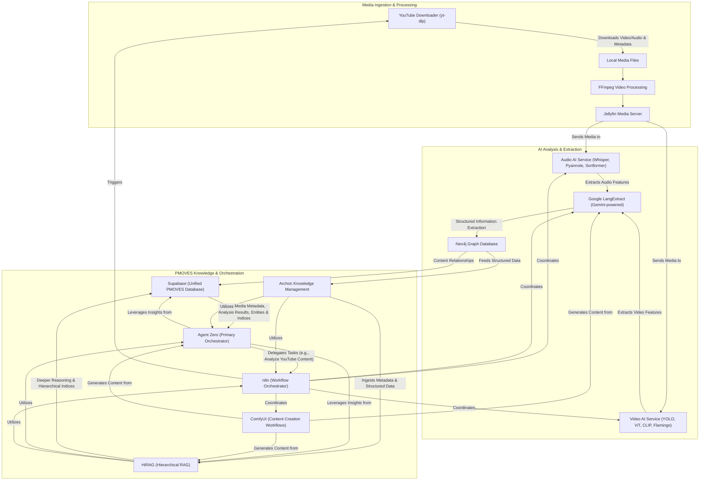
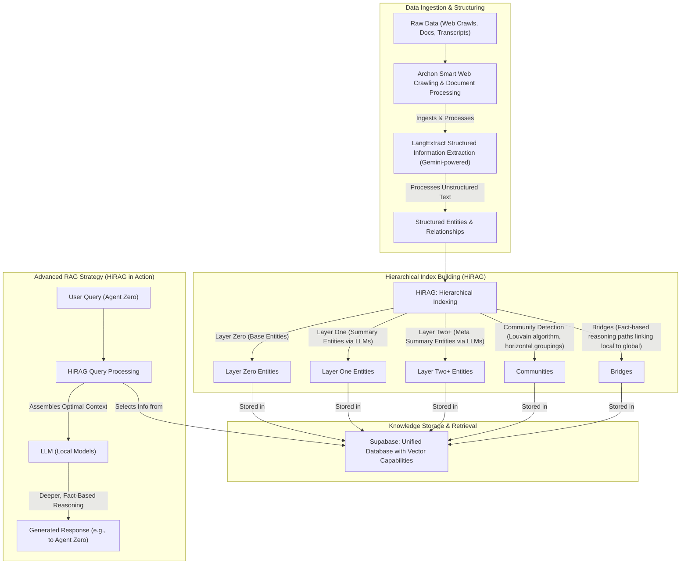
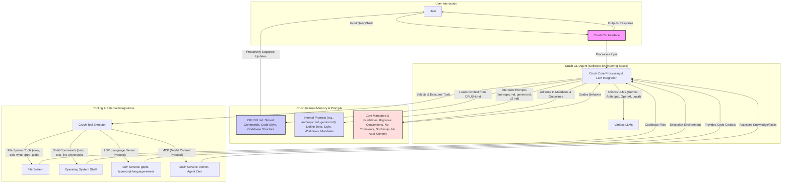
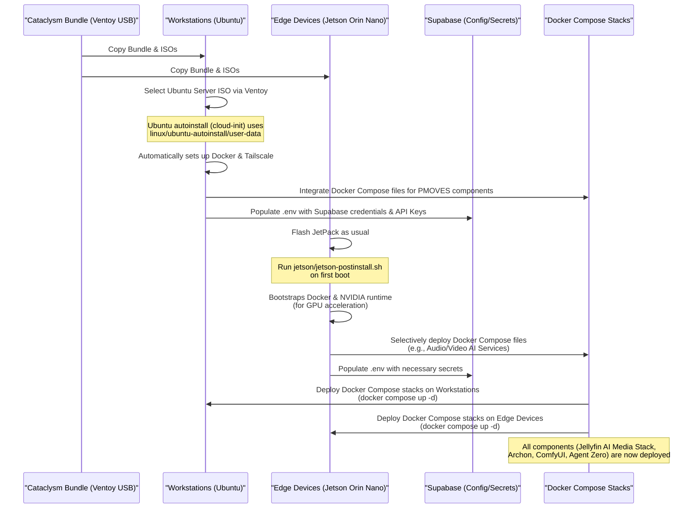

# PMOVES: A Self-Improving Multi-Agent AI Architecture

The PMOVES (POWERFULMOVES) system is an advanced, distributed multi-agent architecture designed for continuous self-improvement and research, emphasizing autonomous learning and local control over data and models. This ecosystem integrates various specialized AI and data management tools to handle complex tasks, from financial analysis to content creation. Below are several Mermaid diagrams illustrating different architectural, configuration, and workflow aspects of the PMOVES system.

--------------------------------------------------------------------------------

## 1. High-Level PMOVES Architecture

This diagram provides a top-level view of the PMOVES system, categorizing its main components into functional layers.

**Explanation:**

The PMOVES system is envisioned with a Central Brain managed by Agent Zero, acting as the primary orchestrator across the network, making decisions, and managing the overall system. This "brain" is dynamic, learning, and can create subordinate agents.

Supporting Agent Zero are the Support Systems. Archon serves as the knowledge and task management backbone, an integrated environment for all context engineering, and a specialized agent builder. It offers robust knowledge management, including smart web crawling, document processing, and code example extraction, with advanced RAG strategies like vector search. n8n acts as the automation and workflow orchestration layer, facilitating multi-agent task delegation and seamless communication between components via the Model Context Protocol (MCP).

Specialized AI "Muscles" provide deep processing and generation capabilities. HiRAG offers hierarchical retrieval-augmented generation for deeper, fact-based reasoning on complex, multi-layered knowledge structures, overcoming traditional RAG limitations. LangExtract is a Python library for extracting structured information from unstructured text documents with precise source grounding, often powered by LLMs like Gemini. ComfyUI handles sophisticated content creation workflows, such as text-to-image and video generation.

The Data & Operational Backbones include Firefly III, a self-hosted personal finance manager. Supabase is the unified database with vector capabilities for the entire PMOVES system, serving as the backend for Archon and storing vector embeddings for semantic search. Local Models (Ollama, NVIDIA NIM, Nemo) are a suite of LLMs distributed across the hardware network, providing the underlying language model capabilities for various agents, ensuring data privacy and efficient local processing.

All these components are deployed and run on Underlying Infrastructure comprising a Distributed Computing network of workstations and edge devices, with Docker used for isolating and deploying components across this infrastructure.

--------------------------------------------------------------------------------

## 2. Detailed PMOVES Functional Layers and Interactions

This diagram illustrates the interactions and data flow across different functional layers within the PMOVES system, detailing how components collaborate to achieve autonomous operations and self-improvement.

**Explanation:**

This detailed view shows the PMOVES system operating across five distinct layers.

Layer 1: User Interaction & Interfaces represents the direct points of contact for users. This includes the interactive terminal interface for Agent Zero, the web interface for Archon for managing knowledge and tasks, and the web interface for Firefly III for personal finance management.

Layer 2: Primary Orchestration & Adaptive Learning is where Agent Zero reigns as the primary orchestrator. It receives user tasks, makes decisions, and delegates them. Its persistent memory allows it to learn from past experiences, and it uses online search for external information. n8n is the workflow orchestrator, automating connections and facilitating multi-agent task delegation using the MCP (Model Context Protocol) as a central hub.

Layer 3: Specialized Knowledge & Agent Services details the core AI services. Archon is crucial for building specialized sub-agents and managing knowledge. It ingests data from web crawling and documents, which is then processed by LangExtract to extract structured information. This structured data, combined with Archon's knowledge base, is fed into HiRAG for hierarchical retrieval-augmented generation, enabling deeper reasoning.

Layer 4: External Services & Data Storage includes specific applications and the central data repository. Firefly III offers a REST JSON API for programmatic access to financial data, automated via n8n. ComfyUI executes AI-driven content generation workflows, also automated by n8n. Supabase acts as the unified database, storing vector embeddings and serving as Archon's backend. Local Models provide the underlying LLM capabilities for all other AI components, running on the distributed hardware.

Finally, Layer 5: Hardware & Infrastructure underpins the entire system. Docker Runtime ensures isolated and portable environments for all services, while the Distributed Hardware Network comprises various workstations and edge computing devices, optimizing for different workloads. This layered approach enables autonomous upgrading and self-improvement, with Agent Zero orchestrating research, Archon managing knowledge, LangExtract and HiRAG refining information, and Supabase centralizing learned data.

--------------------------------------------------------------------------------

## 3. Jellyfin AI Media Stack Integration Workflow

This diagram illustrates the workflow for integrating the Jellyfin AI Media Stack into PMOVES, highlighting its specialized role as an "AI muscle" for media analysis and content creation.

**Explanation:**

The Jellyfin AI Media Stack is integrated as a specialized AI muscle within the PMOVES architecture, leveraging Google LangExtract powered by Gemini for entity extraction.

1. Content Ingestion & Processing: The YouTube Downloader (yt-dlp) ingests media from YouTube, passing video/audio and metadata to FFmpeg for further processing. Jellyfin Media Server then manages and streams this content.

2. AI Analysis & Extraction: The media from Jellyfin is routed to dedicated Audio AI Service (utilizing models like Whisper, Pyannote Audio, NVIDIA Sortformer for transcription, diarization, emotion recognition) and Video AI Service (using YOLO v11, Vision Transformers, CLIP, Flamingo for object detection, scene understanding, video-language reasoning). The outputs from these services are then fed into Google LangExtract (Gemini-powered) for structured information and entity extraction, creating data for Neo4j knowledge graphs.

3. PMOVES Knowledge & Orchestration: The structured data from LangExtract and Neo4j, along with rich metadata from analysis, is ingested into Archon's knowledge management system. This knowledge is further processed by HiRAG to build hierarchical indices and enable deeper, fact-based reasoning. All this information (media metadata, AI analysis results, extracted entities, and HiRAG indices) is centrally stored in Supabase, the unified PMOVES database. Agent Zero, the primary orchestrator, can delegate tasks to the Jellyfin stack (e.g., finding and analyzing YouTube content) via n8n. n8n acts as the workflow orchestration layer and MCP Hub, facilitating communication and task hand-offs between Agent Zero and the Jellyfin services, as well as orchestrating ComfyUI for content creation based on the generated insights.

This integration creates a powerful synergy for research, data processing, and content generation, allowing PMOVES agents to query and retrieve deep insights from analyzed media.

--------------------------------------------------------------------------------

## 4. Geometry Bus and Multimodal Anchors (CHIT)

The Geometry Bus is a new logical layer that standardizes how all PMOVES agents describe, exchange, and explore content across video, audio, image, and text. It is grounded in the CHIT Geometry Packet (CGP v0.1) defined in `docs/understand/PMOVESCHIT.md` and extended by the decoders in `docs/understand/PMOVESCHIT_DECODERv0.1.md` and `docs/understand/PMOVESCHIT_DECODER_MULTIv0.1.md`.

- Canonical packet: `spec: chit.cgp.v0.1` with `super_nodes[] → constellations[] → points[]`.
- Anchor space: every constellation provides an `anchor` (direction) with soft spectrum bins for “where” content lives; points carry cross-modal metadata.
- Shape IDs: stable `shape_id` keys address anchors/points across DB and in-memory caches.
- Time/space alignment: each point may include `{video_id, t_start, t_end, frame_idx}` or `{audio_id, t_start, t_end}` or `{doc_id, token_start, token_end}` to jump between modalities.

Recommended Supabase tables (minimal):
- `anchors(id, kind, dim, meta)`
- `constellations(id, anchor_id, summary, radial_min, radial_max, spectrum, meta)`
- `shape_points(id, constellation_id, modality, ref_id, t_start, t_end, frame_idx, token_start, token_end, proj, conf, meta)`
- `shape_index(shape_id, modality, ref_id, loc_hash, meta)` for fast cross-modal lookup.

Event topics (publish/subscribe):
- `geometry.cgp.v1` — new/updated CGP packets
- `analysis.entities.v1` — entity graphs from LangExtract/Neo4j
- `analysis.audio.v1` — emotions/segments (audio)
- `analysis.video.v1` — detections/segments (video)

In-memory “ShapeStore” (service-local cache):
- Keyed by `shape_id` with LRU retention; mirrors recent `shape_points` and `constellations` to support sub‑100ms interactive scrubbing/jumping between modalities.

Exploration UI (agent + user):
- A single canvas where anchors/constellations are the primary navigation. From any point, jump to the corresponding video frame, audio span, or text snippet.
- Decoders provide “geometry‑only” retrieval and learned summarization; security utilities (HMAC/AES‑GCM) optionally sign and encrypt anchors when sharing.

References:
- See `docs/understand/PMOVESCHIT.md` for the CGP spec and backend/frontend notes.
- See `docs/understand/PMOVESCHIT_DECODERv0.1.md` and `docs/understand/PMOVESCHIT_DECODER_MULTIv0.1.md` for decoders, metrics, and security.

--------------------------------------------------------------------------------

## 5. YouTube Ingestion as a First-Class Source (upgrade from PMOVES_YT)

Consolidating `docs/PMOVES.yt/PMOVES_YT.md` into the architecture view. The YouTube worker is both an ingestion source and a Geometry Bus participant.

Endpoints (worker):
- `POST /yt/info` → `{ id, title, uploader, duration, webpage_url }`
- `POST /yt/download` → downloads MP4 to S3 `yt/<id>/raw.mp4`; inserts `videos`; emits `ingest.file.added.v1`
- `POST /yt/transcript` → extracts audio + Whisper; inserts `transcripts`; emits `ingest.transcript.ready.v1`
- `POST /yt/ingest` → convenience: info + download + transcript

Compose profiles: `workers|orchestration|agents` expose `pmoves-yt` (8077) and `ffmpeg-whisper` (8078).

Data model (Supabase):
- `videos(video_id, namespace, title, source_url, s3_base_prefix, meta)`
- `transcripts(video_id, language, text, s3_uri, meta)`
- Next: `detections`, `segments`, `emotions` feeding the Geometry Bus tables above.

Flow → Geometry Bus tie‑in:
1) `/yt/ingest` yields raw media + transcript rows and events.
2) Analysis workers produce detections/segments/emotions; derive CGP `constellations` aligned by timestamps.
3) Publish `geometry.cgp.v1`; UI/agents update views and enable cross‑modal jumps.

Notes:
- Switch `ffmpeg-whisper` to `faster-whisper` for GPU auto‑detect (desktop/Jetson).
- For Jetson, use L4T PyTorch bases; keep CLIP/CLAP optional by profile.

--------------------------------------------------------------------------------

## 6. Geometry Decoders, Security, and Calibration

- Endpoints:
  - `POST /geometry/event` — accepts CGP packets; if `CHIT_REQUIRE_SIGNATURE=true`, verifies HMAC; if `CHIT_DECRYPT_ANCHORS=true`, decrypts `anchor_enc`.
  - `GET /shape/point/{id}/jump` — returns a compact locator for UI/agents to jump (video/audio/text).
  - `POST /geometry/decode/text` — geometry-only or learned (Tiny T5) summaries; gated by `CHIT_DECODE_TEXT`.
  - `POST /geometry/decode/image` — CLIP-based (optional); gated by `CHIT_DECODE_IMAGE` and requires the SentenceTransformer CLIP weights + Pillow for fetching/ranking supplied URLs.
  - `POST /geometry/decode/audio` — CLAP-based (optional); gated by `CHIT_DECODE_AUDIO` and requires the `laion-clap` + `torch` stack so the gateway can cache the checkpoint locally.
  - `POST /geometry/calibration/report` — basic JS/Wasserstein-1D/coverage metrics for spectra.

- Env flags (gateway):
  - `CHIT_REQUIRE_SIGNATURE`, `CHIT_PASSPHRASE`, `CHIT_DECRYPT_ANCHORS`
  - `CHIT_DECODE_TEXT`, `CHIT_DECODE_IMAGE`, `CHIT_DECODE_AUDIO`
  - `CHIT_CODEBOOK_PATH` (default `datasets/structured_dataset.jsonl`), `CHIT_T5_MODEL`

- Security helpers: `tools/chit_security.py` (sign/verify/encrypt/decrypt).

- UI contract: UI drives interaction; server returns locators and summaries without side effects, leaving room for rich client-side choreography.

--------------------------------------------------------------------------------

## 7. Agents as MCP Providers (Local-First)

- Agent Zero (Conductor) and Archon (Librarian) expose MCP-style tools over stdio shims:
  - Paths: `services/agent-zero/mcp_server.py`, `services/archon/mcp_server.py`.
  - Run via Make: `make mcp-agent-zero FORM=POWERFULMOVES` or `make mcp-archon FORM=CREATOR`.
  - Tools include: `geometry.publish_cgp`, `geometry.decode_text`, `geometry.jump`, `knowledge.rag.query`, `knowledge.codebook.update`, etc.
- Forms (temperaments) in `configs/agents/forms/*.yaml`:
  - `POWERFULMOVES` (default), `CREATOR`, `RESEARCHER` — tunable weights for decode/retrieve/generate and mesh offload thresholds.
- Privacy defaults: shapes-only sharing; artifact sharing requires explicit approval.

## 4. HiRAG Integration Workflow

This diagram details how HiRAG (Hierarchical Retrieval-Augmented Generation) is integrated into PMOVES, showing its role in building hierarchical knowledge structures and enhancing fact-based reasoning capabilities.

**Explanation:**

HiRAG integration provides hierarchical knowledge structuring and deeper, fact-based reasoning, moving beyond traditional flat RAG approaches within PMOVES.

1. Data Ingestion & Structuring: Raw Data from various sources (web crawls, documents, media transcripts) is first ingested and processed by Archon's smart web crawling and document processing capabilities. LangExtract, a core PMOVES component, then processes this unstructured text, extracting structured entities and relationships with precise source grounding, often powered by Gemini.

2. Hierarchical Index Building (HiRAG): The structured entities and relationships are fed into HiRAG, which builds hierarchical indices. This involves:

    • Layer Zero: Direct extractions (base entities).
    
    • Layer One: LLMs cluster and summarize Layer Zero nodes to create higher-level concepts.
    
    • Layer Two+: Further abstraction and summarization for increasingly complex concepts.
    
    • Community Detection: HiRAG identifies "communities" of related thematic nodes across all layers, representing horizontal groupings of information.
    
    • Bridges: Fact-based reasoning paths are computed, linking local entities to global concepts and communities, reducing hallucination.

3. Knowledge Storage & Retrieval: All these hierarchical layers, communities, and bridges are stored within Supabase, the unified PMOVES database, leveraging its vector capabilities for advanced semantic retrieval.

4. Advanced RAG Strategy (HiRAG in Action): When a User Query (from Agent Zero) comes in, HiRAG Query Processing dynamically selects information from local entities, communities, and global bridges, assembling an optimal context for the LLM based on query complexity. This rich context enables Local Models (LLMs) to perform deeper, fact-based reasoning, producing generated responses with higher accuracy and reduced contradictions. This enhances Agent Zero's persistent memory and improves online search by formulating more precise queries and learning dynamic policies for knowledge acquisition.

--------------------------------------------------------------------------------

## 8. Live Geometry UI + WebRTC Shape Handshakes

- Static UI hosted by v2 gateway at `/geometry/` shows a canvas of recent points and listens for `geometry.cgp.v1` updates (broadcast locally on ingest).
- WebRTC signaling: clients connect to `/ws/signaling/{room}` and exchange offers/candidates. DataChannel `shapes` sends:
  - `shape-hello` (nodeId optional, forms, policy: shapes_only)
  - `shape-share` (CGP headers or signed capsule)
  - `shape-capsule` (signed CGP payload)
- Publish to mesh: `POST /mesh/handshake` publishes to NATS subject `mesh.shape.handshake.v1`. Mesh Agent verifies (if `MESH_PASSPHRASE` set) and forwards to `/geometry/event` on local nodes.
- Optional in-browser encryption: UI can AES‑GCM encrypt `anchor` → `anchor_enc` with PBKDF2(passphrase) + IV, and sign the CGP (HMAC). Receiving gateway can decrypt when `CHIT_DECRYPT_ANCHORS=true`.
- This enables PMOVES-to-PMOVES local collaboration: share only “shapes” (CGP) by default; artifacts shared on explicit approval.

## 5. Crush CLI Integration Context

This diagram focuses on the Crush interactive CLI agent for software engineering, showing its internal structure, memory, and operational guidelines within the PMOVES ecosystem.

**Explanation:**

Crush positions itself as an interactive CLI agent, a "coding bestie" for software engineering tasks within PMOVES. It runs each task in a secure, short-lived virtual machine with preinstalled developer tools.

1. User Interaction: A User provides queries or tasks directly to the Crush CLI Interface.

2. Crush Core Processing: Crush's core processing integrates with multiple LLMs (OpenAI, Anthropic, Gemini, local models), allowing switching mid-session while preserving context. Its behavior is governed by internal prompts (e.g., anthropic.md, gemini.md, v2.md), which define its tone, style, and operational workflows.

3. Crush Internal Memory & Prompts:

    • CRUSH.md: A file in the current working directory is automatically added to Crush's context, storing frequently used bash commands, user code style preferences, and codebase structure information. Crush proactively suggests adding useful commands or code style information to CRUSH.md for future reference.

    • Core Mandates & Guidelines: Crush rigorously adheres to existing project conventions, never assumes library availability, mimics existing code style, and makes idiomatic changes. Critically, it does not add comments unless explicitly asked, never uses emojis, and never commits changes without explicit user permission.

4. Tooling & External Integrations: Crush executes tasks using a variety of tools:

    • File System Tools: view, edit, write, grep, glob for interacting with the codebase.

    • Shell Commands: bash for running commands like build, test, lint, typecheck. Crush explains critical bash commands that modify the file system before execution.

    • LSP (Language Server Protocol): Used for additional code context, enhancing its understanding of the project.

    • MCP (Model Context Protocol): Crush adds capabilities via MCPs (http, stdio, sse), allowing it to connect to other MCP servers like Archon or Agent Zero.

The workflow emphasizes understanding, planning, incremental implementation, and rigorous verification through testing and linting, all while maintaining a concise and professional CLI interaction style.

--------------------------------------------------------------------------------

## 6. Cataclysm Provisioning Workflow

This diagram illustrates how the Cataclysm Provisioning Bundle is used for the mass deployment of Docker Compose stacks and other infrastructure components across the distributed PMOVES hardware network.

**Explanation:**

The Cataclysm Provisioning Bundle is a critical tool for the mass deployment and consistent setup of PMOVES components across its distributed hardware.

1. Bundle Preparation: The Cataclysm Bundle (typically on a Ventoy USB stick) contains the necessary ISOs, automated installation scripts, and configuration files. This bundle is copied to multiple Workstations (e.g., Ubuntu-based) and Edge Devices (e.g., Jetson Orin Nano Super devices).

2. Workstation Deployment: For Linux-based workstations, the Ubuntu autoinstall process is used. It leverages linux/ubuntu-autoinstall/user-data for unattended installations, which also sets up Docker and Tailscale. These scripts are then extended to integrate the specific Docker Compose files for PMOVES components like Archon, Agent Zero, and ComfyUI. The system populates environment variables (.env) with credentials and API keys, potentially sourced from Supabase or other secure mechanisms.

3. Edge Device Deployment: For Jetson Orin Nano devices, after flashing JetPack, the jetson/jetson-postinstall.sh script is run on first boot. This bootstraps Docker and the NVIDIA runtime, which is essential for GPU-accelerated AI models within the Jellyfin AI Media Stack (e.g., Audio AI Service, Video AI Service). Specific Docker Compose files can be selectively deployed to these edge devices.

4. Docker Compose Deployment: Once the base environment is provisioned and configured, the respective Docker Compose stacks for PMOVES components (such as the Jellyfin AI Media Stack, Archon, ComfyUI, and Agent Zero) are brought up using docker compose up -d commands on both workstations and edge devices. This ensures a consistent and efficient deployment of the entire distributed AI ecosystem.

The Cataclysm bundle also handles secrets management through placeholders in .env files, which are populated by the post-install scripts. This automated deployment mechanism is key to scaling and maintaining the PMOVES system.
