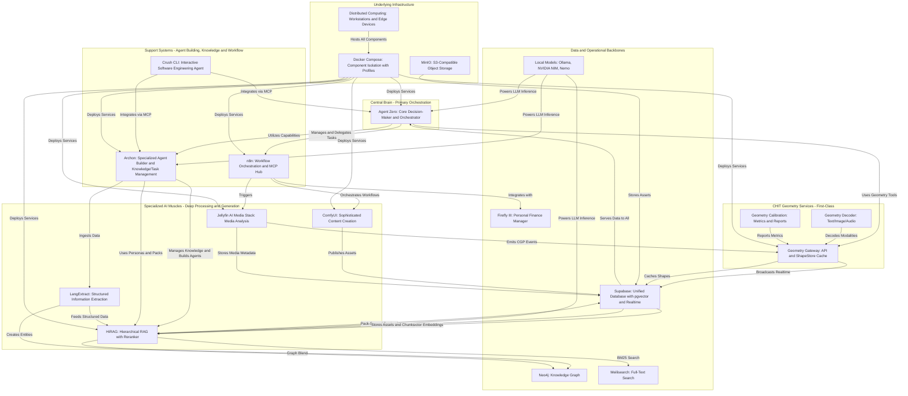
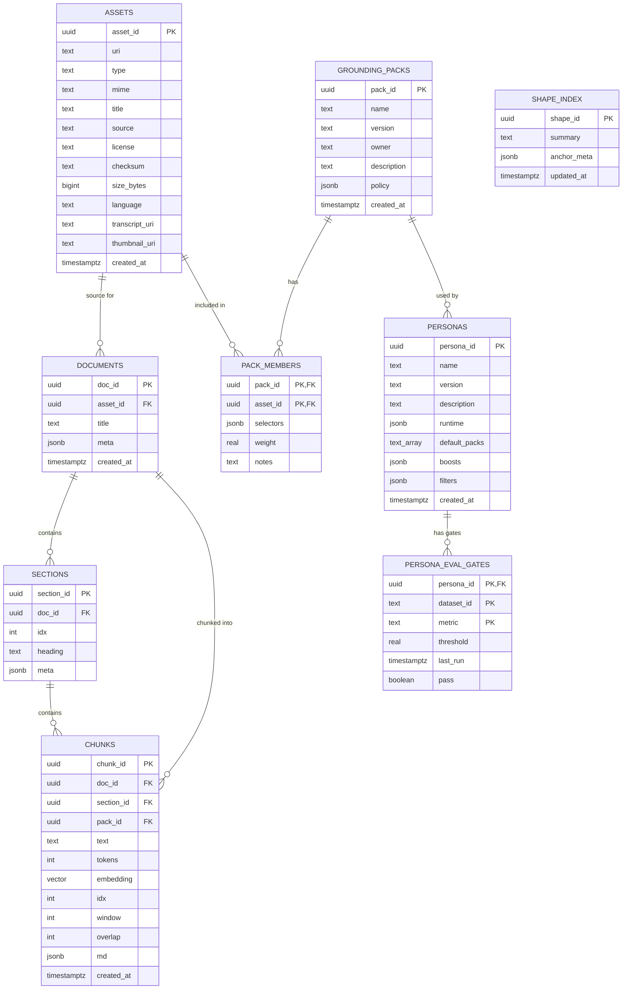
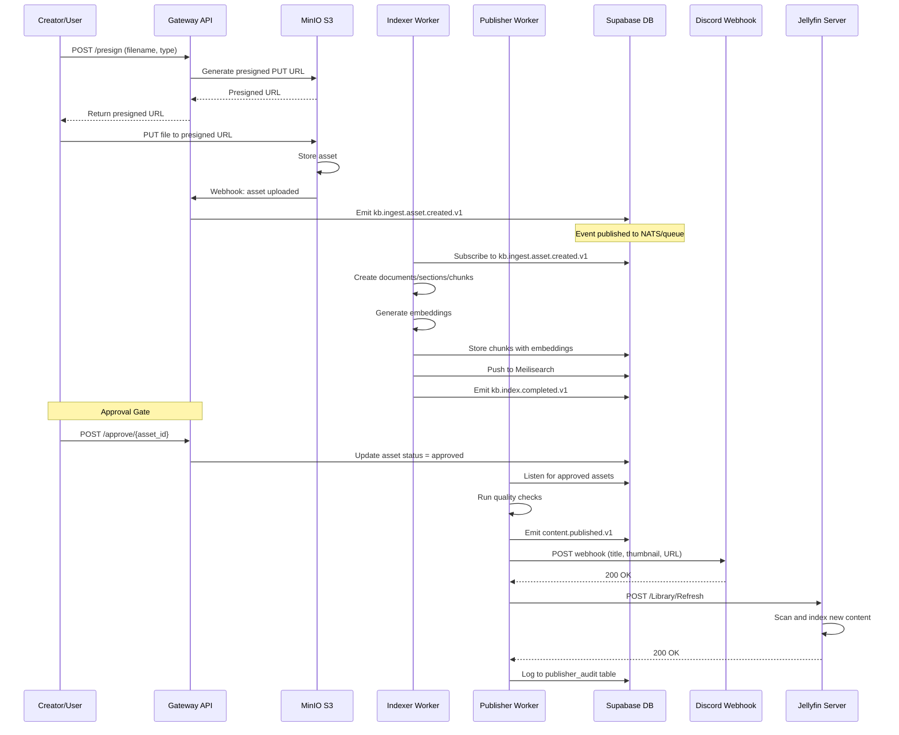
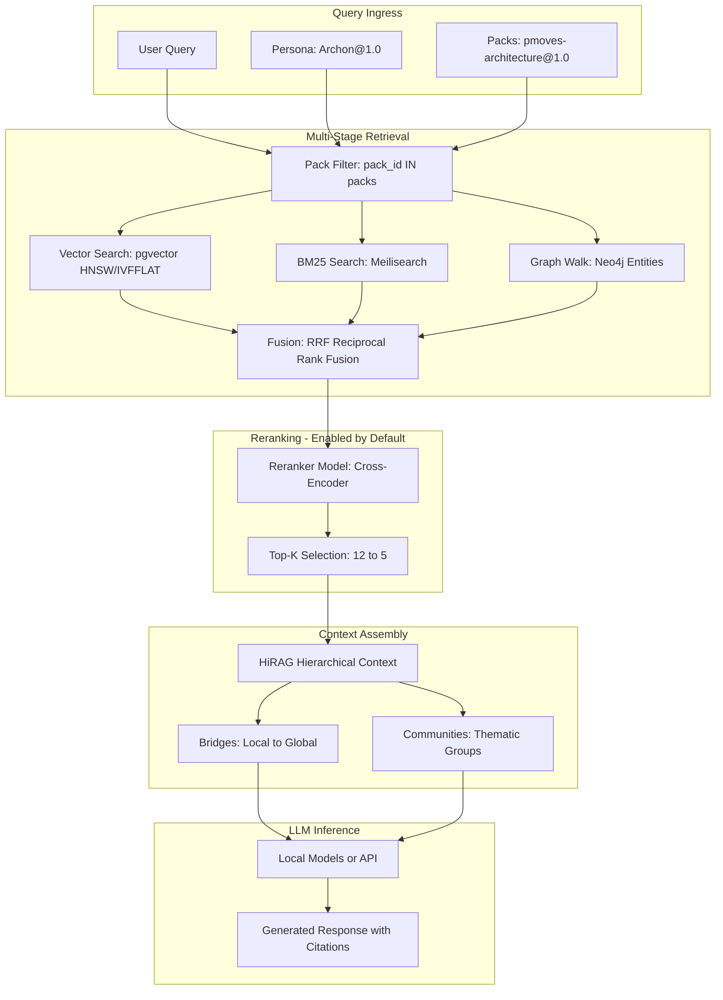
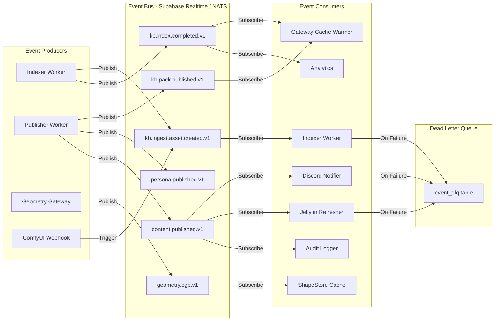
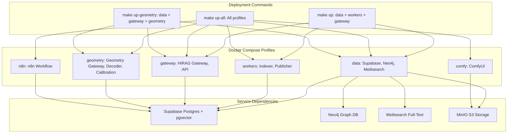
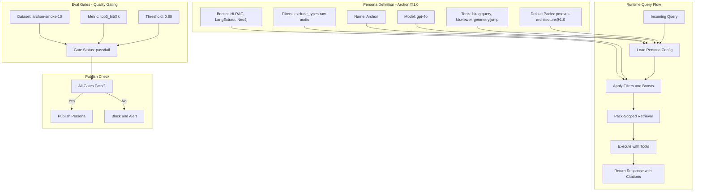

# PMOVES v5.12 Architecture - Updated Mermaid Diagrams

## 1. High-Level PMOVES v5.12 Architecture



---

## 2. v5.12 Data Model - Grounded Personas and Library



---

## 3. Creator Pipeline - Presign to Publish Workflow



---

## 4. CHIT Geometry System - First-Class Integration

```mermaid
graph TD
    subgraph analysis_workers["Analysis Workers - CGP Producers"]
        A[Audio AI: Whisper, Pyannote]
        B[Video AI: YOLO, ViT, CLIP]
        C[Text Analysis: LangExtract]
        D[ComfyUI: Content Generation]
    end

    subgraph geometry_core["CHIT Geometry Services"]
        E[Geometry Gateway v0.2]
        F[ShapeStore Cache In-Memory]
        G[Geometry Decoder: Text/Image/Audio]
        H[Geometry Calibration: Metrics]
    end

    subgraph persistence["Geometry Persistence - Supabase"]
        I[anchors table]
        J[constellations table]
        K[shape_points table]
        L[shape_index table]
        M[Realtime Broadcast Channel]
    end

    subgraph consumers["Geometry Consumers"]
        N[Agent Zero: geometry.jump, geometry.decode_text]
        O[Archon: geometry.query, geometry.publish_cgp]
        P[UI Canvas: Live Visualization]
        Q[n8n Workflows: Polling Fallback]
    end

    A -->|Emit geometry.cgp.v1| E
    B -->|Emit geometry.cgp.v1| E
    C -->|Emit geometry.cgp.v1| E
    D -->|Emit geometry.cgp.v1| E
    
    E -->|HMAC Verify| F
    E -->|Store Anchors| I
    E -->|Store Constellations| J
    E -->|Store Points| K
    E -->|Update Index| L
    E -->|Broadcast| M
    
    F -->|Cache Hit| E
    F -->|Warm from DB| I
    F -->|Warm from DB| J
    
    G -->|Decode Request| E
    H -->|Calibration Report| E
    
    M -->|WebSocket Subscribe| P
    M -->|Realtime Update| N
    M -->|Realtime Update| O
    
    Q -->|Poll shape_points| K
    Q -->|GET /v0/shape/{id}| E
    
    I -->|Provides| F
    J -->|Provides| F
    K -->|Jump Locators| E
```

---

## 5. Pack-Scoped Retrieval with Reranker



---

## 6. Event Bus Architecture - NATS/Supabase Realtime



---

## 7. Compose Profiles and Service Groups



---

## 8. Persona Runtime and Eval Gates



---

## Key Changes in v5.12

1. **Grounded Personas**: Personas now have explicit runtime configs, default packs, boosts, and filters with eval gates
2. **Pack-Scoped Retrieval**: Queries are scoped to grounding packs with weighted selectors
3. **CHIT Geometry First-Class**: Geometry services promoted to first-class with dedicated profile, versioned API (v0.2), and Realtime integration
4. **Creator Pipeline**: Complete presign → webhook → approval → index → publish flow with Discord/Jellyfin integration
5. **Reranker Default On**: Cross-encoder reranking enabled by default in retrieval pipeline
6. **Event Bus Maturity**: Structured event contracts with DLQ for failure handling
7. **Compose Profiles**: Modular deployment with profiles for data, workers, gateway, geometry, comfy, n8n

All diagrams use compatible Mermaid syntax and reflect the current v5.12 architecture.