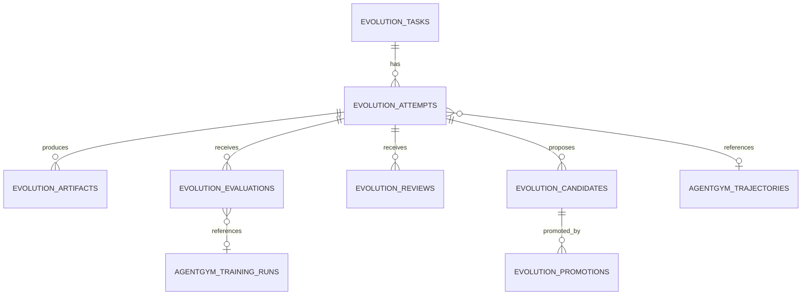

# Evolution Fabric Supabase Schema Proposal

**Status:** Proposed; not yet a migration
**Version:** 0.1.0

## 1. Design goal

Add the minimum durable data model needed to coordinate software/skill evolution while reusing existing AgentGym trajectory and training tables.

This proposal is additive. It does not replace:

- `agentgym_trajectories`;
- `agentgym_training_runs`;
- AgentGym event storage;
- CHIT/geometry tables;
- Graphiti/Cipher memory;
- Open Notebook storage;
- existing agent registry and room manifests.

## 2. Entity graph



## 3. Proposed tables

### 3.1 `evolution_tasks`

One immutable task specification per requested improvement.

```sql
create table public.evolution_tasks (
  id uuid primary key default gen_random_uuid(),
  event_id uuid not null unique,
  title text not null,
  repository text not null,
  base_ref text not null,
  target_node text,
  room_id text,
  stage text not null default 'rehearsal'
    check (stage in ('rehearsal','live','review','archive')),
  planner_agent text not null,
  reviewer_agent text not null,
  worker_agents text[] not null default '{}',
  specification jsonb not null,
  task_spec_sha256 text not null unique,
  dataset_id text,
  dataset_version text,
  minimum_score numeric(5,4) not null default 0.8500,
  status text not null default 'created'
    check (status in ('created','assigned','running','evaluating','reviewing','candidate','promoted','rejected','failed','cancelled','archived')),
  created_by uuid references auth.users(id) on delete set null,
  created_at timestamptz not null default now(),
  updated_at timestamptz not null default now()
);

create index evolution_tasks_status_idx
  on public.evolution_tasks(status, created_at desc);
create index evolution_tasks_node_idx
  on public.evolution_tasks(target_node, status);
```

The application must reject updates to `specification`, `task_spec_sha256`, `repository`, and `base_ref` after the first attempt starts. A trigger can enforce this in the migration.

### 3.2 `evolution_attempts`

One worker execution in one bounded workspace.

```sql
create table public.evolution_attempts (
  id uuid primary key default gen_random_uuid(),
  event_id uuid not null unique,
  task_id uuid not null references public.evolution_tasks(id) on delete cascade,
  runtime text not null
    check (runtime in ('pmoves-crush','hermes-agent','hermes-self-evolution','codex','other')),
  agent_id text not null,
  node_id text not null,
  room_session_id text,
  branch text,
  base_commit text not null,
  workspace_uri text,
  model_route text,
  status text not null default 'started'
    check (status in ('started','completed','failed','cancelled','timed_out')),
  trajectory_id uuid,
  shape_id text,
  commit_sha text,
  reflection text,
  metrics jsonb not null default '{}'::jsonb,
  checks jsonb not null default '{}'::jsonb,
  started_at timestamptz not null default now(),
  completed_at timestamptz,
  created_at timestamptz not null default now()
);

create index evolution_attempts_task_idx
  on public.evolution_attempts(task_id, started_at desc);
create index evolution_attempts_agent_idx
  on public.evolution_attempts(agent_id, runtime, started_at desc);
create index evolution_attempts_trajectory_idx
  on public.evolution_attempts(trajectory_id)
  where trajectory_id is not null;
```

`trajectory_id` should reference `agentgym_trajectories(id)` only after the live schema confirms type and table location. The first migration may use an indexed nullable UUID without a foreign key, then add the constraint after validation.

### 3.3 `evolution_artifacts`

Immutable references to patches, transcripts, reports, recordings, datasets, and other large outputs.

```sql
create table public.evolution_artifacts (
  id uuid primary key default gen_random_uuid(),
  attempt_id uuid not null references public.evolution_attempts(id) on delete cascade,
  kind text not null
    check (kind in ('patch','transcript','test_report','evaluation_report','review_report','recording','dataset','checkpoint','other')),
  uri text not null,
  mime text,
  size_bytes bigint,
  sha256 text not null,
  redaction_status text not null default 'pending'
    check (redaction_status in ('pending','passed','failed','not_required')),
  metadata jsonb not null default '{}'::jsonb,
  created_at timestamptz not null default now(),
  unique (attempt_id, kind, sha256)
);

create index evolution_artifacts_attempt_idx
  on public.evolution_artifacts(attempt_id, kind);
```

The object-store key should include the task and attempt IDs, for example:

```text
s3://evolution-artifacts/<task_id>/<attempt_id>/<kind>/<sha256>.<ext>
```

### 3.4 `evolution_evaluations`

Versioned scoring results.

```sql
create table public.evolution_evaluations (
  id uuid primary key default gen_random_uuid(),
  event_id uuid not null unique,
  task_id uuid not null references public.evolution_tasks(id) on delete cascade,
  attempt_id uuid not null references public.evolution_attempts(id) on delete cascade,
  evaluator text not null,
  dataset_id text not null,
  dataset_version text not null,
  score numeric(5,4) not null check (score >= 0 and score <= 1),
  component_scores jsonb not null,
  hard_gates jsonb not null,
  report_artifact_id uuid references public.evolution_artifacts(id) on delete set null,
  agentgym_training_run_id text,
  passed boolean not null,
  created_at timestamptz not null default now()
);

create index evolution_evaluations_attempt_idx
  on public.evolution_evaluations(attempt_id, created_at desc);
create index evolution_evaluations_dataset_idx
  on public.evolution_evaluations(dataset_id, dataset_version);
```

### 3.5 `evolution_reviews`

Independent post-work decisions.

```sql
create table public.evolution_reviews (
  id uuid primary key default gen_random_uuid(),
  event_id uuid not null unique,
  task_id uuid not null references public.evolution_tasks(id) on delete cascade,
  attempt_id uuid not null references public.evolution_attempts(id) on delete cascade,
  reviewer_agent text not null,
  worker_agent text not null,
  independent_from_worker boolean not null,
  decision text not null check (decision in ('approve','revise','reject')),
  confidence numeric(5,4) check (confidence >= 0 and confidence <= 1),
  rubric_id text not null,
  rubric_version text not null,
  findings jsonb not null default '[]'::jsonb,
  required_changes jsonb not null default '[]'::jsonb,
  evidence_refs jsonb not null default '[]'::jsonb,
  report_artifact_id uuid references public.evolution_artifacts(id) on delete set null,
  created_at timestamptz not null default now(),
  check (independent_from_worker = true),
  check (reviewer_agent <> worker_agent)
);

create index evolution_reviews_attempt_idx
  on public.evolution_reviews(attempt_id, created_at desc);
```

A human override should be stored as a separate review row with a human reviewer identity rather than mutating an agent review.

### 3.6 `evolution_candidates`

A versioned reusable or promotable output.

```sql
create table public.evolution_candidates (
  id uuid primary key default gen_random_uuid(),
  event_id uuid not null unique,
  task_id uuid not null references public.evolution_tasks(id) on delete cascade,
  attempt_id uuid not null references public.evolution_attempts(id) on delete cascade,
  evaluation_id uuid references public.evolution_evaluations(id) on delete restrict,
  review_id uuid references public.evolution_reviews(id) on delete restrict,
  kind text not null
    check (kind in ('skill','prompt','tool_description','code','config','model','dataset')),
  name text not null,
  version text not null,
  artifact_uri text not null,
  semantic_hash text not null,
  source_runtime text not null,
  status text not null default 'proposed'
    check (status in ('proposed','self_evolving','evaluating','draft_pr_ready','promoted','rejected','superseded')),
  metadata jsonb not null default '{}'::jsonb,
  created_at timestamptz not null default now(),
  unique (kind, name, version)
);

create index evolution_candidates_task_idx
  on public.evolution_candidates(task_id, created_at desc);
create index evolution_candidates_status_idx
  on public.evolution_candidates(status, kind);
```

### 3.7 `evolution_promotions`

The immutable production/non-production promotion record.

```sql
create table public.evolution_promotions (
  id uuid primary key default gen_random_uuid(),
  event_id uuid not null unique,
  candidate_id uuid not null references public.evolution_candidates(id) on delete restrict,
  promotion_level text not null
    check (promotion_level in ('observed','reusable_pattern','skill_candidate','code_candidate','model_candidate','production')),
  repository text,
  pull_request integer,
  merge_sha text,
  approved_by text[] not null default '{}',
  post_merge_checks jsonb not null default '{}'::jsonb,
  promoted_at timestamptz not null default now(),
  archived_at timestamptz
);

create index evolution_promotions_candidate_idx
  on public.evolution_promotions(candidate_id, promoted_at desc);
```

A `production` promotion requires a PR number, merge SHA, at least one human approver, and passing post-merge checks. A trigger or RPC should enforce that condition.

## 4. Optional event inbox table

If JetStream delivery and database persistence need a transactional bridge, add:

```sql
create table public.evolution_event_inbox (
  event_id uuid primary key,
  subject text not null,
  schema_version text not null,
  payload jsonb not null,
  received_at timestamptz not null default now(),
  processed_at timestamptz,
  processing_status text not null default 'received'
    check (processing_status in ('received','processed','failed','dead_letter')),
  error text
);
```

This table is not a replacement for NATS. It provides idempotent persistence at the consumer boundary.

## 5. Realtime publication

Recommended realtime tables after RLS is complete:

- `evolution_tasks`
- `evolution_attempts`
- `evolution_evaluations`
- `evolution_reviews`
- `evolution_candidates`
- `evolution_promotions`

Do not publish full transcripts or large artifact payloads through Realtime. Publish status and URI metadata only.

## 6. RLS direction

The migration should follow the repository's current owner/single-user and multi-user security modes. Until that choice is resolved, use these principles:

- service-role-only inserts for normalized NATS consumers;
- authenticated/operator reads for task and status records;
- artifact access through short-lived signed URLs;
- no anonymous reads of transcripts, patches, review evidence, or model checkpoints;
- human promotion writes through a dedicated RPC with authorization checks;
- private domain data excluded from evolution tables by default.

Do not copy the policy sketch directly into production before checking the active Supabase auth model.

## 7. Required RPCs

### `create_evolution_task(specification jsonb)`

- validates required fields;
- computes `task_spec_sha256` server-side;
- stores the immutable task;
- returns task ID and hash;
- publishes or queues `evolution.task.created.v1` after commit.

### `record_evolution_attempt_completion(envelope jsonb)`

- validates event ID and task hash;
- verifies artifact checksums;
- upserts by `event_id`;
- marks task `evaluating`;
- queues evaluation.

### `record_evolution_review(envelope jsonb)`

- verifies reviewer independence;
- validates rubric version;
- stores evidence references;
- updates task status to `candidate`, `running`, or `rejected`.

### `promote_evolution_candidate(candidate_id uuid, promotion jsonb)`

- requires authorized human identity for `production`;
- requires passed evaluation and approved review;
- requires PR/merge evidence for code/config candidates;
- inserts immutable promotion record;
- sets candidate status;
- queues `evolution.candidate.promoted.v1`.

## 8. Views for the UI and Open Notebook

### `evolution_task_summary`

One row per task with:

- current status;
- target node and stage;
- attempt count;
- best score;
- latest review decision;
- candidate and PR state;
- artifact count;
- last activity.

### `evolution_attempt_scoreboard`

One row per attempt with:

- runtime/agent/model route;
- check status;
- component scores;
- hard-gate failures;
- review decision;
- candidate ID.

### `evolution_approved_lessons`

Candidates promoted at `reusable_pattern` or above, suitable for controlled Archon/Cipher/Hermes ingestion.

## 9. Retention

| Data | Proposed retention |
|---|---|
| Task specifications and promotions | Indefinite |
| Review/evaluation metadata | Indefinite |
| Attempt records | Indefinite metadata |
| Full transcripts | 90 days by default; longer only for approved datasets |
| Test reports and patches | Indefinite for promoted candidates; 180 days otherwise |
| Failed sandbox workspaces | Delete after artifact verification, normally within 7 days |
| JetStream evolution facts | 90 days |

## 10. Migration sequence

1. Inspect live AgentGym table names, schemas, and ID types.
2. Add tables without cross-system foreign keys.
3. Add indexes and check constraints.
4. Add idempotent RPCs.
5. Add RLS and role grants.
6. Add Realtime publication.
7. Add contract tests and seed fixtures.
8. Validate with one synthetic task.
9. Add AgentGym foreign key only after live compatibility is confirmed.
10. Promote to live after the RFC acceptance criteria pass.
