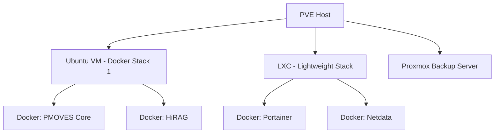

# Docker on Proxmox: Integration Guide for PMOVES.AI

## 1. Purpose
This guide defines how to correctly deploy and operate **Docker** environments within **Proxmox Virtual Environment (PVE)** for the **PMOVES.AI provisioning bundle**, while avoiding common host-level conflicts and ensuring long-term maintainability.

**Goal:** Maintain isolation between PVE and Docker workloads by using VMs or LXCs as container hosts, never installing Docker directly on the Proxmox host. This standard aligns with PMOVES.AI’s modular infrastructure strategy and the Cataclysm Studios provisioning framework.

---

## 2. Architecture Overview
### Recommended Design
- **Proxmox Host (PVE):** Runs the hypervisor and manages networking and storage.
- **Docker Host VMs or LXCs:** Run individual Docker Compose stacks (e.g., Jellyfin AI, HiRAG, or n8n). These use `vmbr0` or a dedicated `vmbr1` bridge for networking.
- **PMOVES Agents & Services:** Deployed as containers within Docker hosts, communicating with Supabase, Neo4j, and n8n orchestrators.



---

## 3. Provisioning Workflow
### Preflight Guardrail
Before any provisioning script runs Docker installation, ensure it aborts if executed on a Proxmox host:
```yaml
- name: Abort if running on Proxmox host
  ansible.builtin.shell: dpkg -l | grep -q pve-manager
  register: pve_present
  ignore_errors: true

- name: Fail when PVE detected
  ansible.builtin.fail:
    msg: "Refusing to install Docker on a Proxmox host. Use a VM or LXC."
  when: pve_present.rc == 0
```

### VM Template Provisioning
- OS: Ubuntu Server 22.04+
- Enable **QEMU Guest Agent**
- Mount secondary disk at `/opt/docker`
- Install Docker and Compose via Cloud-Init or `install_docker_vm.sh`
- Configure hostname and tags (e.g., `darkxside-core-01`, `pmoves-dev-01`)

### LXC Template Provisioning
- Set `nesting=1` and `keyctl=1`
- Mount `/opt/appdata` for persistent Docker volumes
- Enable `overlay` and `br_netfilter` modules
- Use lightweight stacks (e.g., Portainer, monitoring, or proxies)

---

## 4. Networking Best Practices
### Standard Bridging
- `vmbr0`: default LAN bridge for most VMs/LXCs
- `vmbr1`: optional dedicated Docker network bridge for isolated stacks

### Docker Network Config
To prevent firewall and bridge conflicts, avoid Docker manipulating iptables:
```json
{
  "iptables": false
}
```

For LAN-level services (e.g., Portainer, NPM, or Netdata):
```yaml
networks:
  lan:
    driver: macvlan
    driver_opts:
      parent: vmbr0
```

---

## 5. Security and Secrets Management
Follow PMOVES conventions for environment templates. Example:
```bash
SUPABASE_URL=https://your-supabase.co
SUPABASE_SERVICE_KEY=your-service-key
TAILSCALE_AUTHKEY=your-tailnet-key
PROXMOX_API_TOKEN=your-proxmox-token
JELLYFIN_API_KEY=optional-long-lived-key
```

- Store secrets in `.env.local` or managed vaults.
- Exclude secrets from version control.
- Provisioning scripts automatically populate `.env` from `.env.template`.

---

## 6. Monitoring and Maintenance
### Prune Automation
Include a systemd timer for automated cleanup:
```ini
[Unit]
Description=Docker prune

[Service]
Type=oneshot
ExecStart=/usr/bin/docker system prune -af --volumes

[Timer]
OnCalendar=weekly
Persistent=true
```

### Monitoring
Deploy either:
- **cAdvisor + Prometheus + Grafana** for cluster metrics
- **Netdata** for local performance insights

### Backups
Use Proxmox Backup Server (VM-level) + Restic or Rclone for `/opt/docker` syncs.

---

## 7. Integration References
- [`CATACLYSM_STUDIOS_INC/PMOVES-PROVISIONS/README.md`](../README.md)
- [`pmoves/docs/PMOVES_ARC.md`](../../../pmoves/docs/PMOVES_ARC.md)
- [`docs/PMOVES_Multi-Agent_System_Crush_CLI_Integration_and_Guidelines.md`](../../../docs/PMOVES_Multi-Agent_System_Crush_CLI_Integration_and_Guidelines.md)

---

## 8. Summary Checklist
| Task | Description | Status |
|------|--------------|---------|
| Guard against host-level Docker install | Preflight check | ✅ |
| Create VM & LXC templates | Cloud-init + postinstall scripts | ✅ |
| Define standard bridges | vmbr0 & vmbr1 with macvlan | ✅ |
| Add secrets templates | `.env.template` auto-filled | ✅ |
| Automate cleanup & backup | prune timer + PBS/Restic | ✅ |
| Cross-reference docs | README + folders.md + PMOVES_ARC | ✅ |

---

**Maintainer:** Cataclysm Studios Infrastructure / PMOVES.AI
**Last Updated:** October 2025

