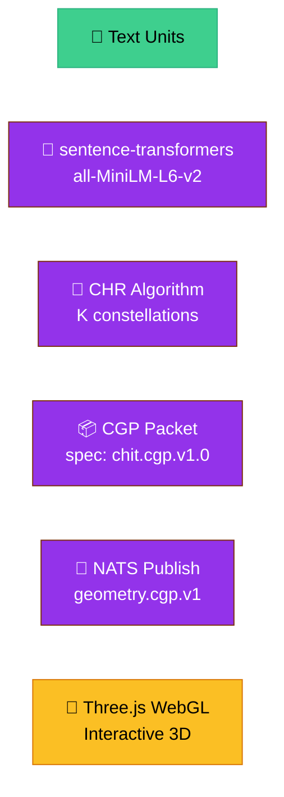

# CHR to Shapes Pipeline

**Pipeline ID:** `chr-to-shapes`
**Status:** Production Ready
**Purpose:** Convert text theories into interactive 3D geometric visualizations

---

## Overview

This pipeline implements the CONCH (Consciousness Harvest) pipeline's CHR algorithm to cluster text embeddings, generate CHIT Geometry Packets (CGP), and render them as interactive 3D shapes via Hyperdimensions.



> **📊 Diagram Source:** [diagrams/chr-to-shapes.mmd](../diagrams/chr-to-shapes.mmd)

---

## Pipeline Stages

### Stage 1: Text Unit Collection

**Input Sources:**
- Supabase: `pmoves_core.consciousness_theories`
- Manual input via API
- YouTube transcripts (see: youtube-to-persona.md)

**Data Format:**
```json
{
  "id": "theory-001",
  "text": "Physicalism is the theory that everything is physical...",
  "namespace": "pmoves.consciousness",
  "metadata": {
    "category": "materialism",
    "proponents": ["David Chalmers", "Daniel Dennett"]
  }
}
```

**Collection Methods:**

```python
# From Supabase
import httpx

async def fetch_theories(namespace: str, limit: int = 100):
    async with httpx.AsyncClient() as client:
        response = await client.get(
            f"{SUPABASE_URL}/rest/v1/pmoves_core.consciousness_theories",
            params={"namespace": f"eq.{namespace}", "limit": str(limit)},
            headers={"apikey": SUPABASE_ANON_KEY}
        )
        return response.json()

# Manual input
units = [
    {"id": "001", "text": "Theory 1...", "namespace": "pmoves.consciousness"},
    {"id": "002", "text": "Theory 2...", "namespace": "pmoves.consciousness"}
]
```

---

### Stage 2: Embedding Generation

**Service:** consciousness-service (8096)

**Embedding Methods (in priority order):**

1. **sentence-transformers** (preferred)
   - Model: `all-MiniLM-L6-v2`
   - Dimension: 384
   - Quality: High semantic understanding

2. **HashingVectorizer** (fallback)
   - Method: sklearn `HashingVectorizer`
   - Dimension: 384
   - Quality: Fast, deterministic

```python
# Automatic selection in consciousness-service
def _maybe_st_model():
    try:
        from sentence_transformers import SentenceTransformer
        model = SentenceTransformer("all-MiniLM-L6-v2")
        logger.info("Loaded sentence-transformers model")
        return model
    except ImportError:
        logger.warning("sentence-transformers unavailable, using HashingVectorizer")
        return None
```

---

### Stage 3: CHR Clustering

**Algorithm:** Constellation Harvest Regularization

**Parameters:**
| Parameter | Default | Range | Description |
|-----------|---------|-------|-------------|
| `K` | 8 | 2-16 | Number of constellations |
| `iters` | 30 | 10-100 | Optimization iterations |
| `bins` | 8 | 4-16 | Entropy histogram bins |
| `beta` | 12.0 | 1-20 | Softmax temperature |
| `seed` | 42 | Any | Random seed |

**Quality Metrics:**

| Metric | Formula | Target |
|--------|---------|--------|
| MHEP | Helmoltz Entropy Profile | > 0.85 |
| Hg | Global entropy | Balanced |
| Hs | Slab entropy | Per constellation |

**API Call:**

```bash
curl -X POST http://localhost:8096/chr/run \
  -H "Content-Type: application/json" \
  -d '{
    "units": [
      {
        "id": "theory-001",
        "text": "Physicalism is...",
        "namespace": "pmoves.consciousness",
        "metadata": {"category": "materialism"}
      }
    ],
    "config": {
      "K": 8,
      "iters": 30,
      "beta": 12.0
    },
    "encrypt_anchors": false,
    "publish_to_nats": true
  }'
```

**Response:**

```json
{
  "status": "success",
  "chr_result": {
    "K": 8,
    "MHEP": 0.85,
    "Hg": 2.3,
    "Hs": [0.8, 0.7, 0.6, 0.5, 0.4, 0.3, 0.2, 0.1],
    "constellations": [
      {
        "id": "constellation-0",
        "size": 5,
        "entropy": 0.8,
        "points": ["theory-001", "theory-005", ...]
      }
    ]
  },
  "cgp_packet": {
    "spec": "chit.cgp.v1.0",
    "super_nodes": [...]
  },
  "nats_published": true
}
```

---

### Stage 4: CGP Construction

**Format:** CHIT Geometry Packet v1.0

**Structure:**

```json
{
  "spec": "chit.cgp.v1.0",
  "summary": "CHR clustering with K=8 constellations, MHEP=0.85",
  "created_at": "2026-03-13T12:00:00Z",
  "super_nodes": [{
    "id": "consciousness-super",
    "label": "pmoves.consciousness",
    "summary": "CHR clustering results",
    "x": 0.0,
    "y": 0.0,
    "r": 10.0,
    "constellations": [{
      "id": "constellation-0",
      "summary": "Materialist theories",
      "anchor": [0.5, 0.3, 0.8],
      "spectrum": [0.8, 0.6, 0.4, 0.2, 0.1],
      "points": [{
        "id": "theory-001",
        "modality": "text",
        "proj": 0.95,
        "conf": 0.9,
        "summary": "Physicalism is the theory..."
      }],
      "meta": {
        "namespace": "pmoves.consciousness",
        "category": "materialism",
        "mhep": 0.85
      }
    }]
  }],
  "sig": {
    "alg": "HMAC-SHA256",
    "hmac": "base64-encoded-signature",
    "key_id": "CHIT_PROD_PASSPHRASE"
  },
  "meta": {
    "source": "consciousness-service.chr.run.v1",
    "tags": ["chr", "consciousness", "clustering"]
  }
}
```

**Field Mappings:**

| CGP Field | CHR Source |
|-----------|------------|
| `anchor` | Softmax cluster center |
| `spectrum` | Point distribution (entropy spectrum) |
| `proj` | Softmax assignment probability |
| `conf` | Point density in constellation |

---

### Stage 5: NATS Publishing

**Subjects:**
- `geometry.cgp.v1` - Primary CGP publication
- `tokenism.cgp.ready.v1` - Tokenism trigger

**Subscribers:**
- Hi-RAG v2 - Indexing
- Hyperdimensions - Rendering (via Portal)
- Tokenism - Attribution tracking

**Publication Flow:**

```python
async def publish_cgp(self, cgp: Dict[str, Any]) -> bool:
    """Publish CGP to GEOMETRY BUS."""
    if not self.nc or not self.nc.is_connected:
        logger.error("NATS not connected")
        return False

    try:
        # Publish to geometry bus
        await self.nc.publish(
            "geometry.cgp.v1",
            json.dumps(cgp).encode()
        )

        # Signal Tokenism
        await self.nc.publish(
            "tokenism.cgp.ready.v1",
            json.dumps({"cgp_id": cgp["super_nodes"][0]["id"]}).encode()
        )

        logger.info(f"Published CGP {cgp['super_nodes'][0]['id']}")
        return True

    except Exception as e:
        logger.error(f"NATS publish failed: {e}")
        return False
```

---

### Stage 6: Shape Rendering

**Service:** Hyperdimensions (via Portal)

**Technology:** Three.js WebGL

**CGP to 3D Mapping:**

| CGP Element | Three.js Object |
|-------------|-----------------|
| Super Node | THREE.Group |
| Constellation | THREE.Group (positioned by anchor) |
| Point | THREE.Mesh (geometry by modality) |
| Spectrum | Color gradient / material |

**Geometry Mapping:**

```typescript
function modalityToGeometry(modality: string): THREE.BufferGeometry {
  switch (modality) {
    case "text":
      return new THREE.SphereGeometry(0.5, 32, 32);
    case "image":
      return new THREE.BoxGeometry(1, 1, 1);
    case "audio":
      return new THREE.ConeGeometry(0.5, 1, 32);
    default:
      return new THREE.SphereGeometry(0.5, 32, 32);
  }
}

function spectrumToColor(spectrum: number[]): THREE.Color {
  // Map spectrum to RGB
  return new THREE.Color(
    spectrum[0],  // R
    spectrum[1],  // G
    spectrum[2]   // B
  );
}
```

**Rendering via BoTZ Skill:**

```bash
# Render CGP as 3D shape
/hyperdim:render --file cgp.json

# Animate CGP sequence
/hyperdim:animate --sequence cgps/*.json --duration 5000

# Export as GLTF
/hyperdim:export --file cgp.json --format gltf --output shape.gltf
```

---

## Complete Pipeline Example

### From Text to 3D Shape

```python
import asyncio
import httpx
import json

async def text_to_shape(text_units: list):
    """Complete pipeline from text to 3D shape."""

    # 1. Run CHR
    async with httpx.AsyncClient() as client:
        response = await client.post(
            "http://localhost:8096/chr/run",
            json={
                "units": text_units,
                "config": {"K": 8, "iters": 30},
                "publish_to_nats": True
            }
        )
        result = response.json()

    # 2. Extract CGP
    cgp = result["cgp_packet"]

    # 3. Save CGP for rendering
    with open("output.json", "w") as f:
        json.dump(cgp, f, indent=2)

    # 4. Render (via BoTZ)
    # /hyperdim:render --file output.json

    print(f"MHEP: {result['chr_result']['MHEP']}")
    print(f"Constellations: {len(result['chr_result']['constellations'])}")
    print(f"CGP: {cgp['spec']}")

    return cgp

# Usage
units = [
    {
        "id": "theory-001",
        "text": "Physicalism is the theory that everything is physical...",
        "namespace": "pmoves.consciousness",
        "metadata": {"category": "materialism"}
    },
    {
        "id": "theory-002",
        "text": "Dualism posits that mind and body are distinct...",
        "namespace": "pmoves.consciousness",
        "metadata": {"category": "dualism"}
    }
]

cgp = asyncio.run(text_to_shape(units))
```

---

## Configuration

### CHR Parameters

```bash
# High quality (slow)
{"K": 16, "iters": 50, "beta": 8.0}

# Balanced (default)
{"K": 8, "iters": 30, "beta": 12.0}

# Fast (lower quality)
{"K": 4, "iters": 10, "beta": 20.0}
```

### Visualization Options

```bash
# Auto-rotate camera
/hyperdim:render --file cgp.json --auto-rotate

# Show labels
/hyperdim:render --file cgp.json --show-labels

# Set background
/hyperdim:render --file cgp.json --background "#1a1a2e"

# Custom colors
/hyperdim:render --file cgp.json --color-scheme "viridis"
```

---

## Monitoring

### Pipeline Health

```bash
# Check services
curl http://localhost:8096/healthz  # consciousness-service

# Monitor NATS
nats sub "geometry.cgp.v1"
nats sub "tokenism.cgp.ready.v1"

# Check CHR metrics
curl http://localhost:8096/metrics
```

### Quality Metrics

```bash
# Get MHEP from response
curl -X POST http://localhost:8096/chr/run \
  -d '{"units": [...], "config": {"K": 8}}' \
  | jq '.chr_result.MHEP'

# Target: MHEP > 0.85
# Good: 0.85 - 0.95
# Excellent: 0.95+
```

---

## Troubleshooting

### Common Issues

**Issue:** Low MHEP score (< 0.7)
```
Solution:
- Increase K (more constellations)
- Increase iters (more optimization)
- Check input text quality
- Verify embeddings are working
```

**Issue:** Rendering fails
```
Solution:
- Verify CGP spec is "chit.cgp.v1.0"
- Check Hyperdimensions Portal connection
- Test with minimal CGP first
```

**Issue:** NATS publish fails silently
```
Solution:
- Check health endpoint for nats_connected
- Verify NATS_URL credentials
- Monitor subjects with nats sub
```

---

## References

- **Main Docs:** [../README.md](../README.md)
- **CONCH Integration:** [../../CONCH_INTEGRATION_MAP.md](../../CONCH_INTEGRATION_MAP.md)
- **NATS Subjects:** [../nats-subjects.md](../nats-subjects.md)
- **Consciousness Service:** [services/consciousness-service.md](../services/consciousness-service.md)
- **Hyperdimensions:** [services/hyperdimensions.md](../services/hyperdimensions.md)
